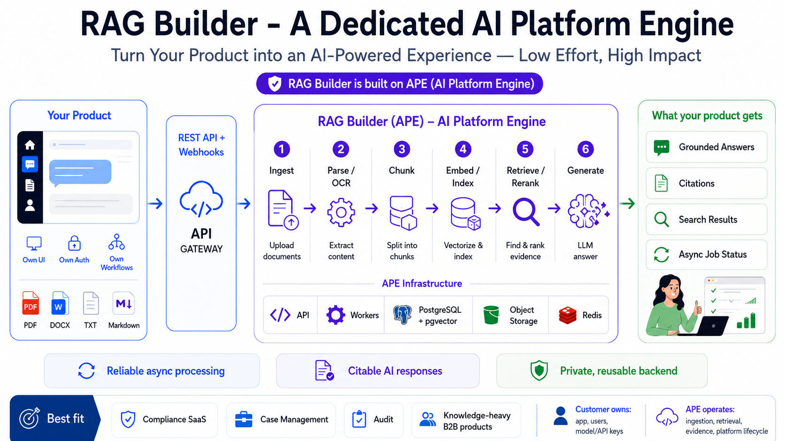

# RAG Builder

### A private AI knowledge engine your product can Integrate with ease.

RAG Builder is the product-facing name for **APE (AI Platform Engine)**, the reusable backend underneath this repository.

RAG Builder helps software products add document ingestion, search, grounded answers, and citations without rebuilding the entire AI backend from scratch.



> **One reusable engine. Many product experiences.**
>
> Your application keeps the UI, users, and workflow. RAG Builder carries the document journey: ingest, parse, chunk, embed, index, retrieve, and generate.

[Start the learning journey](docs/learning/rag-from-zero.md) · [Integrate the API](docs/platform-integration-guide.md) · [See the architecture](docs/Platform-at-a-glance.md)

---

## Why this exists

The moment a product wants to “ask our documents,” it inherits a surprisingly large system:

```text
upload -> parse/OCR -> chunk -> embed -> index -> retrieve -> answer -> cite
```

That system also needs authentication, project isolation, object storage, background workers, provider integration, migrations, and operational status.

RAG Builder is a learning-first implementation of that journey, shaped as a reusable backend for real applications.

```text
Your product  ── REST + API key ──►  RAG Builder
                                      ├─ PostgreSQL + pgvector
                                      ├─ background workers
                                      ├─ object storage
                                      └─ LLM / embedding providers
```

## What a product gets

- Upload and manage project-scoped documents.
- Parse PDF, DOCX, TXT, and Markdown content.
- Optional OCR paths for scanned/image content.
- Structure-aware chunking with source offsets and page metadata.
- PostgreSQL-native semantic and keyword retrieval.
- Hybrid search with rank fusion and reranking hooks.
- Stateful RAG conversations and SSE streaming.
- Source metadata for citations and evidence display.
- Organization API keys, project boundaries, health/readiness, and background processing foundations.

The repository is still being shaped toward a repeatable dedicated hosted service. The learning path and architecture make the decisions visible instead of hiding them behind a demo.

## Small examples of what becomes possible

| Product | Instant AI capability |
| --- | --- |
| Law firm workspace | Add matter documents, ask case questions, and return source pages. |
| Call-center platform | Search support policies and draft grounded agent replies. |
| Audit/compliance SaaS | Retrieve evidence from policies, reports, and working papers. |
| HR platform | Answer handbook questions for a selected organization or region. |
| Document management system | Add “ask this folder” without replacing the existing UI. |
| Internal operations tool | Turn procedures and playbooks into a searchable assistant. |

The host product owns the experience. RAG Builder owns the knowledge lifecycle.

## The journey inside the engine

```text
1. Ingest       receive a document and preserve the original
2. Parse/OCR    turn bytes or pixels into text with provenance
3. Chunk        split text into useful, citable passages
4. Embed/Index  represent meaning and build search structures
5. Retrieve     find and rank evidence with semantic + keyword search
6. Generate     ask the LLM to answer from the evidence
```

The most important idea is simple:

> **The model should write from evidence, not pretend the evidence does not matter.**

## Learn it like a story

The learning docs are written for beginners who want to understand both the concepts and the code.

### Start here

[RAG from Zero: Follow One Question Through the Engine](docs/learning/rag-from-zero.md)

You will follow a question such as “What is our refund policy?” through the complete pipeline, then open the source files behind each stage.

### Continue through the building blocks

1. [Knowledge ingestion](docs/learning/knowledge-ingestion-journey.md)
2. [Parsing and extraction](docs/learning/document-parsing-and-extraction.md)
3. [OCR fundamentals](docs/learning/ocr-fundamentals.md)
4. [Chunking](docs/learning/text-chunking-for-rag.md)
5. [Embeddings](docs/learning/embeddings-fundamentals.md)
6. [Vector storage and pgvector](docs/learning/vector-storage-and-pgvector.md)
7. [Semantic and hybrid retrieval](docs/learning/semantic-search-for-rag.md)
8. [Conversation RAG and prompting](docs/learning/conversation_rag_journey.md)
9. [Configuration and tuning](docs/learning/configuration-system.md)
10. [Docker local development](docs/learning/docker-local-development.md)

Each chapter asks you to predict, trace, tweak, observe, and explain. That is how a list of settings becomes engineering understanding.

## Architecture at a glance

```text
Business application
        │  REST + organization API key
        ▼
FastAPI routes and project access checks
        │
        ▼
Feature services
  ├── knowledge       upload, parse, chunk, lifecycle
  ├── retrieval       embeddings, keyword index, vector search, fusion
  └── conversations   context, prompts, LLM calls, citations
        │
        ├── PostgreSQL + pgvector
        ├── Redis + background workers
        ├── local/MinIO object storage
        └── provider contracts for LLM, embeddings, OCR, parsing, storage
```

The project uses a modular-monolith shape so the core is easy to inspect and deploy. It does not require a microservice for every stage.

## Quick start with Docker

Docker Desktop is the easiest way to explore the full local journey.

```bash
git clone <repository-url> rag-builder
cd rag-builder

cp .env.docker.example .env.docker
docker compose --env-file .env.docker up --build
```

Local surfaces:

| Surface | URL |
| --- | --- |
| Operator console | `http://localhost:3000/operator/` |
| API | `http://localhost:8000` |
| Health | `http://localhost:8000/health` |
| Readiness | `http://localhost:8000/ready` |
| MinIO console | `http://localhost:9001` |

The local stack includes the React operator console, FastAPI, a Taskiq worker, PostgreSQL with pgvector, Redis, MinIO, and one-shot migration/bootstrap services. The console is intentionally open in the current trusted deployment and follows the backend's existing configurable authentication behavior; it does not add users, login, sessions, or browser-stored credentials.

Useful targeted flows use the same Compose file:

```bash
# Backend, worker, and required infrastructure (no frontend)
docker compose --env-file .env.docker up --build backend worker

# Frontend only; renders a backend-unavailable state until the API exists
docker compose --env-file .env.docker up --build --no-deps frontend
```

For host frontend development with Vite fast refresh:

```bash
cd frontend
pnpm install
pnpm dev
```

## First API journey

The product flow is intentionally small:

1. Create an organization and API key.
2. Create a project for a corpus boundary.
3. Upload a document.
4. Poll or subscribe to processing status.
5. Search for evidence.
6. Ask a grounded question.

The copy-paste integration path is in the [Platform Integration Guide](docs/platform-integration-guide.md). Endpoint contracts live in the [API reference](docs/api/README.md).

## Repository map

```text
backend/app/
  api/            HTTP routes, envelopes, health
  dependencies/   request wiring and access checks
  models/         shared SQLAlchemy ORM
  modules/
    organizations/ organization and API-key lifecycle
    projects/      project boundaries
    knowledge/     documents, parsing, chunking
    retrieval/     embeddings, indexing, search
    conversations/ RAG chat, prompts, citations
  platform/       database, providers, jobs, auth, persistence
  worker/         background task entrypoints

frontend/
  src/api/        generated OpenAPI contract and one typed API client
  src/app/        routing, navigation, and query-client composition
  src/components/ reusable accessible states and primitives
  src/features/   operator screens grouped by domain

docs/
  architecture/   boundaries and decision records
  features/       behavior contracts
  learning/       concepts, stories, experiments, code journeys
```

## What is implemented and what is still evolving

The repository demonstrates the full conceptual journey from authentication and document upload through retrieval and chat, plus an internal operator console for deployment health, durable work, documents, configuration, metrics, and audit. It is not a public SaaS product.

The most important next development work is:

- first-class asynchronous outcome webhooks;
- stronger claim-level citations and insufficient-evidence behavior;
- measured evidence quality and learned-reranker evaluation;
- safer file-ingestion boundaries and repeatable dedicated deployment operations.

The scope is intentionally focused. The next product should not begin with agents, GraphRAG, voice, a connector marketplace, multiple vector databases, or a complex billing control plane.

## Documentation guide

| Need | Start here |
| --- | --- |
| Understand the product | [Platform at a Glance](docs/Platform-at-a-glance.md) |
| Integrate an application | [Platform Integration Guide](docs/platform-integration-guide.md) |
| Learn RAG from the beginning | [RAG from Zero](docs/learning/rag-from-zero.md) |
| Follow document processing | [Knowledge Ingestion Journey](docs/learning/knowledge-ingestion-journey.md) |
| Understand search quality | [Hybrid Retrieval Journey](docs/learning/hybrid-retrieval-journey.md) |
| Understand chat grounding | [Conversation RAG Journey](docs/learning/conversation_rag_journey.md) |
| Study architecture | [Architecture](docs/architecture/README.md) |
| Explore behavior | [Features](docs/features/README.md) |
| Operate pgvector | [pgvector Operations Runbook](docs/learning/pgvector-operations-runbook.md) |

## The larger direction

The strongest product path for this repository is a **dedicated hosted Knowledge API** for document-heavy B2B software vendors. A supported self-hosted edition can follow when the hosted deployment, upgrade, backup, and operational model are repeatable.

For compliance and case-management software vendors, RAG Builder is a private document intelligence and grounded retrieval backend that helps them add reliable, citable AI search and answers without building a RAG platform themselves or sending customer data through a shared AI data plane.

## License

See [LICENSE](LICENSE) for the current repository license.
