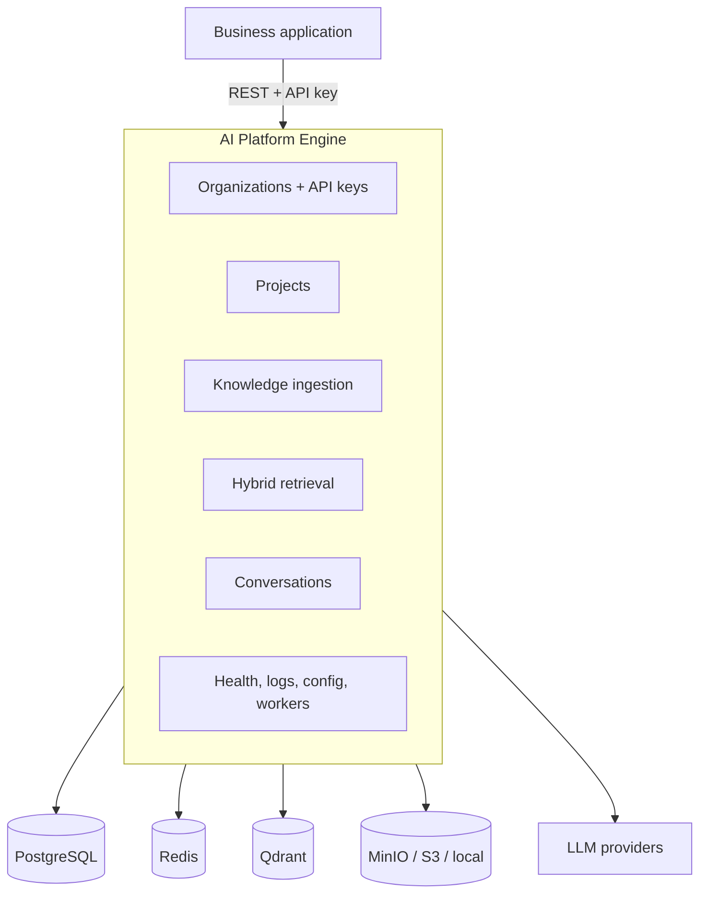
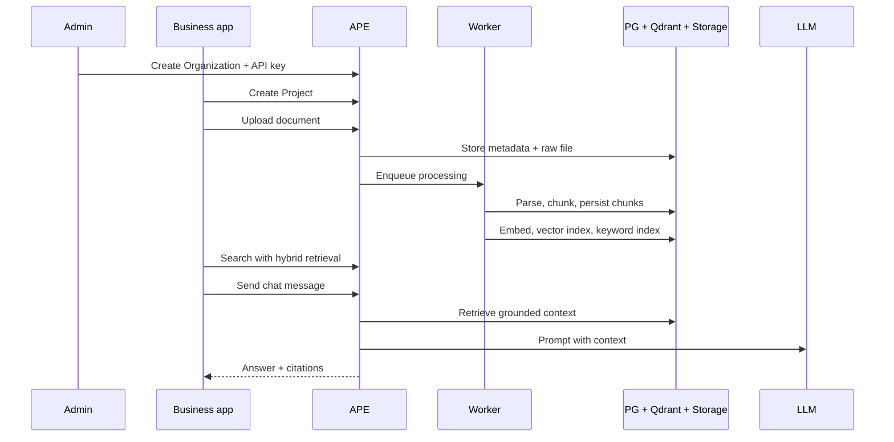

# AI Platform Engine (APE) - Platform at a Glance

**The master overview for the project.** Start here when you want the product
story, the Phase 1 journey, the architecture shape, and the roadmap in one
place.

**Integrating APE into your app?** Use the
[Platform Integration Guide](platform-integration-guide.md) first. For setup, go to
[../README.md](../README.md).

---

## The Short Version

APE is a **self-hosted, provider-agnostic RAG platform** that enterprise
applications call through REST APIs.

It is not a chatbot glued to a vector database. It is the reusable AI
infrastructure layer behind many possible products: document intelligence,
search, chat, compliance assistants, internal knowledge systems, legal research,
audit workflows, and SaaS AI add-ons.

```text
Your application keeps the business experience.
APE owns the AI lifecycle.
```

Phase 1 now gives the full core journey:

```text
Organization key
    -> Project
    -> Upload document
    -> Parse / chunk
    -> Embed / index
    -> Hybrid search
    -> RAG chat with citations
```

---

## Why APE Exists

Most companies do not want every product team to rebuild the same AI plumbing:
file ingestion, parsing, chunking, embeddings, vector search, keyword search,
LLM calls, citations, auth, workers, logs, health checks, and deployment.

APE turns that repeated work into a platform.

| Instead of every app building... | APE provides... |
| -------------------------------- | --------------- |
| A one-off RAG pipeline | A reusable API platform |
| Vendor-specific SDK code | Provider interfaces for LLMs, embeddings, storage, vectors |
| Unclear document scope | Project-scoped isolation everywhere |
| A demo chat endpoint | Ingestion, indexing, retrieval, conversations, citations |
| A shared black-box SaaS | A customer-owned self-hosted deployment |

The goal is simple: let business applications add AI features without becoming
AI infrastructure projects themselves.

---

## Product Shape



APE sits beside the application, not inside it. The application owns users,
business workflows, permissions, and UI. APE owns the AI pipeline and exposes a
stable API surface.

---

## Who It Is For

| Audience | What APE gives them |
| -------- | ------------------- |
| Product teams | A way to add grounded AI features without rebuilding RAG internals |
| Backend engineers | Clean module boundaries, provider abstraction, and async services |
| Platform teams | A reusable service that can support many internal products |
| Security teams | Self-hosted data boundary, API keys, project isolation, no shared cloud required |
| Founders / ISVs | A foundation for AI add-ons, vertical copilots, and private deployments |
| Learners | A production-shaped RAG system with docs explaining why each piece exists |

---

## The Phase 1 Journey



### API Order

| Step | Action | Main endpoint |
| ---- | ------ | ------------- |
| 1 | Create an Organization | `POST /api/v1/organizations` |
| 2 | Create an Organization API key | `POST /api/v1/organizations/{id}/api-keys` |
| 3 | Create a Project | `POST /api/v1/projects` |
| 4 | Upload a document | `POST /api/v1/projects/{project_id}/documents` |
| 5 | Wait for ingestion | `GET /api/v1/projects/{project_id}/documents/{id}` |
| 6 | Embed and index | Auto-worker handoff or `POST .../embed`, `POST .../index` |
| 7 | Search | `POST /api/v1/projects/{project_id}/search` |
| 8 | Chat | `POST /api/v1/projects/{project_id}/conversations/{id}/messages` |

Long-running work runs in the worker. The API returns quickly while parsing,
OCR, embedding, and indexing continue asynchronously.

---

## What Is Shipped Now

| Capability | Purpose | Phase 1 state |
| ---------- | ------- | ------------- |
| Organizations | Tenant and machine-to-machine auth boundary | Shipped |
| Organization API keys | Authenticate business integrations | Shipped |
| Projects | Data isolation boundary for documents, retrieval, and chat | Shipped |
| Knowledge ingestion | Upload, parse, store, and chunk documents | Shipped |
| Storage abstraction | Keep raw and parsed artifacts behind a provider | Shipped |
| OCR contract | Optional OCR provider boundary for image/scanned inputs | Shipped, with Bangla OCR limitation |
| Embeddings | Convert chunks into model vectors | Shipped |
| Vector indexing | Persist searchable points in Qdrant | Shipped |
| Keyword indexing | Build BM25 / FTS rows in PostgreSQL | Shipped |
| Hybrid retrieval | BM25 + vector + RRF + reranking | Shipped |
| Conversations | Stateful RAG chat with citations and streaming | Shipped |
| Operations baseline | Docker stack, migrations, health, readiness, structured logs | Shipped |

---

## Feature Map

### Organizations and Auth

Organizations answer: **who is calling?** They own API keys, rate limits, and the
tenant boundary. Business routes use Organization keys; admin routes use the
deployment admin key.

Start here:
[features/organization_module.md](features/organization_module.md) -
[api/organization_api.md](api/organization_api.md)

### Projects

Projects answer: **which knowledge corpus is this request for?** Every document,
chunk, vector, retrieval query, and conversation is scoped by `project_id`.

Start here:
[features/project_module.md](features/project_module.md) -
[api/project_api.md](api/project_api.md)

### Knowledge

Knowledge owns the ingestion path: upload, storage, parsing, quality checks,
optional OCR, and structure-aware chunking. It stops at `status=chunked`; the
retrieval module owns embedding and indexing.

Start here:
[features/knowledge_module.md](features/knowledge_module.md) -
[learning/knowledge-ingestion-journey.md](learning/knowledge-ingestion-journey.md)

### Retrieval

Retrieval turns chunks into searchable knowledge. Phase 1 includes semantic
search plus hybrid retrieval: keyword candidates, vector candidates, reciprocal
rank fusion, and reranking.

Start here:
[features/retrieval_module.md](features/retrieval_module.md) -
[learning/hybrid-retrieval-journey.md](learning/hybrid-retrieval-journey.md)

### Conversations

Conversations complete the RAG loop: retrieve context, build a prompt, call the
LLM provider, persist messages, and return durable citation snapshots.

Start here:
[features/conversation_module.md](features/conversation_module.md) -
[learning/conversation_rag_journey.md](learning/conversation_rag_journey.md)

---

## Two Boundaries, One Clean Mental Model

```text
Deployment
  -> Organization     who is calling
       -> Project     which corpus
            -> Documents
            -> Chunks
            -> Embeddings
            -> Search
            -> Conversations
```

| Boundary | Owns | Enforced by |
| -------- | ---- | ----------- |
| Organization | Tenant identity, API keys, rate limits | `require_organization_api_key` |
| Project | Documents, chunks, embeddings, search, chat | `project_id`, repositories, provider filters |

This keeps the product flexible. A dedicated deployment can have one
Organization and many Projects. A SaaS deployment can have many Organizations,
each with many Projects.

---

## Architecture At A Glance

```text
Client
  |
  v
api/v1/routes/              HTTP validation, response models, Depends
  |
  v
dependencies/               Composition and cross-module wiring
  |
  v
modules/<feature>/services/ Business orchestration and transactions
  |
  +--> repositories/         PostgreSQL persistence
  |
  +--> platform providers    LLM, embeddings, vector store, storage, OCR
```

| Principle | What it means in APE |
| --------- | -------------------- |
| Modular architecture | Feature slices with clear boundaries — easy to navigate, test, and extend |
| Provider-agnostic core | Vendor SDKs stay behind provider implementations |
| Project-scoped by default | No global business data path |
| Worker-first AI lifecycle | Slow AI work happens outside HTTP requests |
| Configuration-driven | Models, retrieval, chunking, and infrastructure are environment-controlled |
| Learning-first docs | Major features explain purpose, flow, trade-offs, and production notes |

Canonical detail:
[architecture/module-architecture.md](architecture/module-architecture.md)

---

## Use Cases

| Domain | Example product experience |
| ------ | -------------------------- |
| Document management | Add "ask this folder" across indexed client documents |
| Tax and audit | Query regulations, working papers, and client files with citations |
| Legal | Matter-scoped contract and case-law Q&A |
| HR and policy | Employee handbook assistant per department or region |
| ERP / finance | Search procedures, invoices, policies, and reporting notes |
| Research | Corpus per study, with exact-term and semantic discovery |
| Internal platforms | One reusable AI service for many internal applications |
| Vertical SaaS | Offer AI as a premium module without rewriting the stack per product |

The common thread: the business application keeps its workflow, and APE supplies
the document intelligence layer behind it.

---

## Business Models It Can Support

| Model | How APE fits |
| ----- | ------------ |
| Private customer deployment | Sell or deliver one APE stack per enterprise customer |
| Embedded AI add-on | Add AI features to an existing SaaS product behind the scenes |
| Internal AI platform | Centralize RAG infrastructure for multiple departments |
| Vertical copilot foundation | Build domain-specific assistants on top of domain-neutral infrastructure |
| Managed private cloud | Operate APE for customers while keeping a deployment-level data boundary |
| Consulting accelerator | Start client AI projects from a mature ingestion-to-chat baseline |

APE is most valuable where trust, deployment control, and integration depth
matter more than a quick hosted demo.

---

## Where APE Can Stand Out

| Advantage | Why it matters |
| --------- | -------------- |
| Platform over chatbot | The same backend can power search, chat, workflows, and future evaluation |
| Self-hosted by design | Enterprises can keep data, infra, and model choices under their control |
| Project isolation | Multi-corpus and multi-customer use cases are built into the model |
| Hybrid retrieval now | Exact terms and semantic meaning both participate in ranking |
| Provider abstraction | OpenAI, Ollama, Gemini, Qdrant, MinIO, and future providers stay replaceable |
| Modular architecture | Bounded contexts and provider seams keep the platform cohesive and evolvable |
| Learning docs | The repository teaches the architecture, not just the commands |

The long-term opportunity is not to compete as another chat UI. It is to become
the AI infrastructure layer that product teams can trust, extend, and deploy.

---

## API Surface

**Base path:** `/api/v1`

| Tier | Auth | Routes |
| ---- | ---- | ------ |
| Public | None | `GET /health`, `GET /ready` |
| Admin | `APE_AUTH__ADMIN_API_KEY` | `/api/v1/organizations/**` |
| Business | Organization API key | `/api/v1/projects/**` and nested modules |

| Module | Reference |
| ------ | --------- |
| Organizations | [api/organization_api.md](api/organization_api.md) |
| Projects | [api/project_api.md](api/project_api.md) |
| Knowledge | [api/knowledge_api.md](api/knowledge_api.md) |
| Retrieval | [api/retrieval_api.md](api/retrieval_api.md) |
| Conversations | [api/conversation_api.md](api/conversation_api.md) |

OpenAPI remains the live contract at `/docs`.

For step-by-step integration (auth, polling, copy-paste examples), see
[platform-integration-guide.md](platform-integration-guide.md).

---

## Technology Stack

| Layer | Current choice |
| ----- | -------------- |
| API | Python 3.12, FastAPI, Pydantic, Uvicorn |
| Database | PostgreSQL, SQLAlchemy 2 async, Alembic |
| Vector store | Qdrant behind `BaseVectorStoreProvider` |
| Cache and queue | Redis, Taskiq |
| Object storage | Local filesystem or MinIO / S3-compatible storage |
| Embeddings | Hash, Ollama, OpenAI, Gemini |
| LLM | Echo, OpenAI-compatible, Ollama, Gemini |
| Tooling | Ruff, Mypy, Pytest, pre-commit |
| Deployment | Local venv, infrastructure-only Docker, full Docker Compose |

---

## Roadmap View

```text
Now
  Phase 1 core journey: org auth -> project -> ingest -> index -> retrieve -> chat

Next
  Connector hardening, observability, evaluation, better operations runbooks

Later
  Enterprise connectors, cost analytics, model registry, prompt library

Advanced
  GraphRAG, query planning, memory, agent workflows, Kubernetes, distributed inference
```

### Near-Term Hardening

| Area | Direction |
| ---- | --------- |
| Connectors | Move beyond file upload into source connectors such as SQL, API, website, SharePoint, Google Drive, and S3 |
| Evaluation | Add quality measurement, feedback loops, and RAG regression checks |
| Observability | Trace retrieval, LLM calls, worker stages, cost, and latency |
| Operations | Improve worker monitoring, bulk reindexing, and production deployment profiles |
| OCR | Add better OCR provider options for languages not covered by the current Paddle backend |

---

## Known Limitations

| Limitation | Current impact | Workaround or future path |
| ---------- | -------------- | ------------------------- |
| Bangla OCR | Scanned/custom-font Bangla PDFs are not production-ready with PaddleOCR 3.7 | Use PDFs with Unicode Bengali text, text/docx inputs, or add a Bengali-capable OCR provider |
| Verified-key cache TTL | Revoked keys may remain accepted briefly until cache expiry | Domain events invalidate on revoke/org disable; reduce TTL or disable cache for stricter deployments |
| Worker crash during parsing | A document can remain in `parsing` | Call the reprocess endpoint |
| Enterprise connectors | File upload is shipped; broad connector sync is still roadmap work | Build connectors behind the provider contract |

---

## Documentation Map

| Need | Go to |
| ---- | ----- |
| **Integrate into your application** | [platform-integration-guide.md](platform-integration-guide.md) |
| Install and run | [../README.md](../README.md) |
| API reference | [api/README.md](api/README.md) |
| Architecture | [architecture/README.md](architecture/README.md) |
| Feature docs | [features/README.md](features/README.md) |
| Learning journeys | [learning/README.md](learning/README.md) |
| Architecture decisions | [architecture/adr/README.md](architecture/adr/README.md) |
| Auth deep dive | [learning/organization-api-key-auth-journey.md](learning/organization-api-key-auth-journey.md) |
| Hybrid retrieval | [learning/hybrid-retrieval-journey.md](learning/hybrid-retrieval-journey.md) |
| RAG chat | [learning/conversation_rag_journey.md](learning/conversation_rag_journey.md) |

---

## Closing Thought

APE Phase 1 is the foundation of a deployable AI platform: authenticated,
project-scoped, worker-backed, provider-agnostic, and capable of the complete
RAG path from documents to cited answers.

The next chapter is about turning that foundation into a broader enterprise AI
operating layer: connectors, evaluation, observability, cost visibility, and
advanced retrieval workflows.

*Last aligned with: Organizations auth (ADR-012), hybrid retrieval (ADR-009),
conversations (ADR-008), and the Phase 1 end-to-end RAG journey.*
