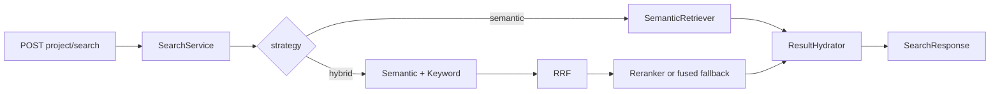
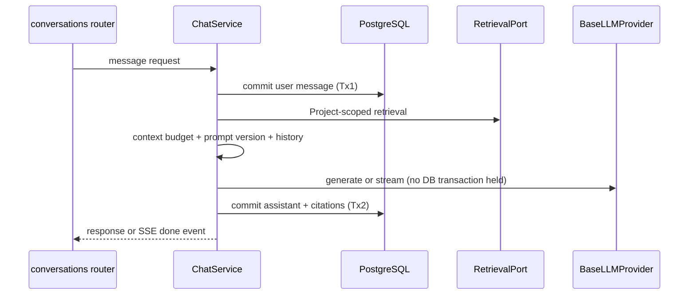

# RAG Runtime Flows and Ownership

This is the code-derived map of the supported ingestion, retrieval, and chat
paths after the durable-jobs vertical slice. Binding layer rules remain in
[module-architecture.md](./module-architecture.md).

## Scope and isolation

All business routes are under `/api/v1`. Organization API-key authentication is
applied by the business router, and every nested Project route runs
`ensure_project_accessible` before its handler. Services therefore receive an
already-authorized `project_id`; repositories still fail closed by adding that
ID to every Project-owned query. Worker payloads also carry `project_id`, and
worker repositories use the same scoped bases.

The router dependency owns access checks. The former service callback for
re-checking a Project was removed because every live caller supplied a no-op;
it did not provide a second security boundary.

Project reads and nested corpus routes use `ensure_project_accessible`, which
hides deleted Projects. Project update/status/delete routes use
`ensure_project_owned`, which still verifies Organization ownership but includes
deleted rows so the service can return stable conflict and idempotent lifecycle
semantics.

## Upload through ready

### Upload and dispatch

| Concern | Owner | Verified behavior |
| --- | --- | --- |
| HTTP streaming | `api/v1/routes/documents_router.py` | Reads `UploadFile` in bounded chunks and builds `DocumentIngestInput`. |
| Hash, duplicate detection, storage, lifecycle | `modules/knowledge/services/document_service.py` | Spools while hashing, enforces size, writes raw bytes, and stages the Document plus durable processing job. |
| Storage selection | `dependencies/knowledge.py` → storage factory | Deployment configuration chooses local or MinIO behind `BaseStorageProvider`. |
| Durable submission | `modules/jobs/services/job_service.py` | Commits configuration snapshot, idempotent JobRun, and outbox intent in the caller transaction. |
| Executor selection | `dependencies/knowledge.py` → job queue factory | Taskiq is the normal transport; inline is a test/development executor. |

If raw storage fails, the database transaction is rolled back and the API
returns `storage_unavailable`. The Document, JobRun, immutable normalized
configuration snapshot, and outbox intent commit together. Redis failure after
that commit leaves the outbox pending; the lifespan dispatcher retries it. The
response keeps the existing Document contract and adds `job_id`.

### Parsing, OCR fallback, and chunking

`worker/handlers/document.py` delegates to `worker/job_runtime.py`. The runtime
acquires the persisted lease, restores the job's secret-free configuration
snapshot over live credentials, heartbeats in an isolated session, and then
runs `DocumentProcessingWorkflow`. Duplicate deliveries that cannot acquire the
lease are ignored; Document status is not an execution admission gate.

The workflow records `parsing`, reads raw bytes, and delegates file selection to
`CompositeDocumentParserProvider`. PDFs use `PdfExtractionWorkflow`: PyMuPDF
extracts all pages, PDFium retries degraded pages, and the configured
`OCRProvider` is tried only for pages still below the quality threshold. OCR is
accepted only when it improves the best parser candidate. Plain text, DOCX, and
images use their registered parser implementations.

Accepted text and a versioned JSON provenance sidecar are stored through
`BaseStorageProvider`. `ChunkingService` selects the snapshotted strategy and
replaces the document's chunks in one transaction. Expected Document version
and a transaction advisory lock fence stale/parallel execution. Classified
transient failures schedule a durable retry; terminal failures retain safe
structured job details and a sanitized Document message.

### Embedding and indexing

When `auto_embed` is enabled, successful processing atomically stages the
idempotent `document.embed` child job with the same configuration snapshot. The embed worker runs
`EmbeddingWorkflow`, which loads Project-scoped chunks, replaces only the
configured provider/model/embedding-set rows, batches calls through
`BaseEmbeddingProvider`, and marks the document `embedded`.

When `auto_index` is enabled, successful embedding stages `document.index`, which validates the native pgvector
rows, rebuilds PostgreSQL keyword rows and BM25 statistics, and marks the
document `ready`. `composition/retrieval.py` is the single constructor for this
service across API, worker, CLI, and integration-test execution, so one Settings
snapshot controls queue, embedder, batch size, metadata keys, and index version.

Embedding and indexing use the same expected-version/advisory-lock fence and
transactional replace semantics. A crash after output commit but before job
success can replay without appending duplicate vectors, keyword rows, or BM25
statistics; stale worker terminal writes are rejected by lease ownership.

## Job inspection and recovery

Project-scoped list/detail/retry endpoints expose execution state separately
from Document lifecycle. Detail includes attempts, lease/heartbeat, stage,
progress, structured failure, payload, and the secret-free configuration hash
and snapshot. Explicit retry is limited to failed jobs and creates a new linked
run; automatic transient and expired-lease recovery reuses the same run until
its attempt budget is exhausted.

## Retrieval

`SearchService` resolves request overrides against `RetrievalConfig` and builds
a `RetrievalContext`. Semantic SQL lives only in
`ChunkEmbeddingRepository`; keyword SQL and BM25 persistence live in retrieval
repositories/workflows. Both paths require matching `project_id`, active
`embedding_set_version`, ready/non-deleted documents, and allowlisted metadata
filters. Hybrid retrieval runs semantic and keyword candidates concurrently,
fuses them with RRF, optionally reranks through `BaseRerankerProvider`, and
falls back to fused order when reranking is unavailable. `ResultHydrator` is the
single ORM-to-response hydration point.

## Chat

`dependencies/conversations.py` adapts `SearchService` to `RetrievalPort` and
injects the conversation-aware LLM resolver. `ChatService` depends only on the
retrieval and LLM contracts. `ContextBuilder` deduplicates and trims ranked
chunks; `PromptBuilder` formats the versioned prompt and bounded history.
`max_history_messages=0` means no prior messages.

Provider failures become the stable `llm_provider_unavailable` application
error. Streaming uses the same service mapping and emits a sanitized SSE error;
client cancellation leaves the already-committed user message but does not
persist a partial assistant message.

## Cross-cutting owners after alignment

| Concern | Single owner |
| --- | --- |
| Success/error envelope schemas | `core/http/envelopes.py` |
| Global HTTP exception mapping | `core/exception_handlers.py` |
| Pagination DTOs | `platform/http/pagination.py` |
| Project-owned lifecycle queries | `platform/persistence/project_scoped_repository.py` |
| Service lifecycle operations | `platform/domain/lifecycle_service.py` |
| OCR language normalization | `platform/domain/ocr_language.py` |
| Retrieval service construction | `composition/retrieval.py` |
| Durable job/outbox construction and recovery | `composition/jobs.py` |
| Lease, heartbeat, configuration restore, failure transition | `worker/job_runtime.py` |
| Provider selection | `platform/providers/implementations/*_factory.py`, called by composition layers |
| Worker entry/session ownership | `worker/handlers/` |

## Verified architecture alignment and durable-job slice

- Removed the parallel `platform/http/envelopes.py` re-export; live imports now
  point to the core owner used by exception handling.
- Removed empty root `app/workflows` and `app/utils` packages; workflows remain
  inside the modules that own them.
- Removed the unused `HybridRetriever.from_context` constructor.
- Removed the service-level Project guard callback after tracing every runtime
  caller to a no-op; API authorization and repository scoping remain intact.
- Moved provider/config construction out of `IndexingService` and the default
  LLM factory call out of `ChatService` into composition.
- Reconciled ORM metadata with the existing migration schema: Project scoping
  no longer implies redundant single-column indexes, while intentional
  Organization indexes and database defaults are represented in the models.
- Added Project-scoped persisted jobs, immutable configuration snapshots,
  transactional dispatch intents, lease/heartbeat recovery, replay-safe stage
  writes, and product job inspection/retry APIs.

## Intentional non-goals

No cancellation, webhooks, UI, billing, new queue system, customer
authorization model, provider registry, or later-phase index lifecycle is
introduced here.
