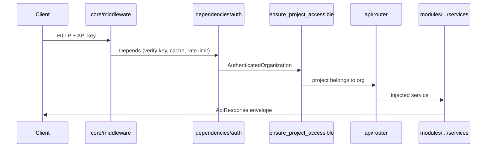
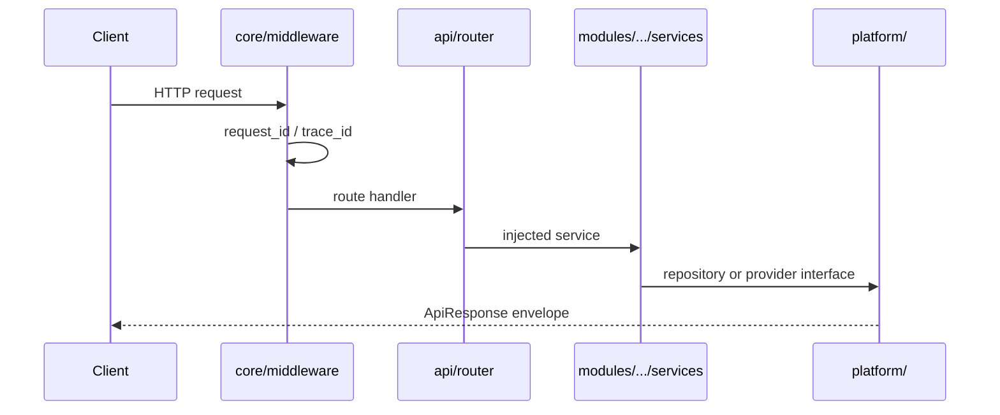

# System Architecture Guide

Overview of the AI Platform Engine (APE) foundation. For **canonical** layout
and dependency rules, see **[Module Architecture](./module-architecture.md)**.

Binding rules: `.cursor/rules/architecture.mdc`, `.cursor/rules/project-context.mdc`.

---

## Documentation index

| Document | Topic |
| -------- | ----- |
| **[Module architecture](./module-architecture.md)** | Canonical repo layout, dependency rules, composition root |
| [Domain ownership](./domain-ownership.md) | Project data scope + Organization auth scope |
| [Organization API key auth (ADR-012)](./adr/012-organization-api-key-auth.md) | M2M credentials, Depends-only auth, cache, rate limits |
| [Provider architecture](./provider-architecture.md) | Interfaces, SDK isolation, error taxonomy |
| [Configuration architecture](./configuration-architecture.md) | Deployment / platform / project config |
| [Background processing](./background-processing.md) | Jobs, queue, worker boundaries |
| [Deployment architecture](./deployment-architecture.md) | Local vs production topology |
| [ADRs](./adr/README.md) | Architecture decision records |

---

## High-level topology

```text
Business Application
        │
   REST / API
        ▼
┌───────────────────────────────────────────────────┐
│  api/  →  modules/<feature>/services/             │
│              ↓                                    │
│  platform/ (persistence, providers, jobs, db)     │
│  core/ (config, logging, exceptions)              │
└───────────────────────────────────────────────────┘
        │         │         │         │
        ▼         ▼         ▼         ▼
   PostgreSQL   Redis    Qdrant    MinIO
```

**Project** is the isolation boundary for business data (`project_id`). **Organization** is the auth / tenant boundary when `APE_AUTH__ENABLED=true` (ADR-012).

---

## Authenticated request lifecycle

Business routes (`/api/v1/projects/**` and nested modules) depend on `require_organization_api_key` before handlers run. Middleware assigns correlation IDs only — it does not parse API keys.



Admin routes (`/api/v1/organizations/**`) use `require_admin_api_key` instead. Public: `GET /health`, `GET /ready`.

Detail: [organization-api-key-auth-journey.md](../learning/organization-api-key-auth-journey.md).

---

## Request lifecycle (unauthenticated / health)



1. **Middleware** (`core/middleware.py`) — correlation IDs, access logs
2. **Router** (`api/v1/routes/`) — validation, DI, `ApiResponse`
3. **Service** (`modules/<f>/services/`) — orchestration, transactions
4. **Platform** — persistence, provider interfaces, job enqueue

Errors → `ErrorResponse` via `core/exception_handlers.py`.

---

## Application startup

`main.py` lifespan creates `Database` plus `RedisConnectivity` and
`QdrantConnectivity` (`platform/infra/connectivity/`), probes dependencies
(best-effort), disposes on shutdown.

Deployment-level health: `platform/system/health_service.py` + `api/health.py`.

---

## Adding a feature module

See `backend/app/modules/README.md` and `modules/_template/README.md`.

1. Create `modules/<name>/` with services, repositories, schemas, models
2. Add router in `api/v1/routes/` and register on `api/v1/router.py`
3. Register models in `composition/orm_registry.py`
4. Alembic migration + `docs/features/<name>.md` + tests

---

## Learning docs

Hands-on guides: `docs/learning/` (configuration, logging, database, Docker, testing).
