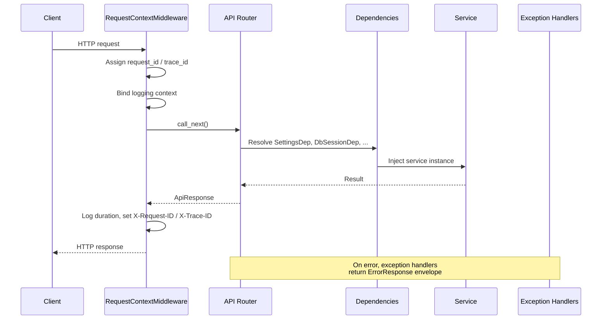
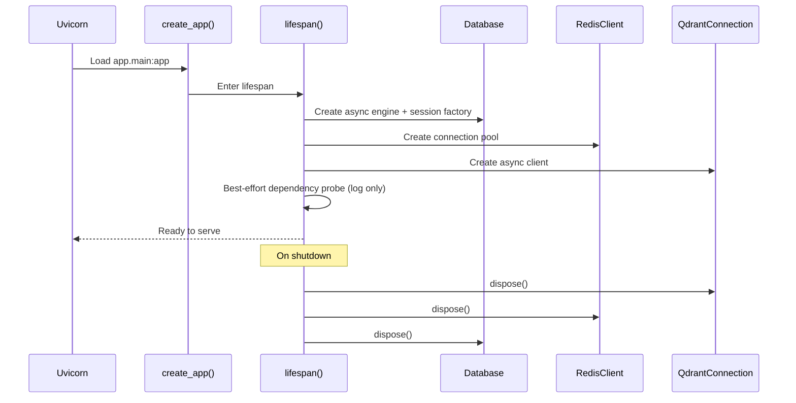

# System Architecture Guide

This document describes **how the AI Platform Engine (APE) is structured** at
the foundation level: layers, request flow, cross-cutting concerns, and where
future features plug in.

Binding rules live in `.cursor/rules/architecture.mdc` (engineering standards)
and `.cursor/rules/project-context.mdc` (product vision and scope). This guide
elaborates on those rules with diagrams and concrete file references.

---

## 1. High-level topology

APE runs as a self-hosted microservice. A business application talks to it over
REST; the platform owns all AI infrastructure internally.

```text
Business Application
        │
   REST / API
        │
        ▼
┌───────────────────────────────────────────────────┐
│              AI Platform Engine (APE)             │
│                                                   │
│  ┌─────────┐  ┌──────────┐  ┌─────────────────┐  │
│  │ Router  │→ │ Service  │→ │ Repo / Provider │  │
│  └─────────┘  └──────────┘  └─────────────────┘  │
│                                                   │
│  Cross-cutting: config, logging, errors, DI       │
└───────────────────────────────────────────────────┘
        │         │         │         │
        ▼         ▼         ▼         ▼
   PostgreSQL   Redis    Qdrant    MinIO
```

Within a deployment, **Project** is the isolation boundary. Every future API
call, query, job, and artifact will be scoped by `project_id`.

---

## 2. Layered backend architecture

```text
                 HTTP Request
                      │
                      ▼
┌─────────────────────────────────────────────────────┐
│  Middleware (RequestContext, CORS)                  │
└─────────────────────────────────────────────────────┘
                      │
                      ▼
┌─────────────────────────────────────────────────────┐
│  Router Layer (api/)                                │
│  • Pydantic validation                              │
│  • Dependency injection                             │
│  • ApiResponse serialization                        │
│  • NO business logic, DB queries, or AI calls       │
└─────────────────────────────────────────────────────┘
                      │
                      ▼
┌─────────────────────────────────────────────────────┐
│  Service Layer (services/)                          │
│  • Business orchestration                           │
│  • Transaction control (commit / rollback)          │
│  • Coordinates repositories + providers             │
└─────────────────────────────────────────────────────┘
             │                    │
             ▼                    ▼
┌────────────────────┐  ┌─────────────────────────────┐
│ Repository Layer   │  │ Provider Layer              │
│ (repositories/)    │  │ (providers/)                │
│ • PostgreSQL CRUD  │  │ • LLM, Vector Store, Storage│
│ • project_id scope │  │ • OCR, Connectors, etc.     │
│ • NO AI / vector   │  │ • Vendor SDKs stay here     │
└────────────────────┘  └─────────────────────────────┘
```

### Layer rules (summary)

| Layer | May do | Must not do |
| ----- | ------ | ----------- |
| Router | Validate, serialize, inject deps, enforce `project_id` | Business logic, DB, AI |
| Service | Orchestrate, control transactions, call repos/providers | Direct vendor SDK usage |
| Repository | CRUD, entity mapping, `project_id` filtering | LLM calls, vector search |
| Provider | Translate domain models ↔ vendor SDKs | Leak SDK types to services |

---

## 3. Request lifecycle

Every HTTP request passes through the same pipeline before it reaches a handler.



### Step-by-step

1. **Middleware** (`app/core/middleware.py`) — generates or honors inbound
   `X-Request-ID` and `X-Trace-ID`, binds them to structlog context, emits
   structured access logs, echoes IDs on the response.

2. **Router** (`app/api/`) — FastAPI validates the request against Pydantic
   schemas and resolves dependencies via `Depends()`.

3. **Dependencies** (`app/dependencies/common.py`) — expose settings, DB
   sessions, Redis, Qdrant, and services from `app.state` (populated at startup).

4. **Service** (`app/services/`) — executes business logic. Owns commits.

5. **Response** — success payloads wrap in `ApiResponse[T]`; failures funnel
   through global handlers into `ErrorResponse` with `code`, `message`,
   `trace_id`, and optional `details`.

---

## 4. Application startup and shutdown

Infrastructure clients are created once per process via the FastAPI **lifespan**
context manager, not per request.



Key files:

- `backend/app/main.py` — `create_app()`, `lifespan()`, `_probe_dependencies()`
- `backend/app/db/session.py` — `Database` (async engine + session factory)
- `backend/app/db/redis.py` — `RedisClient`
- `backend/app/db/qdrant.py` — `QdrantConnection` (connectivity only; vector
  operations will go through `BaseVectorStoreProvider` later)

Startup probes are **best-effort**: failures are logged but do not abort boot.
Degraded state is reported via `GET /ready`.

---

## 5. API surface (foundation)

| Route | Versioned | Purpose |
| ----- | --------- | ------- |
| `GET /health` | No | Liveness — process is running |
| `GET /ready` | No | Readiness — probes PostgreSQL, Redis, Qdrant, MinIO |
| `/api/v1/*` | Yes | Future business endpoints (empty router today) |
| `/docs`, `/redoc` | No | OpenAPI UI (disabled in production) |

System probes stay **unversioned** so load balancers and orchestrators get a
stable contract across API versions.

---

## 6. Standard response contracts

### Success — `ApiResponse[T]`

```json
{
  "success": true,
  "message": null,
  "data": { },
  "meta": {
    "request_id": "abc123",
    "trace_id": "def456"
  }
}
```

### Failure — `ErrorResponse`

```json
{
  "success": false,
  "error": {
    "code": "validation_error",
    "message": "The request failed validation.",
    "trace_id": "def456",
    "details": [
      { "field": "name", "message": "Field required", "type": "missing" }
    ]
  }
}
```

Defined in `backend/app/schemas/common.py`. Handlers in
`backend/app/core/exception_handlers.py` ensure every error path returns this
shape. Stack traces never leak to clients.

---

## 7. Configuration flow

All runtime settings resolve from the environment (optional `.env` file) through
a single `Settings` object.

```text
Environment variables (APE_*)
        │
        ▼
  Pydantic Settings (get_settings)
        │
        ├── app / server / logging / cors
        ├── database / redis / qdrant / minio
        │
        ▼
  Injected via Depends() or read at startup
```

Precedence (future): `defaults → environment → database → per-Project overrides`.

See `docs/learning/configuration-system.md` for details.

---

## 8. Database architecture

```text
Alembic (migrations)
        │
        ▼
Declarative Base (db/base.py)  ←──  ORM models (models/)
        │
        ▼
AsyncEngine + session factory (db/session.py)
        │
        ▼
BaseRepository (repositories/)  ←──  Service layer commits transactions
```

- **Migrations** — all schema changes via Alembic; never auto-create tables in
  production.
- **Mixins** — `UUIDPrimaryKeyMixin`, `TimestampMixin`, `ProjectScopedMixin`
  in `models/base.py` (building blocks, not business entities).
- **Sessions** — request-scoped via `get_db_session`; service layer owns
  `commit()` / `rollback()`.

See `docs/learning/database-and-migrations.md`.

---

## 9. Provider abstraction (readiness)

The `providers/` package is intentionally empty. It is the designated home for
vendor implementations behind abstract interfaces:

```text
Service
   │
   ▼
Domain model (VectorChunk, SearchFilter, ...)
   │
   ▼
BaseVectorStoreProvider  (interface)
   │
   ▼
QdrantProvider  (implementation — vendor SDK)
```

`QdrantConnection` in `db/qdrant.py` manages **connectivity only** (health
checks). Actual vector operations will not call the Qdrant SDK from services.

---

## 10. Where future features plug in

When implementing a new capability (e.g. Projects):

1. **ORM model** — `models/project.py` (compose mixins), import in `models/__init__.py`.
2. **Migration** — `alembic revision --autogenerate -m "add projects"`.
3. **Repository** — `repositories/project_repository.py` (extends `BaseRepository`, filters by `project_id`).
4. **Service** — `services/project_service.py` (orchestration, transactions).
5. **Schemas** — `schemas/project.py` (request/response Pydantic models).
6. **Router** — `api/v1/routes/projects.py`, register on `api_v1_router`.
7. **Docs** — `docs/features/projects.md`.
8. **Tests** — `tests/unit/`, `tests/integration/`.

---

## 11. Related documentation

| Document | Topic |
| -------- | ----- |
| `docs/learning/foundation-sprint-overview.md` | What the foundation sprint delivered |
| `docs/learning/application-factory-and-fastapi.md` | `create_app`, lifespan, DI |
| `docs/learning/configuration-system.md` | Pydantic Settings, env vars |
| `docs/learning/structured-logging.md` | structlog, correlation IDs |
| `docs/learning/database-and-migrations.md` | SQLAlchemy async, Alembic |
| `docs/learning/docker-local-development.md` | Compose stack, health checks |
| `docs/learning/testing-strategy.md` | Pytest layout, fixtures, markers |
