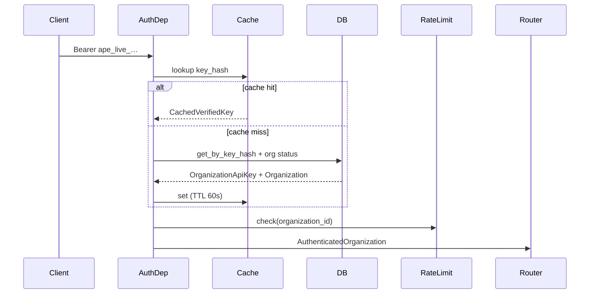

# Organization & API Key Authentication

Tenant boundary and machine-to-machine authentication for the public REST API.

## Purpose

**Organization** is the auth/tenant boundary. **Project** remains the data isolation boundary. Organization API keys authenticate business API calls; a deployment admin key bootstraps Organization and key provisioning.

## Architecture

```text
api/v1/routes/organizations_router.py     ← admin key (Depends)
api/v1/router.py                          ← business routers wrapped with org key Depends
        │
        ▼
dependencies/auth.py                      ← cache → DB verify → rate limit
        │
        ├── platform/infra/auth/          ← VerifiedKeyCache (Redis / memory)
        ├── platform/infra/rate_limit/    ← RedisRateLimiter
        └── modules/organizations/        ← CRUD + key lifecycle
        │
        ▼
app/models/organization.py
app/models/organization_api_key.py
projects.organization_id FK
```

Auth runs **only** in FastAPI `Depends` — middleware enriches logging from `request.state.authenticated_organization` after auth.

## Data flow (authenticated request)



## Configuration

| Variable | Default | Description |
| -------- | ------- | ----------- |
| `APE_AUTH__ENABLED` | `false` | Master on/off (dev/tests) |
| `APE_AUTH__ADMIN_API_KEY` | — | Bootstrap admin key |
| `APE_AUTH__KEY_PEPPER` | — | HMAC pepper (≥32 bytes random) |
| `APE_AUTH__VERIFY_CACHE_ENABLED` | `true` | Short-lived positive cache |
| `APE_AUTH__VERIFY_CACHE_TTL_SECONDS` | `60` | Cache TTL |
| `APE_AUTH__VERIFY_CACHE_BACKEND` | `redis` | `redis` or `memory` |
| `APE_AUTH__RATE_LIMIT_ENABLED` | `true` | Org-scoped rate limit |
| `APE_AUTH__RATE_LIMIT_REQUESTS` | `1000` | Max requests per window |
| `APE_AUTH__RATE_LIMIT_WINDOW_SECONDS` | `60` | Window size |
| `APE_AUTH__RATE_LIMIT_FAIL_OPEN` | `false` | Allow requests if Redis unavailable |

## API surfaces

- **Admin:** `/api/v1/organizations/**` — requires `APE_AUTH__ADMIN_API_KEY`
- **Business:** `/api/v1/projects/**` and nested routes — requires Organization API key
- **Public:** `GET /health`, `GET /ready`

See [organization_api.md](../api/organization_api.md).

## Key lifecycle

- **Create:** `POST .../api-keys` — returns full secret once
- **Rotate:** `POST .../api-keys/{id}/rotate?revoke_old=false` — new key; old remains valid
- **Revoke:** `DELETE .../api-keys/{id}` — idempotent; invalidates cache entry

## Project scoping

- `GET /projects` filters by authenticated `organization_id`
- `POST /projects` sets `organization_id` from auth context
- Nested routes use `ensure_project_accessible` (single query: `project_id` + `organization_id`)

## Dependencies

- PostgreSQL (`organizations`, `organization_api_keys`, `projects.organization_id`)
- Redis (verified-key cache + rate limiting when enabled)
- Alembic migration `0014_organizations_auth`

## Testing

- Unit: `tests/unit/platform/test_api_key_crypto.py`, `test_verified_key_cache.py`, `tests/unit/modules/organizations/`
- Integration: `tests/integration/test_auth_api.py` (requires PostgreSQL)

## Production considerations

- Set strong random `APE_AUTH__KEY_PEPPER` and `APE_AUTH__ADMIN_API_KEY`; never commit to VCS.
- Use Redis cache backend with multiple API workers.
- Set `APE_AUTH__RATE_LIMIT_FAIL_OPEN=false` in production.
- Rotate admin and organization keys through the API; revoke compromised keys immediately.
