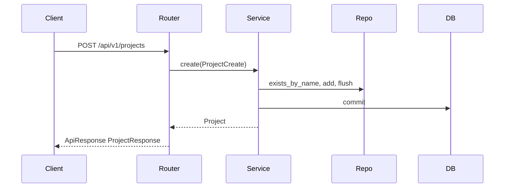

# Project Management

Central aggregate root for APE — the isolation boundary for all business data.

## Purpose

Every deployment hosts one or more **Projects**. Documents, connectors, prompts,
chats, and AI configuration will be scoped by `project_id`. This module introduces
the Project entity and its lifecycle APIs so downstream features have a real
isolation anchor.

## Architecture

```text
api/v1/routes/projects_router.py
        │
        ▼
dependencies/projects.py  →  ProjectService
        │
        ▼
ProjectRepository (AsyncRepository)
        │
        ▼
app/models/project.py  →  projects table (PostgreSQL)
```

- **ORM:** `Project` lives in `app/models/` (shared across modules).
- **Aggregate root:** extends `AsyncRepository`; project-owned entities use `ProjectScopedRepository`.
- **Shared primitives:** `LifecycleListFilters`, `ListParams`, `mark_soft_deleted`, `build_lifecycle_filters`.

## Data flow



## API

| Method | Path | Description |
| ------ | ---- | ----------- |
| `POST` | `/api/v1/projects` | Create (always `is_active=true`) |
| `GET` | `/api/v1/projects` | Paginated list |
| `GET` | `/api/v1/projects/{id}` | Get by id |
| `PATCH` | `/api/v1/projects/{id}` | Update name/description |
| `PATCH` | `/api/v1/projects/{id}/status` | Toggle `is_active` (no body; flips current value) |
| `DELETE` | `/api/v1/projects/{id}` | Soft delete |

**Soft delete:** `deleted_at` is set (source of truth); `is_active` becomes `false`.
`deleted_by` is nullable until the auth module ships.

**List filters:** `limit`, `offset`, `include_deleted`, `is_active`.

## Configuration

No module-specific environment variables. Uses standard `APE_DATABASE__*` settings.

## Dependencies

- PostgreSQL (async SQLAlchemy)
- Alembic migration `0002_add_projects`

## Design decisions

| Decision | Rationale |
| -------- | --------- |
| `deleted_at` not `is_deleted` | Single source of truth; avoids redundant boolean |
| Partial unique index on `name` | Uniqueness among non-deleted rows only |
| `AsyncRepository` base | Reusable list/get/soft-delete filters for lifecycle entities |
| Models in `app/models/` | Shared schema for joins and Alembic discovery |
| Separate status endpoint | Clear operational toggle vs metadata patch |

## Production considerations

- Name collisions return `409 project_name_conflict`.
- Mutations on soft-deleted projects return `409 project_deleted`.
- Hard delete and cross-store cascade deferred (ADR-002).
- Auth/RBAC not enforced in this slice; `deleted_by` remains `null`.

## Testing strategy

- **Unit:** `tests/unit/modules/projects/test_project_service.py` (mocked repo/session)
- **Integration:** `tests/integration/test_projects_api.py` (requires PostgreSQL; skips if unavailable)

## Future improvements

- Auth integration and `deleted_by` population
- Restore / undelete endpoint
- Hard delete with coordinated cascade (relational/semantic artifacts and object storage)
- Per-project AI configuration storage
- Organization grouping (`organization_id`)
