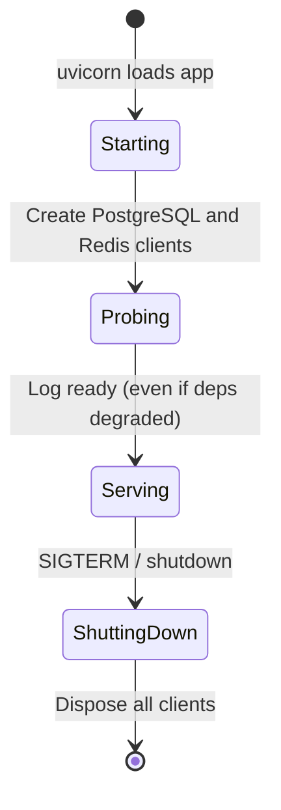

# Application Factory and FastAPI Foundation

This document explains the **application factory pattern**, FastAPI lifespan
events, dependency injection, and API versioning as implemented in the
foundation sprint.

---

## Why an application factory?

Instead of configuring FastAPI at import time in a single global block, APE uses
`create_app()` in `backend/app/main.py`. Benefits:

| Benefit | Explanation |
| ------- | ----------- |
| Testability | Tests call `create_app(settings)` with overrides without touching production config |
| Clarity | All wiring (middleware, handlers, routers) lives in one function |
| Multiple instances | Future workers or test fixtures can spin isolated apps |
| ASGI compatibility | Module-level `app = create_app()` remains the uvicorn entrypoint |

```python
# Production / development
uvicorn app.main:app --reload

# Tests
app = create_app()  # or with injected Settings
```

---

## What `create_app()` wires

```text
create_app(settings)
    │
    ├── configure_logging(settings)
    ├── FastAPI(title, version, lifespan, docs toggles)
    ├── app.state.settings = settings
    ├── CORSMiddleware
    ├── RequestContextMiddleware
    ├── register_exception_handlers(app)
    ├── include_router(health_router)          # unversioned
    └── include_router(api_v1_router, prefix)  # /api/v1
```

Production disables `/docs` and `/redoc` when `APE_APP__ENV=production`.

---

## Lifespan: startup and shutdown

FastAPI's `lifespan` context manager owns long-lived infrastructure:



**Startup** (`lifespan` enter):

1. Instantiate `Database` and `RedisConnectivity` on `app.state`.
2. Verify pgvector preflight; log best-effort warnings for other connectivity failures.
3. Log `application_started`.

**Shutdown** (`lifespan` exit):

1. Dispose Redis → Database (reverse order).
2. Log `application_stopped`.

This pattern ensures connection pools are not created per request and are cleaned
up gracefully.

---

## Dependency injection

FastAPI's `Depends()` resolves dependencies per request. APE centralizes wiring
in `backend/app/dependencies/common.py`:

```text
Request
   │
   ▼
get_settings()          → Settings (cached, from env)
get_database(request)   → Database (from app.state)
get_db_session(request) → AsyncSession (request-scoped)
get_health_service(...) → HealthService (composed)
```

Typed aliases simplify route signatures:

```python
async def health(service: HealthServiceDep) -> ApiResponse[LivenessStatus]:
    return ApiResponse.ok(service.liveness())
```

**Rule:** Only `api/` and `dependencies/` use these factories. Feature modules
must not import `app.dependencies` — route wiring lives in `api/v1/routes/`.
Routers inject services and schemas only; they never construct repositories or
open DB connections directly.

---

## API versioning

| Path prefix | Router | Purpose |
| ----------- | ------ | ------- |
| `/` | `api/health.py` | System probes — stable across versions |
| `/api/v1` | `api/v1/router.py` | All business endpoints |

Breaking API changes require `/api/v2`, never silent changes to `/api/v1`.

The v1 router is empty today. Future feature routers register like:

```python
# api/v1/router.py (future)
from app.api.v1.routes.projects import router as projects_router
api_v1_router.include_router(projects_router)
```

---

## Global exception handling

All errors — domain (`APEError`), validation, HTTP, or unexpected — return the
same `ErrorResponse` envelope. Handlers are registered once in
`register_exception_handlers(app)`.

Exception hierarchy (`core/exceptions.py`):

```text
APEError (base)
├── BadRequestError (400)
├── UnauthorizedError (401)
├── ForbiddenError (403)
├── NotFoundError (404)
├── ConflictError (409)
├── ValidationError (422)
└── ServiceUnavailableError (503)
```

Services raise `APEError` subclasses; routers do not catch them manually.

---

## Standard response envelope

Routers declare `response_model=ApiResponse[SomeSchema]`. FastAPI validates the
outbound payload against Pydantic, catching serialization bugs early.

---

## Common mistakes

| Mistake | Correct approach |
| ------- | ---------------- |
| Creating DB engine inside a route | Use lifespan + `get_db_session` |
| Catching exceptions in every router | Rely on global handlers |
| Putting business logic in routers | Delegate to services |
| Hardcoding `/api/v1` in routes | Use `settings.app.api_v1_prefix` |
| Skipping `create_app()` in tests | Use `create_app()` + `LifespanManager` |

---

## Key files

| File | Responsibility |
| ---- | -------------- |
| `backend/app/main.py` | Factory, lifespan, router registration |
| `backend/app/dependencies/common.py` | DI functions and typed aliases |
| `backend/app/api/health.py` | System health routes |
| `backend/app/api/v1/router.py` | Versioned API aggregator |
| `backend/app/core/exception_handlers.py` | Global error envelope |
| `backend/app/platform/http/envelopes.py` | `ApiResponse`, `ErrorResponse` |
