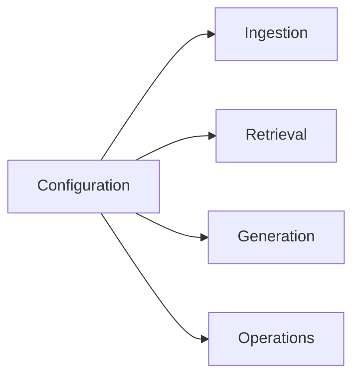

# Configuration: The Control Panel for the Journey

> **Beginner question:** why are there so many environment variables, and how do I know which one to change?

Configuration is the engine’s control panel. It lets the same code run locally, in Docker, with a hosted provider, or with private infrastructure. The important skill is not memorising variable names; it is understanding which stage each setting changes.

## The basic rule

APE reads nested settings through Pydantic Settings:

```text
APE_<SECTION>__<FIELD>
```

Examples:

```text
APE_APP__ENV=development
APE_DATABASE__HOST=localhost
APE_RETRIEVAL__STRATEGY=hybrid
APE_CHAT__CONTEXT_CHAR_BUDGET=12000
```

The double underscore represents nesting. `APE_RETRIEVAL__HNSW_EF_SEARCH` means `settings.retrieval.hnsw_ef_search`.

## Where a value comes from

The foundation currently implements defaults plus environment variables:

```text
code defaults -> environment/.env -> Settings object -> dependencies/services/providers
```

The architecture may later add database or project overrides. Do not assume those layers exist just because the long-term design mentions them.

## Find the stage before changing the knob



### Ingestion settings

| Setting area | Changes | First question to ask |
| --- | --- | --- |
| Storage backend/root | Where raw and parsed artifacts live | Is the file present and readable by the worker? |
| Maximum upload bytes | Which files are accepted | Are failures clear and intentional? |
| Parser/OCR backend | How text is extracted | Is the source digital text or pixels? |
| OCR language | Which recognition model is used | Does the provider support the script? |
| Chunking strategy/limits | How text becomes retrieval units | Did the correct heading and exception stay together? |

### Retrieval settings

| Setting area | Changes | First question to ask |
| --- | --- | --- |
| Embedding backend/model | Meaning representation | Are chunks and questions in the same vector space? |
| Embedding dimensions | Vector schema/storage compatibility | Does changing this require migration and re-embedding? |
| Strategy | Semantic, keyword, or hybrid path | Is the failure conceptual or exact-token matching? |
| Candidate top-k | Evidence entering fusion/reranking | Is the right chunk present but ranked too low? |
| RRF settings | How semantic/keyword ranks combine | Which searcher is bringing the useful result? |
| Reranker | How the shortlist is reordered | Is a better second opinion worth the latency? |
| Metadata allowlist | Which filters become SQL predicates | Does a filter represent a real business boundary? |
| HNSW search effort | Recall/latency trade-off | Is approximate search missing filtered neighbors? |

### Generation settings

| Setting area | Changes | First question to ask |
| --- | --- | --- |
| LLM backend/model | Writing quality, cost, latency, language | Is retrieval correct before changing the model? |
| Temperature | Output variability | Does the task need repeatability? |
| Retrieval top-k | How much evidence is offered to chat | Is the answer incomplete or noisy? |
| Context chunk/character budget | Prompt size and cost | Is the smallest sufficient packet being sent? |
| History window | Conversational continuity | Is prior context useful or distracting? |
| System prompt version | Grounding and safety instructions | Can we reproduce the answer later? |

## A configuration example

```env
# Environment
APE_APP__ENV=development

# Storage
APE_STORAGE__BACKEND=minio
APE_MINIO__ENDPOINT=localhost:9000

# Embeddings: use a real provider for semantic experiments
APE_EMBEDDING__BACKEND=openai
APE_EMBEDDING__MODEL=text-embedding-3-small
APE_EMBEDDING__DIMENSIONS=1536

# Retrieval
APE_RETRIEVAL__STRATEGY=hybrid
APE_RETRIEVAL__SEMANTIC_CANDIDATE_TOP_K=50
APE_RETRIEVAL__KEYWORD_CANDIDATE_TOP_K=50
APE_RETRIEVAL__HNSW_EF_SEARCH=100

# Chat
APE_CHAT__RETRIEVAL_TOP_K=10
APE_CHAT__MAX_CONTEXT_CHUNKS=8
APE_CHAT__CONTEXT_CHAR_BUDGET=12000
APE_CHAT__MAX_HISTORY_MESSAGES=20
```

The exact supported fields live in `backend/app/core/config.py`. Treat `.env.example` as the starting template and `.env.docker` as the container wiring layer.

## Development defaults versus meaningful AI

`hash` embeddings are useful for deterministic tests. `echo` chat is useful for checking the request shape. Neither tells you whether semantic retrieval or answer quality is good.

Use this mental label:

```text
hash/echo = pipeline mechanics
real embedding/LLM = product behavior
```

Do not make product decisions from the first category.

## A hands-on experiment

Use one corpus and change only one setting:

1. `strategy=semantic`;
2. `strategy=hybrid`;
3. hybrid with a larger candidate pool.

Record the returned chunk IDs, source pages, latency, and answer. Then explain which stage changed and why.

## Configuration safety rules

- Keep secrets out of code and committed files.
- Do not change embedding dimensions without a migration/re-embedding plan.
- Pin provider/model configuration with an index snapshot.
- Use allowlisted metadata filters, not arbitrary SQL-shaped input.
- Treat production defaults as explicit, not “whatever the local demo used.”
- Prefer one supported deployment profile before exposing many combinations.

## Learning checkpoint

You understand configuration when you can look at a bad answer and say:

> “The evidence was missing, so I will inspect chunking, embeddings, and candidate depth before changing temperature.”

## Related

- [RAG from Zero](./rag-from-zero.md)
- [Embeddings Fundamentals](./embeddings-fundamentals.md)
- [Hybrid Retrieval Journey](./hybrid-retrieval-journey.md)
- [Docker Local Development](./docker-local-development.md)
