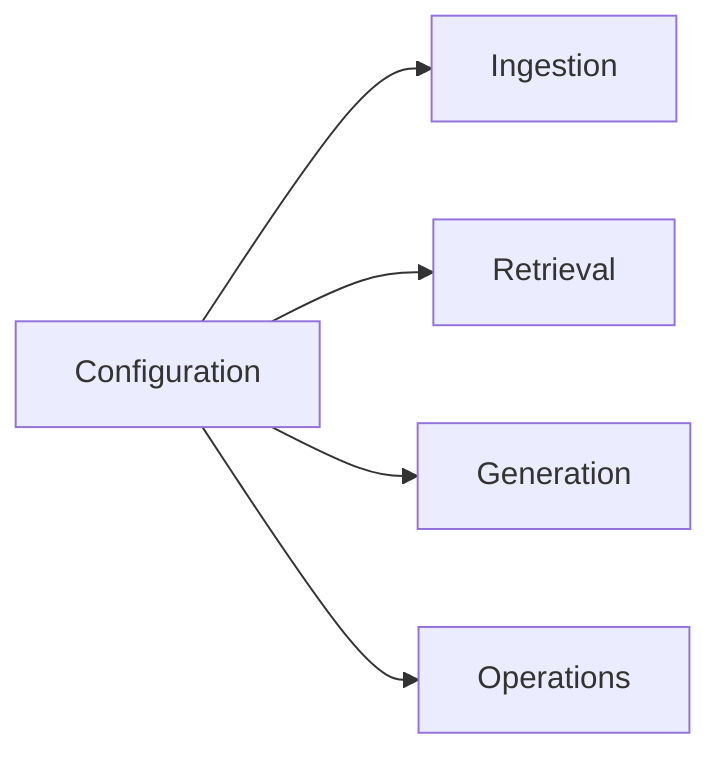

# Configuration: The Control Panel for the Journey

> **Beginner question:** why are there so many environment variables, and how do I know which one to change?

Configuration is the engine’s control plane. It lets the same code run locally,
in Docker, with a hosted provider, or with private infrastructure. The important
skill is knowing who owns a value and when changing it takes effect.

## The basic rule

APE reads nested settings through Pydantic Settings:

```text
APE_<SECTION>__<FIELD>
```

Examples:

```text
APE_APP__ENV=development
APE_DATABASE__HOST=localhost
APE_RUNTIME__CAPABILITY_PROFILE_ID=development
APE_LLM__OPENAI_API_KEY=***
```

The double underscore represents nesting. `APE_RETRIEVAL__HNSW_EF_SEARCH` means `settings.retrieval.hnsw_ef_search`.

## Where a value comes from

The current architecture resolves several explicit layers:

```text
code invariants + immutable profiles
    -> deployment capability/provider settings
    -> immutable Project V2 revision
    -> pinned job/conversation/index snapshot
    -> bounded request scope/filter/pagination
```

Environment variables are primarily for infrastructure, secrets, endpoints, and
deployment capability. Normal response behavior and RAG execution belong to a
Project revision. Calibration and invariant switches are code-owned. Historical
V1 revisions remain readable but cannot be written through the normal API.

## Find the stage before changing the knob


```mermaid
flowchart LR
    C[Configuration] --> I[Ingestion]
    C --> R[Retrieval]
    C --> G[Generation]
    C --> O[Operations]
```

### Ingestion and index settings

| Setting area | Changes | First question to ask |
| --- | --- | --- |
| Storage backend/root | Where raw and parsed artifacts live | Is the file present and readable by the worker? |
| Maximum upload bytes | Which files are accepted | Are failures clear and intentional? |
| Parser/OCR backend | Deployment capability for extracting text | Is the source digital text or pixels? |
| OCR language | Which recognition model is used | Does the provider support the script? |
| Index Profile | Immutable parsing, OCR, chunking, embedding, and FTS identity | Does this require reprocess, re-embed, or rebuild? |

### Retrieval settings

| Setting area | Changes | First question to ask |
| --- | --- | --- |
| Embedding backend/model | Meaning representation | Are chunks and questions in the same vector space? |
| Embedding dimensions | Vector schema/storage compatibility | Does changing this require migration and re-embedding? |
| RAG Execution Profile | Exact code-owned query-time baseline; certification is measured separately | Is the right chunk present but ranked too low? |
| Project Custom execution | Complete persisted candidate/fusion/rerank/context bundle | Is the override necessary and reproducible? |
| Test Lab candidate | Ephemeral one-factor experiment | Did it clear the certification gates? |
| Metadata allowlist | Which filters become SQL predicates | Does a filter represent a real business boundary? |

### Generation settings

| Setting area | Changes | First question to ask |
| --- | --- | --- |
| Deployment generation allowlist | Which logical model IDs Projects may select | Is the provider/model combination supported? |
| Project behavior | Response mode, grounding assurance, instructions, translation | Is the desired behavior Project-specific? |
| Calibration Profile | Evidence thresholds tied to exact providers/models | Does the evidence method match the active stack? |
| Prompt/profile versions | Reproducible generation behavior | Can we reproduce the answer later? |

## A configuration example

```env
# Environment
APE_APP__ENV=development

# Storage
APE_STORAGE__BACKEND=minio
APE_MINIO__ENDPOINT=localhost:9000

# Provider capability and credentials
APE_EMBEDDING__BACKEND=openai
APE_EMBEDDING__MODEL=text-embedding-3-large
APE_EMBEDDING__OPENAI_API_KEY=***
APE_LLM__BACKEND=openai
APE_LLM__OPENAI_API_KEY=***
```

Normal tuning is profile-led. Set `APE_AI_POLICY__DEFAULT_RAG_PROFILE=standard`
for the deployment, then let a Project inherit it or select `standard`, `quality`,
`economy`, or `custom`. Presets always resolve from the current code-owned bundle;
only Custom stores a complete explicit execution bundle. Conversation and job snapshots
record the resolved profile hash and effective values automatically.

The exact supported fields live in `backend/app/core/config.py`. The complete
tabular map (meaning, options, env key, Project overlay) is
[Configuration Map](../configuration-map.md). Treat the root `.env.example` as
the starting template and ignored root `.env` as the Docker runtime
configuration file.

## Development defaults versus meaningful AI

`hash` embeddings are useful for deterministic tests. `echo` chat is useful for checking the request shape. Neither tells you whether semantic retrieval or answer quality is good.

Use this mental label:

```text
hash/echo = pipeline mechanics
real embedding/LLM = product behavior
```

Do not make product decisions from the first category.

## A hands-on experiment

Use Test Lab with one pinned corpus and change only one approved candidate axis:

1. record the active Project/profile/index identities;
2. run the baseline;
3. change one safe query-time execution leaf;
4. compare quality, refusal, citation, cost, and latency gates.

Record the returned chunk IDs, source pages, latency, and answer. Then explain which stage changed and why.

## Configuration safety rules

- Keep secrets out of code and committed files.
- Do not change embedding dimensions without a migration/re-embedding plan.
- Pin provider/model and profile hashes with job, conversation, and index snapshots.
- Use allowlisted metadata filters, not arbitrary SQL-shaped input.
- Treat certification as the evidence needed for a production recommendation; built-in profiles
  remain selectable during development.
- Prefer one supported deployment profile before exposing many combinations.

## Learning checkpoint

You understand configuration when you can look at a bad answer and say:

> “The evidence was missing, so I will inspect chunking, embeddings, and candidate depth before changing temperature.”

## Related

- [Configuration Map](../configuration-map.md) — every field, env key, and option
- [RAG from Zero](./rag-from-zero.md)
- [Embeddings Fundamentals](./embeddings-fundamentals.md)
- [Hybrid Retrieval Journey](./hybrid-retrieval-journey.md)
- [Docker Local Development](./docker-local-development.md)
