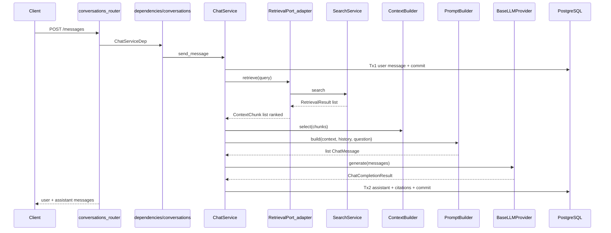

# Conversation RAG — End-to-End Codebase Journey

Start here for the **full chat picture**: how a user question becomes a grounded, cited answer, which files are involved, and why the architecture is split the way it is.

> **Reading order:** this page → [Provider integration](./conversation_provider_integration.md) → [LLM providers](./conversation_llm_providers.md) → [RAG prompting](./conversation_rag_prompting.md) → [Memory](./conversation_memory.md) → [SSE streaming](./conversation_sse_streaming.md)

---

## The 30-second story

1. Client creates a **conversation** (optional title; model config snapshotted on the row).
2. Client sends a **user message** → API persists it immediately (**Tx1 commit**) so the turn survives LLM failures.
3. `ChatService` retrieves ranked chunks via **`RetrievalPort`** (adapter over the configured retrieval strategy).
4. **`ContextBuilder`** dedupes and trims chunks to budget; **`PromptBuilder`** formats system + context + history + question.
5. **`BaseLLMProvider`** generates the answer (OpenAI, Gemini, Ollama, echo — same call shape for all).
6. **`build_citation_snapshots`** maps selected chunks to durable citation JSONB; assistant row persisted (**Tx2 commit**).
7. Optional: **SSE stream** returns token deltas, then a final `done` event with citations.

**Prerequisite:** documents at `status=ready` (retrieval pipeline complete). See [Retrieval feature](../features/retrieval_module.md).

---

## Big-picture diagram



---

## Glossary (plain language)

| Term | Meaning in APE |
| ---- | ---------------- |
| **RAG** | Retrieval-Augmented Generation — fetch relevant document snippets, then ask the LLM using that context |
| **Conversation** | A persisted chat session scoped to a Project |
| **Turn** | One user message + one assistant reply |
| **RetrievalPort** | A small interface so chat never imports retrieval module internals |
| **Context chunk** | One searchable text segment from a document, with score and metadata |
| **Citation snapshot** | Frozen copy of what the model saw (`chunk_hash`, excerpt) — survives re-indexing |
| **Tx1 / Tx2** | Two database commits per turn; user saved before slow LLM I/O |
| **Hybrid retrieval** | BM25 + vector candidates, RRF fusion, and reranking through the retrieval module |

---

## Architectural choices (why it looks like this)

### Module boundary: `RetrievalPort` not `SearchService`

`modules/conversations/` must not import `modules/retrieval/`. The composition layer (`dependencies/conversations.py`) adapts `SearchService` → `RetrievalPort`, keeping chat independent from retrieval internals.

### Split: ContextBuilder vs PromptBuilder vs citations

| Piece | Job |
| ----- | --- |
| **Retrieval** | Rank chunks using the configured strategy, with hybrid as the production path |
| **ContextBuilder** | Dedupe + char/chunk budgets only |
| **PromptBuilder** | Format messages for the LLM |
| **build_citation_snapshots** | Persistence shape for assistant row |

Selection and citation storage are separate concerns.

### Two transactions per turn

Holding a DB transaction open during a 2–20s LLM call ties up connections. Tx1 commits the user message; if the LLM fails, the user still sees their question in history.

### Provider agnostic LLM

`ChatService` calls `BaseLLMProvider.generate()` / `.stream()` only. Switching OpenAI → Gemini → Ollama is **configuration** (`APE_LLM__BACKEND`), not a code change in chat. See [Provider integration](./conversation_provider_integration.md).

### No `sequence` column on messages

Order by `created_at`, `id` — avoids `MAX(sequence)+1` locking on every insert.

---

## Status / lifecycle

| Event | DB effect |
| ----- | --------- |
| Create conversation | `title=null`, config snapshotted |
| Send message (Tx1) | `user` row, `last_message_at` updated |
| LLM success (Tx2) | `assistant` row + citations + metadata; auto-title if first answer |
| LLM failure after Tx1 | User row kept; no assistant row |
| Client disconnect (stream) | User row kept; assistant omitted if Tx2 did not run |

---

## Key files

| Layer | Path |
| ----- | ---- |
| Routes | `api/v1/routes/conversations_router.py` |
| DI + adapters | `dependencies/conversations.py` |
| Orchestration | `modules/conversations/services/chat_service.py` |
| CRUD | `modules/conversations/services/conversation_service.py` |
| Port DTO | `modules/conversations/ports.py` |
| Context / prompt | `context_builder.py`, `prompt_builder.py`, `prompts/registry.py` |
| Citations | `citation_snapshots.py` |
| LLM contract | `platform/providers/contracts/llm.py` |
| LLM factory | `platform/providers/implementations/llm_factory.py` |
| ORM | `models/conversation.py`, `models/message.py` |

---

## Configuration quick reference

```text
APE_LLM__BACKEND=echo|openai|openai_compatible|ollama|gemini
APE_LLM__MODEL=...
APE_CHAT__RETRIEVAL_TOP_K=10
APE_CHAT__MAX_CONTEXT_CHUNKS=8
APE_CHAT__CONTEXT_CHAR_BUDGET=12000
APE_CHAT__MAX_HISTORY_MESSAGES=20
```

---

## Related

- [Conversation module feature](../features/conversation_module.md)
- [Conversation API](../api/conversation_api.md)
- [ADR-008](../architecture/adr/008-chat-on-semantic-baseline.md)
