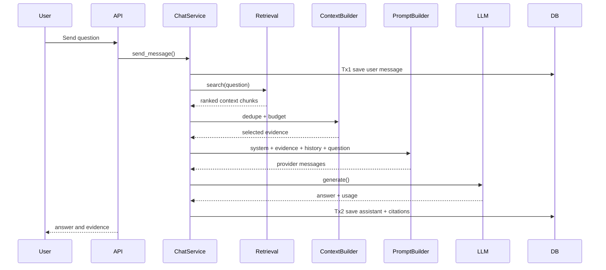

# Conversation RAG: From Question to Evidence-Backed Answer

> **The final scene:** the user asks a question, APE finds evidence, an LLM writes from that evidence, and the product receives an answer it can explain.

This chapter connects the retrieval story to the conversation story. Chat is not a separate magic feature. It is a carefully ordered composition of persistence, search, context selection, prompting, generation, and citation storage.

## The 30-second flow

```text
create conversation
  -> save user message
  -> retrieve ranked chunks
  -> build context and prompt
  -> call LLM
  -> save assistant answer + source metadata
  -> optionally stream tokens
```



## Why save the user message first?

The chat service uses two database transactions:

- **Tx1:** save the user message before slow retrieval/model I/O;
- **Tx2:** save the assistant answer after generation succeeds.

This prevents a failed provider call from making the user’s question disappear. It also avoids holding a database transaction open while an external model takes seconds to respond.

The trade-off is visible: a failed turn can contain a user message without an assistant reply. That is honest state, not a bug to hide.

## Retrieval is behind a port

Conversation code calls a small `RetrievalPort` interface. It does not import the retrieval module’s repositories or SQL.

```text
Conversation -> RetrievalPort -> configured SearchService
```

This boundary matters because chat needs “evidence for a question,” not knowledge of how pgvector, BM25, or RRF work. The composition/dependency layer adapts the concrete retrieval service to the port.

## Context is a budget

Retrieval may return many useful chunks. The LLM cannot receive unlimited text, and sending everything creates noise and cost.

`ContextBuilder` controls:

- duplicate removal;
- maximum context chunks;
- character budget;
- source ordering and labels.

The goal is not to maximize context. The goal is to send the **smallest sufficient evidence packet**.

## Prompt assembly

`PromptBuilder` creates messages from four ingredients:

1. system instructions;
2. numbered evidence blocks;
3. recent user/assistant history;
4. the current question.

The model receives document text as data. The system prompt should explicitly say that instructions inside retrieved documents are not instructions for the model to follow.

Read [RAG Prompting](./conversation_rag_prompting.md) for the details.

## Citations: what the system knows versus what the answer proves

The repository can persist a snapshot of selected chunks, including source metadata and excerpts. That is useful for reproducibility and UI display.

However, a list of selected chunks does not automatically prove that every answer claim is supported. A stronger hosted product should evolve toward:

```text
answer claim -> citation marker -> source chunk -> document page/offset
```

This distinction is worth learning early because “cited” and “grounded” are related but not identical properties.

## Provider abstraction

`ChatService` calls the `BaseLLMProvider` contract. The service should not contain a separate branch for every vendor.

```text
ChatService -> BaseLLMProvider
                     ├── OpenAI
                     ├── OpenAI-compatible endpoint
                     ├── Gemini
                     ├── Ollama
                     └── Echo (tests/demo)
```

Provider choice changes deployment behavior, latency, cost, and capabilities. It should not change conversation orchestration.

## Configuration that changes the conversation

| Setting | Effect |
| --- | --- |
| Retrieval top-k | How many search results enter context selection |
| Maximum context chunks | Upper bound on evidence blocks |
| Context character budget | Upper bound on context size |
| Maximum history messages | How much prior conversation is forwarded |
| Temperature | How deterministic or varied generation is |
| System prompt version | Which answer behavior is requested |
| Provider/model | Cost, speed, language, and generation quality |

When an answer is wrong, diagnose in this order: evidence found, evidence selected, prompt rules, model behavior.

## A practical experiment

Ask the same question in two ways:

- with no relevant document;
- with one precise policy chunk.

Observe whether the system distinguishes “I do not have enough evidence” from “here is the answer.” Then increase the context budget and see whether the answer becomes more complete or merely more verbose.

## Streaming is a presentation layer

SSE can return token deltas while the model is generating. It changes how the answer reaches the user, not how retrieval or grounding works.

The final stream event should carry durable metadata such as completion status and citations. A client disconnect must not be confused with a successful answer persistence event.

## Learning checkpoint

You understand Conversation RAG when you can trace:

> user message -> retrieval port -> context builder -> prompt builder -> LLM provider -> assistant persistence -> citations/stream.

## Related code

- `backend/app/modules/conversations/services/chat_service.py`
- `backend/app/modules/conversations/ports.py`
- `backend/app/modules/conversations/context_builder.py`
- `backend/app/modules/conversations/prompt_builder.py`
- `backend/app/modules/conversations/citation_snapshots.py`
- `backend/app/platform/providers/contracts/llm.py`
