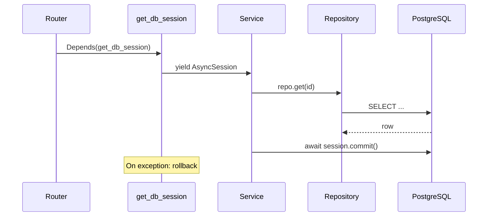

# Database and Migrations

This document explains APE's relational database foundation: async SQLAlchemy
2.x, session management, the declarative base, ORM mixins, repositories, and
Alembic migrations.

---

## Why async PostgreSQL?

FastAPI is async-native. Blocking database calls in `async def` handlers would
stall the event loop. SQLAlchemy 2.x with `asyncpg` lets repositories and
services `await` queries without thread pools.

---

## Component overview

```text
┌─────────────────────────────────────────────────────────┐
│  Alembic (schema migrations)                            │
│  alembic.ini + db/migrations/env.py                     │
└───────────────────────────┬─────────────────────────────┘
                            │ targets
                            ▼
┌─────────────────────────────────────────────────────────┐
│  Declarative Base (db/base.py)                          │
│  Metadata + naming convention for indexes/constraints   │
└───────────────────────────┬─────────────────────────────┘
                            │ parent of
                            ▼
┌─────────────────────────────────────────────────────────┐
│  ORM Models (app/models/) — registered via composition/orm_registry     │
└───────────────────────────┬─────────────────────────────┘
                            │ accessed via
                            ▼
┌─────────────────────────────────────────────────────────┐
│  AsyncRepository / ProjectScopedRepository              │
└───────────────────────────┬─────────────────────────────┘
                            │ used by
                            ▼
┌─────────────────────────────────────────────────────────┐
│  Service Layer — owns commit() / rollback()             │
└─────────────────────────────────────────────────────────┘
```

---

## Database class (`db/session.py`)

`Database` wraps the async engine and session factory:

```python
engine = create_async_engine(
    settings.database.async_dsn,
    pool_size=...,
    max_overflow=...,
    pool_pre_ping=True,  # detect stale connections
)
session_factory = async_sessionmaker(engine, expire_on_commit=False)
```

- Created once in lifespan, stored on `app.state.db`.
- `check()` verifies the pgvector extension and the configured `vector(n)` column.
- `dispose()` closes the pool on shutdown.

---

## Session lifecycle

Sessions are **request-scoped**, transactions are **service-scoped**:



`get_db_session` yields a session and rolls back on unhandled exceptions. The
**service** calls `commit()` after successful orchestration — not the dependency.

---

## Declarative base and naming convention

`Base` in `db/base.py` uses an explicit `NAMING_CONVENTION` so Alembic
autogenerate produces stable, portable constraint names:

```text
ix_%(column_0_label)s
uq_%(table_name)s_%(column_0_name)s
fk_%(table_name)s_%(column_0_name)s_%(referred_table_name)s
pk_%(table_name)s
```

---

## ORM mixins (building blocks)

`models/base.py` provides reusable columns — not business entities:

| Mixin | Columns | Purpose |
| ----- | ------- | ------- |
| `UUIDPrimaryKeyMixin` | `id: UUID` | Primary key |
| `TimestampMixin` | `created_at`, `updated_at` | Audit timestamps (UTC, server default) |
| `ProjectScopedMixin` | `project_id: UUID` | Isolation boundary (indexed) |

Concrete models compose these mixins. Foreign keys to `projects` are declared
when the Project table exists.

---

## Repository bases

| Base | Use when |
| ---- | -------- |
| `AsyncRepository` | Aggregate roots (e.g. `Project`) — unscoped |
| `ProjectScopedRepository` | Project-owned entities — mandatory `project_id` |

Module repositories are thin subclasses adding domain-specific queries only.

`get_by_id` excludes soft-deleted rows by default; pass `include_deleted=True`
for administration, idempotent delete, or mutation conflict paths.

---

## Alembic migrations

### Configuration

- `alembic.ini` — script location, logging; **no hardcoded URL**.
- `composition/migrations/env.py` — injects `settings.database.async_dsn` at runtime,
  imports `app.composition.orm_registry` so autogenerate sees all tables on
  `Base.metadata`.

### Baseline revision

`0001_initial` is a no-op baseline establishing the migration chain. No business
tables exist yet.

### Workflow

```bash
# Apply migrations
alembic upgrade head

# Create new migration after model changes
alembic revision --autogenerate -m "add projects table"

# Roll back one step
alembic downgrade -1
```

Docker Compose runs `alembic upgrade head` before starting uvicorn.

### Rules

- **Never** auto-create tables at runtime in production.
- Register every new model in `composition/orm_registry.py` for autogenerate.
- Review autogenerated diffs — Alembic is not infallible.

---

## Native vector persistence

`chunk_embeddings.embedding` is a pgvector `vector(n)` column managed through
Alembic. `ChunkEmbeddingRepository` owns fixed-dimension persistence and cosine
candidate SQL; model-facing embedding calls still use provider interfaces.
Redis remains a separate connectivity adapter for health and background jobs.

The pgvector migration enables the extension, creates the HNSW cosine index,
and returns legacy packed-vector documents to `chunked` for re-embedding. It
does not attempt unsafe byte conversion.

---

## Common mistakes

| Mistake | Fix |
| ------- | --- |
| Committing inside repository | Commit in service layer |
| Sync SQLAlchemy in async routes | Use `AsyncSession` + `await` |
| Forgetting to register models for Alembic | Add to `composition/orm_registry.py` |
| Unscoped queries | Use `ProjectScopedRepository` with `project_id` |
| Creating engine per request | Use lifespan-managed `Database` |
| Module imports `dependencies/` | Wire HTTP in `api/v1/routes/` only |

---

## Key files

| File | Role |
| ---- | ---- |
| `backend/app/platform/db/base.py` | Declarative `Base` |
| `backend/app/platform/db/session.py` | `Database` engine + sessions |
| `backend/app/platform/domain/mixins.py` | ORM mixins |
| `backend/app/platform/persistence/project_scoped_repository.py` | Project-scoped CRUD |
| `backend/app/composition/orm_registry.py` | Alembic model discovery |
| `backend/app/composition/migrations/env.py` | Async Alembic environment |
| `alembic.ini` | Migration tool config |
