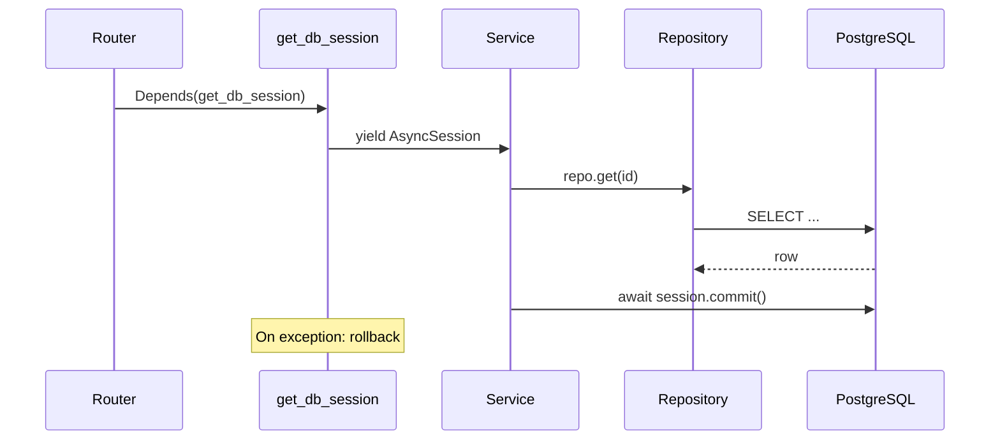

# Database and Migrations

This document explains APE's relational database foundation: async SQLAlchemy
2.x, session management, the declarative base, ORM mixins, repositories, and
Alembic migrations.

---

## Why async PostgreSQL?

FastAPI is async-native. Blocking database calls in `async def` handlers would
stall the event loop. SQLAlchemy 2.x with `asyncpg` lets repositories and
services `await` queries without thread pools.

---

## Component overview

```text
┌─────────────────────────────────────────────────────────┐
│  Alembic (schema migrations)                            │
│  alembic.ini + db/migrations/env.py                     │
└───────────────────────────┬─────────────────────────────┘
                            │ targets
                            ▼
┌─────────────────────────────────────────────────────────┐
│  Declarative Base (db/base.py)                          │
│  Metadata + naming convention for indexes/constraints   │
└───────────────────────────┬─────────────────────────────┘
                            │ parent of
                            ▼
┌─────────────────────────────────────────────────────────┐
│  ORM Models (models/) — mixins today, entities later    │
└───────────────────────────┬─────────────────────────────┘
                            │ accessed via
                            ▼
┌─────────────────────────────────────────────────────────┐
│  BaseRepository (repositories/)                         │
└───────────────────────────┬─────────────────────────────┘
                            │ used by
                            ▼
┌─────────────────────────────────────────────────────────┐
│  Service Layer — owns commit() / rollback()             │
└─────────────────────────────────────────────────────────┘
```

---

## Database class (`db/session.py`)

`Database` wraps the async engine and session factory:

```python
engine = create_async_engine(
    settings.database.async_dsn,
    pool_size=...,
    max_overflow=...,
    pool_pre_ping=True,  # detect stale connections
)
session_factory = async_sessionmaker(engine, expire_on_commit=False)
```

- Created once in lifespan, stored on `app.state.db`.
- `check()` runs `SELECT 1` for readiness probes.
- `dispose()` closes the pool on shutdown.

---

## Session lifecycle

Sessions are **request-scoped**, transactions are **service-scoped**:



`get_db_session` yields a session and rolls back on unhandled exceptions. The
**service** calls `commit()` after successful orchestration — not the dependency.

---

## Declarative base and naming convention

`Base` in `db/base.py` uses an explicit `NAMING_CONVENTION` so Alembic
autogenerate produces stable, portable constraint names:

```text
ix_%(column_0_label)s
uq_%(table_name)s_%(column_0_name)s
fk_%(table_name)s_%(column_0_name)s_%(referred_table_name)s
pk_%(table_name)s
```

---

## ORM mixins (building blocks)

`models/base.py` provides reusable columns — not business entities:

| Mixin | Columns | Purpose |
| ----- | ------- | ------- |
| `UUIDPrimaryKeyMixin` | `id: UUID` | Primary key |
| `TimestampMixin` | `created_at`, `updated_at` | Audit timestamps (UTC, server default) |
| `ProjectScopedMixin` | `project_id: UUID` | Isolation boundary (indexed) |

Concrete models compose these mixins. Foreign keys to `projects` are declared
when the Project table exists.

---

## BaseRepository

Generic async CRUD in `repositories/base_repository.py`:

| Method | Behavior |
| ------ | -------- |
| `get(id)` | Primary key lookup |
| `list(limit, offset)` | Paginated fetch |
| `count()` | Total rows |
| `add(entity)` | Stage insert (no commit) |
| `delete(entity)` | Stage delete |
| `flush()` | Push pending changes (get generated IDs) |

Project-scoped repositories will override queries to always filter by
`project_id`.

---

## Alembic migrations

### Configuration

- `alembic.ini` — script location, logging; **no hardcoded URL**.
- `db/migrations/env.py` — injects `settings.database.async_dsn` at runtime,
  imports `app.models` so autogenerate sees all tables on `Base.metadata`.

### Baseline revision

`0001_initial` is a no-op baseline establishing the migration chain. No business
tables exist yet.

### Workflow

```bash
# Apply migrations
alembic upgrade head

# Create new migration after model changes
alembic revision --autogenerate -m "add projects table"

# Roll back one step
alembic downgrade -1
```

Docker Compose runs `alembic upgrade head` before starting uvicorn.

### Rules

- **Never** auto-create tables at runtime in production.
- Import every new model in `models/__init__.py` for autogenerate discovery.
- Review autogenerated diffs — Alembic is not infallible.

---

## Redis and Qdrant (not ORM)

`db/redis.py` and `db/qdrant.py` manage **connectivity clients**, not relational
persistence. They follow the same lifespan pattern as `Database` but are not
accessed through repositories.

Vector operations will go through `BaseVectorStoreProvider` in `providers/`, not
direct Qdrant SDK calls from services.

---

## Common mistakes

| Mistake | Fix |
| ------- | --- |
| Committing inside repository | Commit in service layer |
| Sync SQLAlchemy in async routes | Use `AsyncSession` + `await` |
| Forgetting to import models for Alembic | Add to `models/__init__.py` |
| Unscoped queries | Always filter by `project_id` (future) |
| Creating engine per request | Use lifespan-managed `Database` |

---

## Key files

| File | Role |
| ---- | ---- |
| `backend/app/db/base.py` | Declarative `Base` |
| `backend/app/db/session.py` | `Database` engine + sessions |
| `backend/app/models/base.py` | ORM mixins |
| `backend/app/repositories/base_repository.py` | Generic CRUD |
| `backend/app/db/migrations/env.py` | Async Alembic environment |
| `alembic.ini` | Migration tool config |
