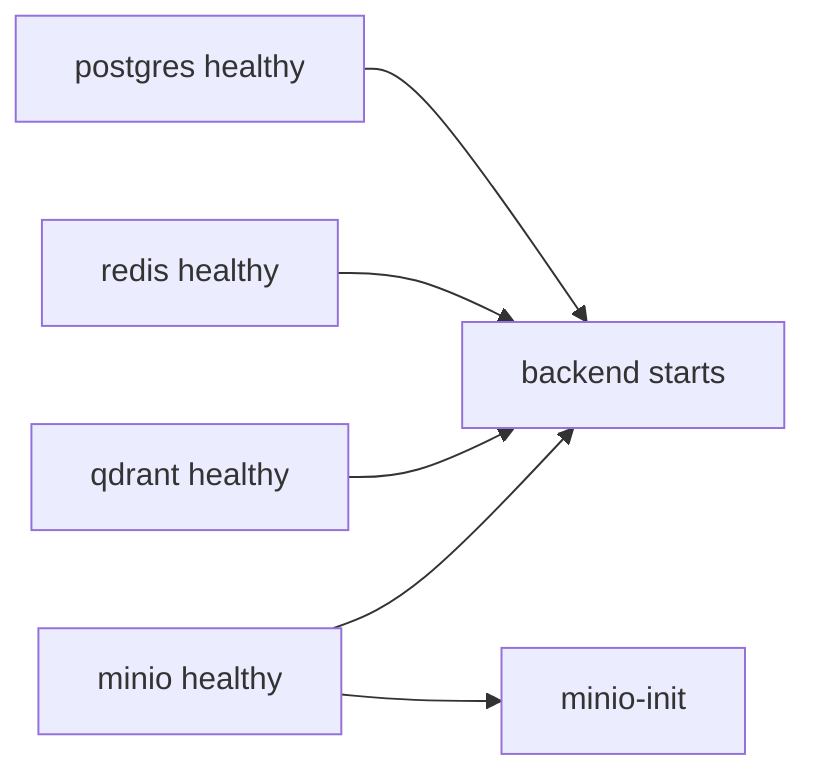

# Docker Local Development

This document explains how APE's Docker-based local development environment
works: images, compose services, networking, health checks, and volumes.

---

## Why Docker Compose?

APE depends on PostgreSQL, Redis, Qdrant, and MinIO. Installing and configuring
each locally is error-prone. A single `docker compose up --build` gives every
developer an identical stack with health-checked startup ordering.

---

## Stack overview

```text
docker compose up --build
        │
        ├── postgres:16-alpine     (relational DB)
        ├── redis:7-alpine         (cache / future job queue)
        ├── qdrant/qdrant:latest   (vector DB)
        ├── minio/minio:latest     (S3-compatible storage)
        ├── minio-init             (one-shot bucket creation)
        └── backend (ape-backend:dev)
              │
              ├── alembic upgrade head
              └── uvicorn --reload
```

| Service | Port(s) | Volume | Health check |
| ------- | ------- | ------ | ------------ |
| backend | 8000 | `./backend` mounted | Dockerfile `HEALTHCHECK` → `/health` |
| postgres | 5432 | `postgres_data` | `pg_isready` |
| redis | 6379 | `redis_data` | `redis-cli ping` |
| qdrant | 6333, 6334 | `qdrant_data` | TCP probe on 6333 |
| minio | 9000, 9001 | `minio_data` | `mc ready local` |
| minio-init | — | — | runs once, exits |

---

## Backend Dockerfile (multi-stage)

`backend/Dockerfile` uses three stages:

```text
base (python:3.12-slim)
   │
   ├── builder → pip install into /opt/venv
   │
   └── runtime → copy venv + app code, non-root user `ape`
```

| Stage | Purpose |
| ----- | ------- |
| `base` | Shared Python runtime settings |
| `builder` | Compile and install dependencies |
| `runtime` | Minimal image — no build tools |

Build context is the **repository root** so `alembic.ini` and `requirements/`
are available. `INSTALL_DEV=true` in compose installs dev dependencies for
local reload.

---

## Startup ordering



`depends_on` with `condition: service_healthy` prevents the backend from
connecting before infrastructure is ready.

Backend startup command:

```sh
alembic upgrade head &&
uvicorn app.main:app --host 0.0.0.0 --port 8000 --reload --reload-dir backend
```

---

## Environment variable wiring

Compose sets **service hostnames** for in-network communication:

| In container | `APE_*` override |
| ------------ | ---------------- |
| `postgres` | `APE_DATABASE__HOST=postgres` |
| `redis` | `APE_REDIS__HOST=redis` |
| `qdrant` | `APE_QDRANT__HOST=qdrant` |
| `minio:9000` | `APE_MINIO__ENDPOINT=minio:9000` |

Credentials come from `.env` (or defaults in compose interpolation):
`POSTGRES_USER`, `MINIO_ROOT_USER`, etc.

---

## Development volumes

```yaml
volumes:
  - ./backend:/app/backend        # live code reload
  - ./alembic.ini:/app/alembic.ini
```

Code changes on the host are picked up by uvicorn `--reload` without rebuilding
the image.

Named volumes (`postgres_data`, `redis_data`, `qdrant_data`, `minio_data`)
persist data across `docker compose down`. Use `docker compose down -v` to wipe.

---

## Health check design choices

| Image | Challenge | Solution |
| ----- | --------- | -------- |
| Qdrant | No curl/wget in minimal image | Bash TCP probe: `</dev/tcp/127.0.0.1/6333` |
| MinIO | curl removed from recent images | `mc ready local` (bundled client) |
| PostgreSQL | — | `pg_isready` (native) |
| Redis | — | `redis-cli ping` (native) |

Readiness endpoint (`GET /ready`) performs application-level probes including
MinIO via HTTP from the backend container.

---

## Common commands

```bash
docker compose up --build        # build + start (foreground)
docker compose up --build -d       # detached
docker compose ps                # status + health
docker compose logs -f backend     # tail API logs
docker compose down              # stop
docker compose down -v           # stop + delete volumes
docker compose config --quiet    # validate compose syntax
```

Makefile shortcuts: `make up`, `make down`, `make logs`.

---

## Hybrid workflow

Many developers run **infra in Docker, API locally**:

```bash
docker compose up -d postgres redis qdrant minio
cp .env.example .env              # APE_* hosts = localhost
alembic upgrade head
cd backend && uvicorn app.main:app --reload
```

Fastest edit/reload loop; same infrastructure as full Docker mode.

---

## Production considerations

The current compose file is **development-oriented**:

- Dev dependencies installed in the image (`INSTALL_DEV=true`).
- Uvicorn with `--reload` (not for production).
- Default credentials (`ape`/`ape`, `minioadmin`).

Production deployments will use:

- `requirements/prod.txt` + Gunicorn + Uvicorn workers.
- Secrets from a vault or orchestrator, not `.env` files.
- Separate compose overrides or Kubernetes manifests under `infra/`.

---

## Key files

| File | Role |
| ---- | ---- |
| `docker-compose.yml` | Full local stack definition |
| `backend/Dockerfile` | Multi-stage API image |
| `.dockerignore` | Exclude caches, tests, docs from build |
| `.env.example` | Documented env template |
| `infra/README.md` | Future production IaC pointer |
