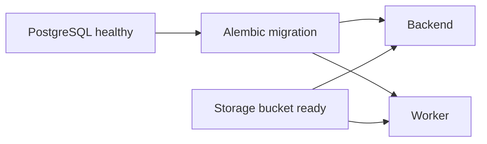

# Docker Local Development: Build the Little City

> **Mental model:** APE is not one process. Local development gives each part of the system a small home so you can watch them collaborate.

```text
operator console -> backend API -> Redis queue -> worker
                        │             │
                        ├────── PostgreSQL + pgvector
                        └────── MinIO object storage
```

## What each service does

| Service | Job in the story | Why it exists |
| --- | --- | --- |
| `frontend` | Shows the operator console | React/Vite monitoring and administration UI |
| `backend` | Receives API calls | HTTP, validation, orchestration |
| `worker` | Performs slow work | Parse, chunk, embed, index |
| `postgres` | Stores truth and search data | Metadata, chunks, vectors, keyword rows |
| `redis` | Moves background work | Queue and selected caches |
| `minio` | Stores files and derived artifacts | S3-compatible object storage |
| `migrate` | Prepares the schema | Runs Alembic once before application services |
| `minio-init` | Creates the bucket | Makes local storage ready |

## Start the stack

From the repository root:

```bash
cp .env.docker.example .env.docker
docker compose --env-file .env.docker up --build
```

The local stack uses development images, source mounts, and reload behavior. It is a learning environment, not the production deployment package.

Useful surfaces:

```text
Console:   http://localhost:3000/operator/
API:       http://localhost:8000
Health:    http://localhost:8000/health
Readiness: http://localhost:8000/ready
MinIO:     http://localhost:9001
```

## Targeted development flows

Compose service targeting keeps one canonical stack definition:

```bash
# Full stack
docker compose --env-file .env.docker up --build

# Backend, worker, and the infrastructure they require
docker compose --env-file .env.docker up --build backend worker

# Infrastructure only for host-side backend work
docker compose --env-file .env.docker up -d postgres redis minio minio-init

# Frontend only (the offline state is intentional and useful)
docker compose --env-file .env.docker up --build --no-deps frontend
```

The Compose frontend uses Vite with a source mount and fast refresh. The production frontend image is a separate multi-stage target with Nginx SPA fallback and same-origin `/api` reverse proxying:

```bash
docker build --target production -t ape-frontend:production frontend
```

## Watch one upload travel through the city

Open three terminals:

```bash
docker compose --env-file .env.docker logs -f backend
docker compose --env-file .env.docker logs -f worker
docker compose --env-file .env.docker logs -f redis
```

Upload a small document. Look for this sequence:

```text
backend: document accepted / queued
redis:   job delivered
worker:  parsing -> chunking -> complete
backend: document status can now be polled
```

This is a much better first Docker lesson than memorising service names: you are watching a request become background work.

## Why the migration container starts first

The application should not consume jobs against an unknown schema. Compose waits for `migrate` to finish before starting the backend and worker.



## Local API plus Docker infrastructure

For faster Python iteration, run only infrastructure in Docker and run the API locally:

```bash
docker compose --env-file .env.docker up -d postgres redis minio minio-init

cd backend
python -m venv .venv
source .venv/bin/activate          # Windows: .venv\Scripts\activate
pip install -r requirements/dev.txt
cp .env.example .env
alembic upgrade head
python -m app
```

The host process uses `localhost`; containers use service names such as `postgres`, `redis`, and `minio`. That is why the application environment and Compose environment are related but not identical.

## A small debugging game

Break one dependency and predict the symptom:

| Break | What you should expect |
| --- | --- |
| Stop Redis | Upload may persist but background processing cannot start |
| Stop the worker | Documents remain queued |
| Stop MinIO | Files cannot be read or written |
| Stop PostgreSQL | API readiness fails and metadata/search is unavailable |
| Delete the bucket | Stored documents exist as metadata but derived work cannot continue |

The lesson is that “the API is running” does not mean “the product is ready.” Readiness is a dependency graph.

## What this local stack is not

The repository’s Compose file is aimed at development. A dedicated hosted service still needs production images, secrets, TLS, resource limits, backups, upgrade procedures, monitoring, and worker recovery. Learn the local topology first; do not mistake it for the commercial deployment contract.

## Learning checkpoint

You understand the local stack when you can answer:

> Why can an upload return successfully while the document is not yet searchable?

Because HTTP acceptance, background processing, storage, embeddings, and indexing are separate stages owned by different processes.

## Related

- [Knowledge Ingestion — End to End](./knowledge-ingestion-journey.md)
- [Configuration System](./configuration-system.md)
- [Database and Migrations](./database-and-migrations.md)
- [Deployment Architecture](../architecture/deployment-architecture.md)
