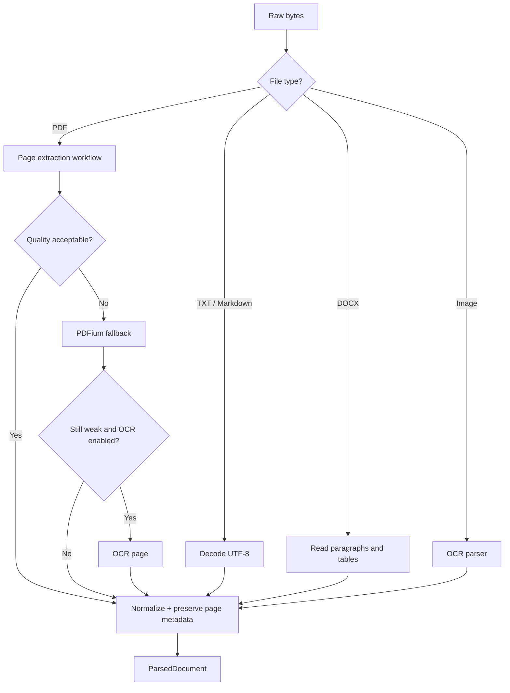

# Document Parsing and Extraction: Teach the Engine to Read

> **The question:** when a PDF looks readable to a human, how does a computer decide what its words are?

Parsing turns file bytes into text and metadata. Retrieval cannot search a PDF object, a DOCX zip, or image pixels directly. It needs normalized text with enough provenance to explain where that text came from.

```text
file bytes -> parser selection -> extracted text -> quality decision -> parsed artifact
```

## Parsing is not OCR

Start with the cheapest, most faithful source:

1. **Text-layer extraction:** read characters already embedded in the file.
2. **Layout fallback:** try a second extractor when the first result is incomplete or garbled.
3. **OCR:** recognize pixels only when there is no trustworthy text layer.

OCR is powerful but probabilistic. It can turn a scan into searchable text while also changing a number, name, or legal phrase. That is why APE scores extraction quality and records the method used.

## The route through APE



## Code path

| Stage | Main file | What to look for |
| --- | --- | --- |
| Worker entry | `backend/app/worker/handlers/document.py` | The background task receives project and document IDs |
| Workflow | `backend/app/modules/knowledge/workflows/document_processing.py` | Status changes, storage reads, parser call, chunk handoff |
| Parser selection | `backend/app/platform/providers/implementations/document_parser_factory.py` | Extension/MIME routing |
| Plain text | `plain_text_parser.py` | UTF-8 decoding and normalization |
| DOCX | `docx_parser.py` | Paragraph/table extraction |
| PDF | `pdf_extraction_workflow.py` | Page candidates, quality scores, fallback order |
| PDF page extractors | `pymupdf_page_extractor.py`, `pdfium_page_extractor.py` | Different extraction strategies |
| OCR | `ocr_factory.py`, `paddle_ocr_provider.py` | Optional provider boundary |

## What is a quality score doing here?

Suppose a PDF extractor returns:

```text
Refunds are available within thirty days...
```

That looks plausible. Now suppose it returns:

```text
R e f u n d s  a r e  a v a i l a b l e  w i t h i n  t h i r t y  d a y s
```

Both are strings, but only the first is useful for chunking and retrieval. A quality scorer can inspect signals such as:

- replacement characters;
- suspicious whitespace;
- amount of readable text;
- script/language mismatch;
- page-level extraction success.

The goal is not to prove that the text is perfect. The goal is to choose a better candidate before bad text contaminates every later stage.

## Why page-level decisions matter

A PDF may contain ten good pages and two scanned pages. Replacing the whole document with OCR would be slower and may reduce quality on the good pages.

APE’s page-oriented approach allows:

```text
page 1 -> native text
page 2 -> native text
page 3 -> PDFium fallback
page 4 -> OCR
```

This is a useful systems lesson: **fallbacks should be as small as the failure.**

## What the parser must preserve

The parsed output should carry more than one long string:

| Metadata | Why it matters later |
| --- | --- |
| Page count | Citation and user navigation |
| Page number/range | Evidence location |
| Parser name/version | Reproducibility and reprocessing |
| Extraction method | Native, fallback, or OCR provenance |
| Quality score | Filtering and operational review |
| Language/confidence | Multilingual routing and OCR safety |
| Warnings | Human explanation when extraction was partial |

If you throw away provenance during parsing, the answer stage cannot recover it.

## A hands-on experiment

Take three files containing the same short policy:

1. a `.txt` file;
2. a digital PDF with selectable text;
3. a screenshot or scanned PDF.

Compare:

- selected parser;
- parse quality score;
- page count;
- extraction method;
- resulting chunk text.

Ask: **which mistakes would be visible to a human reviewer, and which could silently lower retrieval quality?**

## Important scope boundary

APE currently has useful PDF, DOCX, text, Markdown, and optional image/OCR paths. That does not mean every PDF, table, scan, handwritten form, or custom-font document is equally reliable. A production product should publish a supported-file matrix and fail clearly when a parser cannot make trustworthy text.

Bangla scanned/custom-font OCR is a documented limitation. Unicode Bangla text layers and text files are a different case from Bangla OCR. See [Multilingual Text Processing](./multilingual-text-processing.md).

## Learning checkpoint

You understand parsing when you can answer:

> Why is “the parser returned a string” not enough to declare a document searchable?

Next: [Text Chunking for RAG](./text-chunking-for-rag.md).

## Related

- [Knowledge Ingestion — End to End](./knowledge-ingestion-journey.md)
- [OCR Fundamentals](./ocr-fundamentals.md)
- [Object Storage for RAG](./object-storage-for-rag.md)
