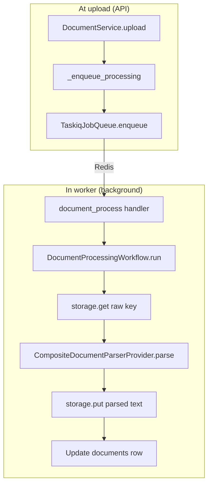

# Document Parsing and Extraction

## The basic idea

**Parsing** turns a file format (PDF, plain text, etc.) into **normalized UTF-8 text** plus metadata (page count, which parser ran). RAG cannot search raw PDF bytes — it needs strings.

In APE, parsing is **always asynchronous**:

- The upload API returns in milliseconds (`status=queued`).
- A **worker** reads the file from object storage and extracts text.
- Extracted text is saved back to storage; metadata goes on the `documents` row.

> **Parsing ≠ OCR.** Parsing reads text that is already embedded in the file (digital PDFs, `.txt`). Scanned PDFs are image-only until [OCR](./ocr-fundamentals.md) is added.

---

## Starting point & end point

| | |
| - | - |
| **Starts** | Taskiq worker receives `document.process` job (enqueued at upload) |
| **Input** | Raw bytes at `document.storage_key` |
| **Output** | UTF-8 text at `document.parsed_text_storage_key` + `page_count`, `parser_name`, etc. |
| **Then** | Same workflow continues to [chunking](./text-chunking-for-rag.md) (`status=chunking` → `chunked`) |

Upload only **triggers** parsing; it does not parse inline.

---

## Visual flow



---

## File-by-file journey

### A. Enqueue (happens on upload, not in worker)

| File | What it does |
| ---- | ------------- |
| `modules/knowledge/services/document_service.py` | After `upload()` commits, calls `_enqueue_processing()` |
| same | Sets `status=queued`, builds `JobDefinition(name="document.process", ...)` |
| `platform/jobs/names.py` | Job name constant `document.process` |
| `platform/jobs/implementations/taskiq_queue.py` | `document_process_task.kiq(project_id=..., document_id=...)` |

### B. Worker picks up job

| File | What it does |
| ---- | ------------- |
| `worker/broker.py` | Taskiq `ListQueueBroker` (Redis lists; no Streams required) |
| `worker/handlers/document.py` | `@broker.task` entrypoint + `run_document_process` |
| `worker/handlers/document.py` | `document_process_task` logs receipt, calls `run_document_process()` |
| same | Creates `Database` session, `get_document_parser()`, `ChunkingService`, `DocumentProcessingWorkflow` |

### C. Workflow — parse phase

| File | What it does |
| ---- | ------------- |
| `workflows/document_processing.py` | `run(document_id)` loads document via `DocumentRepository` |
| same | `status = PARSING`, commit |
| same | `read_storage_bytes(self._storage, document.storage_key)` — full raw file in memory |
| same | `asyncio.to_thread(parser.parse, data=..., filename=..., content_type=...)` |
| `providers/implementations/document_parser_factory.py` | Routes to the right parser (see below) |
| same | `build_parsed_text_storage_key(...)` → `put()` parsed UTF-8 bytes |
| same | Sets `page_count`, `parser_name`, `parser_version`, `language` on `Document` |
| `models/document.py` | Columns updated; status moves to `CHUNKING` then chunking runs |

### D. Parser routing (`CompositeDocumentParserProvider`)

| File type | Implementation file | Technique |
| --------- | --------------------- | --------- |
| `.txt`, `.md`, `text/plain` | `plain_text_parser.py` | `bytes.decode("utf-8")` |
| `.docx` | `docx_parser.py` | `python-docx` paragraphs + table rows |
| `.pdf`, `application/pdf` | `pymupdf_parser.py` | PyMuPDF `fitz.open()` → `page.get_text()` per page |

Contract (DTO): `platform/providers/contracts/document_parser.py`

- Input: raw `bytes`, `filename`, `content_type`
- Output: `ParsedDocument(text, page_count, parser_name, parser_version, warnings, ...)`

### E. PyMuPDF internals (digital PDF path)

```text
pymupdf_parser.py
  fitz.open(stream=data, filetype="pdf")
  for each page:
      page.get_text()     ← embedded text layer only
      if empty and page has images:
          append warning "OCR is not enabled"
  join pages with "\n\n" → ParsedDocument.text
```

If every page is image-only (scanned PDF), `text` may be **empty** but `page_count > 0`. Status can still reach `chunked` with zero chunks. That is the signal you need OCR.

---

## Status transitions during parsing

```text
queued  →  parsing  →  (text extracted)  →  chunking  →  chunked
                ↘ failed (ProviderError or unexpected exception)
```

On failure: `document.error_message` gets a **client-safe** string (`safe_processing_error()` — no stack traces in API).

---

## Concepts

| Term | Meaning |
| ---- | ------- |
| **Digital PDF** | PDF with a selectable text layer — PyMuPDF works well |
| **Scanned PDF** | Pages are images — needs OCR, not parsing alone |
| **ParsedDocument** | Provider DTO — decouples PyMuPDF from workflow |
| **Composite parser** | Single entry point; add new formats by adding providers + routing |
| **Worker boundary** | Parsers run in worker thread pool (`asyncio.to_thread`), not in HTTP handlers |

---

## API surface (what clients see)

| Endpoint | Parsing relevance |
| -------- | ----------------- |
| `POST .../documents` | Triggers enqueue; response `status=queued` |
| `GET .../documents/{id}` | Poll `status`, `parser_name`, `page_count`, `error_message` |
| `POST .../documents/{id}/reprocess` | Bumps `version`, clears parser fields, re-enqueues |

Router: `api/v1/routes/documents_router.py`

---

## Trade-offs

| Choice | Benefit | Cost |
| ------ | ------- | ---- |
| Parsed text in object storage | DB stays small | Extra read to fetch full text |
| Async via Taskiq | API stays fast | Requires Redis + worker process |
| PyMuPDF first | Fast, no GPU | No scanned documents |
| Full `DocumentStatus` enum | Future phases without migration | More states to learn |

---

## Related

- [Knowledge ingestion journey](./knowledge-ingestion-journey.md) — full E2E with file list
- [OCR fundamentals](./ocr-fundamentals.md) — when parsing is not enough (not built yet)
- [Text chunking](./text-chunking-for-rag.md) — next step after parse in the same workflow
