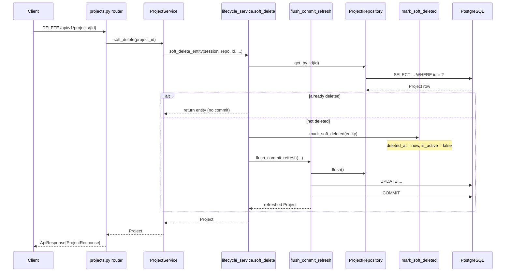

# Entity Lifecycle and Reusable Patterns

This document explains how **ORM mixins**, **repository bases**, and **service
helpers** work together in APE. It uses the **Projects** module as a concrete
example so you can follow a real request from HTTP to PostgreSQL.

For layering rules see [module-architecture.md](../architecture/module-architecture.md).
For database sessions and Alembic see [database-and-migrations.md](./database-and-migrations.md).

---

## What problem does this solve?

Most modules need the same building blocks:

| Concern | Example |
| ------- | ------- |
| Standard columns | `id`, `created_at`, `is_active`, `deleted_at` |
| List behaviour | pagination, hide deleted rows, filter by active |
| Read paths | get by id, return 404 when missing |
| Lifecycle | soft delete, toggle active status |
| Writes | flush → commit → refresh, handle unique constraint races |

Without shared pieces, every module would copy-paste the same SQL filters,
error handling, and transaction code. APE splits reuse into **three layers**:

```text
Mixins          →  what columns exist on the table (ORM)
Repository      →  how we query those columns (SQLAlchemy)
Service helpers →  how we orchestrate reads/writes (business invariants + transactions)
Module service  →  domain rules only you care about (unique name, field mapping, jobs)
```

There is **no generic CRUD service base**. `create` and `update` stay in each
module because that is where domain logic diverges.

---

## The stack at a glance

```text
HTTP Request
    │
    ▼
Router (api/v1/routes/projects.py)
    │  validates JSON → Pydantic schema
    │  injects ProjectService via Depends()
    ▼
ProjectService (modules/projects/services/)
    │  domain rules: unique name, patch fields
    │  calls shared helpers for get / list / soft delete / status / persist
    ▼
┌───────────────────────────────────────────────────────────┐
│  platform/domain/lifecycle_service.py   (read + lifecycle) │
│  platform/domain/transactions.py        (commit boundaries)  │
│  platform/persistence/lifecycle.py      (mark_soft_deleted)   │
└───────────────────────────────────────────────────────────┘
    │
    ▼
ProjectRepository (modules/projects/repositories/)
    │  thin subclass of AsyncRepository
    │  adds exists_by_name()
    ▼
┌───────────────────────────────────────────────────────────┐
│  platform/persistence/async_repository.py  (get, list, count) │
│  platform/persistence/filters.py           (lifecycle WHERE)   │
└───────────────────────────────────────────────────────────┘
    │
    ▼
Project ORM model (app/models/project.py)
    │  composes mixins → columns on `projects` table
    ▼
PostgreSQL
```

---

## Layer 1 — ORM mixins (`platform/domain/mixins.py`)

Mixins are **reusable column definitions**. They do not create tables by
themselves; concrete models inherit them.

| Mixin | Adds | Used for |
| ----- | ---- | -------- |
| `UUIDPrimaryKeyMixin` | `id` | Every entity |
| `TimestampMixin` | `created_at`, `updated_at` | Audit trail |
| `ActiveStatusMixin` | `is_active` | Enable/disable without deleting |
| `SoftDeleteMixin` | `deleted_at`, `deleted_by` | Soft delete (`deleted_at` is truth) |
| `ProjectScopedMixin` | `project_id` | Entities **owned by** a Project |

`Project` is special: it **is** the isolation boundary, so it does **not** use
`ProjectScopedMixin`. A future `Document` model would.

```python
# app/models/project.py (simplified)
class Project(
    Base,
    UUIDPrimaryKeyMixin,
    TimestampMixin,
    ActiveStatusMixin,
    SoftDeleteMixin,
):
    __tablename__ = "projects"
    name: Mapped[str] = mapped_column(String(255), nullable=False)
    description: Mapped[str | None] = mapped_column(Text, nullable=True)
```

**Key idea:** mixins define *shape*. Repositories detect columns with
`getattr(model, "deleted_at", None)` so filters work on any model that
composes the right mixins.

---

## Layer 2 — Lifecycle semantics (`platform/persistence/lifecycle.py`)

Mixins store data; **lifecycle helpers** define what soft delete *means* in code:

```python
mark_soft_deleted(entity, deleted_by=None)
# → sets deleted_at, deleted_by
# → sets is_active = False when the entity has that column

is_soft_deleted(entity)
# → True when deleted_at is not None
```

These are plain functions used by **services**, not by HTTP routes directly.

**Rule:** `deleted_at` is the source of truth. There is no separate
`is_deleted` column in the database.

---

## Layer 3 — Repository filters and base (`platform/persistence/`)

### `LifecycleListFilters`

A small dataclass passed into list/count queries:

```python
LifecycleListFilters(
    include_deleted=False,   # default: hide soft-deleted rows
    is_active=None,          # None = no filter; True/False = filter
)
```

**Important:** `LifecycleListFilters` applies to **list/count only**. Public
`get_by_id` (default `include_deleted=False`) also hides soft-deleted rows so
`GET /projects/{id}` returns 404 after delete. Internal paths (soft delete,
mutation conflicts) use `include_deleted=True`.

### `build_lifecycle_filters(model, ...)`

Turns list/count query params into SQL `WHERE` clauses when the model has the
columns (via mixins):

```text
include_deleted=False  →  WHERE deleted_at IS NULL
is_active=True         →  AND is_active = true
```

### `AsyncRepository`

Generic data access for **aggregate roots** (unscoped entities like `Project`):

| Method | What it does |
| ------ | ------------ |
| `get_by_id` | `SELECT` by primary key; **excludes deleted by default** (`include_deleted=True` for admin/internal) |
| `list_page` | paginated list + lifecycle filters + deterministic order |
| `count` | total for same filters |
| `exists_by_field` | uniqueness checks among non-deleted rows |
| `add` / `flush` | stage changes — **no commit** |

Module repositories are thin:

```python
# modules/projects/repositories/project_repository.py
class ProjectRepository(AsyncRepository[Project]):
    model = Project

    async def exists_by_name(self, name: str, *, exclude_id=None) -> bool:
        return await self.exists_by_field("name", name, exclude_id=exclude_id)
```

**Project-owned entities** use `ProjectScopedRepository` instead — every query
automatically includes `WHERE project_id = :scope`. Lifecycle filters will
align with `AsyncRepository` as those modules ship.

---

## Layer 4 — Service helpers (`platform/domain/`)

Services **own transactions**. Helpers encode repeatable orchestration.

### Transaction helpers (`transactions.py`)

```python
await flush_commit_refresh(session, repository, entity, on_integrity=conflict_error)
```

```text
1. repository.flush()     → send INSERT/UPDATE to DB (still in transaction)
2. session.commit()       → make it permanent
3. session.refresh(entity) → reload server defaults (timestamps, etc.)
```

On `IntegrityError` (e.g. duplicate name race): rollback and raise a clean
`ConflictError` instead of leaking SQL details.

### Lifecycle service helpers (`lifecycle_service.py`)

| Helper | Responsibility |
| ------ | -------------- |
| `get_or_raise` | `get_by_id` + `NotFoundError` with module-specific code |
| `list_paginated` | `ListParams` → `LifecycleListFilters` → `PaginatedResult` |
| `require_not_deleted` | block updates on soft-deleted rows |
| `soft_delete` | idempotent soft delete + persist |
| `update_active_status` | toggle `is_active` on mutable rows |

Helpers take a **repository** and **error messages/codes** from the module —
they are reusable machinery, not domain vocabulary.

---

## Layer 5 — Module service (`ProjectService`)

`ProjectService` wires helpers + **domain-only** logic:

| Method | Shared helper | Module-specific |
| ------ | ------------- | --------------- |
| `get` | `get_or_raise` | error codes |
| `list` | `list_paginated` | — |
| `soft_delete` | `soft_delete_entity` | error codes |
| `update_status` | `update_active_status` | error codes |
| `create` | `flush_commit_refresh` | build `Project`, `exists_by_name` |
| `update` | `get_or_raise`, `require_not_deleted`, `flush_commit_refresh` | name uniqueness, partial patch |

```python
# Simplified ProjectService — the pattern to copy
async def soft_delete(self, project_id: uuid.UUID) -> Project:
    return await soft_delete_entity(
        self._session,
        self._repository,
        project_id,
        not_found_message="Project not found.",
        not_found_code="project_not_found",
    )
```

---

## Walkthrough 1 — Soft delete a project

**Request:** `DELETE /api/v1/projects/{project_id}`



**Who did what:**

1. **Router** — parsed UUID, called service, mapped ORM → `ProjectResponse`.
2. **`soft_delete` helper** — fetch, idempotency check, call `mark_soft_deleted`.
3. **`mark_soft_deleted`** — set columns defined by `SoftDeleteMixin`.
4. **`flush_commit_refresh`** — transaction boundary (service layer rule).
5. **Repository** — only ran SQL; never called `commit()`.

---

## Walkthrough 2 — List projects

**Request:** `GET /api/v1/projects?limit=20&offset=0&is_active=true`

```text
Router
  builds ListParams(limit=20, offset=0, is_active=True)
  │
  ▼
ProjectService.list(params)
  │
  ▼
list_paginated(repository, params)
  │
  ├── LifecycleListFilters(include_deleted=False, is_active=True)
  │
  ├── repository.list_page(...)
  │     └── build_lifecycle_filters(Project, ...)
  │           → WHERE deleted_at IS NULL AND is_active = true
  │           → ORDER BY created_at, id
  │           → LIMIT 20 OFFSET 0
  │
  └── repository.count(same filters) → total for pagination
  │
  ▼
PaginatedResult(items=[...], total=42, limit=20, offset=0)
  │
  ▼
Router wraps in ApiResponse + maps each item to ProjectResponse
```

**Reuse win:** the next module with the same mixins gets identical list
behaviour by calling `list_paginated` — only error messages and response
schemas change at the router.

---

## Walkthrough 3 — Update project (custom domain logic)

**Request:** `PATCH /api/v1/projects/{id}` with `{ "name": "New Name" }`

This path shows **why there is no generic `update` base**:

```text
Router → ProjectService.update(project_id, ProjectUpdate)

1. _require_mutable(project_id)
     get_or_raise(...)           ← shared
     require_not_deleted(...)    ← shared

2. if name changed:
     repository.exists_by_name   ← module-specific uniqueness rule

3. apply fields from ProjectUpdate
     only keys in model_fields_set ← Pydantic partial-update semantics

4. flush_commit_refresh(..., on_integrity=name_conflict)
     ← shared transaction + DB race handling
```

Domain rules (unique name per non-deleted project, partial patch) stay in
`ProjectService`. Helpers handle the boring, identical parts.

---

## Walkthrough 4 — Create project (fully custom orchestration)

**Request:** `POST /api/v1/projects`

```text
1. exists_by_name (module)     → 409 if duplicate
2. Project(name=..., is_active=True)   → mixins supply defaults on flush
3. repository.add(project)     → stage in session
4. flush_commit_refresh        → persist + handle unique index race
```

The partial unique index on `name WHERE deleted_at IS NULL` (from the model)
matches `exists_by_field(..., not_deleted=True)` in the repository.

---

## Aggregate root vs Project-owned entity

| | **Project** (today) | **Document** (future) |
| - | ------------------- | --------------------- |
| Model mixins | UUID, Timestamp, Active, SoftDelete | above + **ProjectScoped** |
| Repository base | `AsyncRepository` | `ProjectScopedRepository` |
| Scope | global within deployment | always `project_id` |
| Service ctor | `session`, `repository` | `session`, `repository`, `project_id` |

Same lifecycle helpers apply to both — they only need a repository that
implements `get_by_id`, `list_page`, `count`, and `flush`.

---

## Dependency injection (how the service gets here)

```text
Request
  → Depends(get_project_service)
       → get_db_session()        # one AsyncSession per request
       → get_project_repository(session)
       → ProjectService(session, repository)
```

The session is shared between service and repository so `flush` in the
repository and `commit` in the service operate on the **same transaction**.

---

## What to reuse in a new module

**Checklist:**

1. Compose mixins on `app/models/<entity>.py`.
2. Register model in `composition/orm_registry.py` + Alembic migration.
3. Subclass `AsyncRepository` or `ProjectScopedRepository`; add domain query methods only.
4. In the service:
   - use `get_or_raise`, `list_paginated`, `soft_delete`, `update_active_status` where applicable;
   - use `flush_commit_refresh` after mutations;
   - implement `create` / `update` yourself.
5. Thin router in `api/v1/routes/`; sample payloads in `docs/api/<module>.md`.

---

## Common mistakes

| Mistake | Why it is wrong |
| ------- | ---------------- |
| `commit()` in repository | breaks transaction ownership; service cannot orchestrate multi-step writes |
| `is_deleted` boolean column | duplicates `deleted_at`; filters and helpers assume `deleted_at` only |
| `ProjectScopedMixin` on `Project` | Project is the scope, not scoped *to* itself |
| Generic `BaseCRUDService` with shared `create`/`update` | hides domain rules; hooks become harder to read than explicit code |
| Skipping mixins but using lifecycle helpers | `build_lifecycle_filters` silently skips missing columns — behaviour drifts |

---

## Related files

| Path | Role |
| ---- | ---- |
| `platform/domain/mixins.py` | ORM column building blocks |
| `platform/persistence/lifecycle.py` | `mark_soft_deleted`, `is_soft_deleted` |
| `platform/persistence/filters.py` | list filters and deterministic ordering |
| `platform/persistence/async_repository.py` | generic repository for aggregate roots |
| `platform/persistence/project_scoped_repository.py` | project-scoped queries |
| `platform/domain/lifecycle_service.py` | shared read/lifecycle orchestration |
| `platform/domain/transactions.py` | flush / commit / refresh |
| `platform/http/pagination.py` | `ListParams`, `PaginatedResult` |
| `modules/projects/` | reference implementation |
| `docs/api/projects.md` | HTTP samples for Postman |

---

## Summary

```text
Mixins        →  columns on the table
Repository    →  SQL that respects those columns
Lifecycle fn  →  what soft delete means in Python
Service helpers →  repeatable orchestration + transactions
Module service →  rules that make this entity unique
```

Together they let each new module stay small: **reuse the machinery, write only
the domain.**
