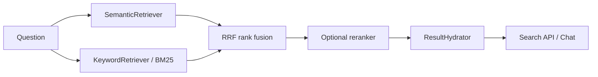

# Hybrid Retrieval: Let Two Searchers Compare Notes

> **The scene:** the question is “What is policy PR-104?” One searcher understands meaning; another is excellent at exact tokens. APE lets both bring evidence to the table.

## The two searchers

### Semantic search

Good at paraphrase:

```text
"How long do I have to get my money back?"
        ≈
"Refunds may be requested within thirty days."
```

### Keyword/BM25 search

Good at exactness:

```text
PR-104, SKU-881, 2026-07-01, case-7421
```

Neither searcher is universally better. Their strengths are different.

## The APE retrieval journey



Retrievers return candidate IDs and scores. The hydrator loads content and source metadata once. This separation keeps search components focused on ranking instead of mixing ranking, ORM loading, and response formatting.

## Why rank fusion instead of adding scores?

Cosine similarity and BM25 scores do not share a reliable scale. A score of `0.82` in one system is not automatically comparable to `12.4` in another.

Reciprocal Rank Fusion (RRF) combines positions instead:

```text
fused_score = sum(weight / (k + rank))
```

A result ranked first by semantic search and fifth by keyword search can still be stronger than a result ranked twentieth by both.

The configurable `APE_RETRIEVAL__RRF_K` controls how quickly rank influence decays. A larger value makes the difference between neighboring ranks softer.

## What reranking does

Fusion creates a shortlist. Reranking examines that shortlist more carefully and reorders it.

Think of it as:

```text
wide, inexpensive search -> narrow, expensive second opinion
```

The current repository includes a lexical reranker based on token overlap. It is useful as a deterministic baseline, but it should not be confused with a learned cross-encoder or other model-based reranker.

## Configuration that matters

| Setting | What it changes |
| --- | --- |
| `APE_RETRIEVAL__STRATEGY=hybrid` | Runs semantic and keyword paths |
| Semantic candidate top-k | How many vector results reach fusion |
| Keyword candidate top-k | How many BM25 results reach fusion |
| `APE_RETRIEVAL__RRF_K` | How rank positions are weighted |
| Rerank enabled | Whether the shortlist receives a second ranking pass |
| Rerank top-n | How expensive the second pass can become |
| Filterable metadata keys | Which business filters are accepted safely |
| HNSW search effort | Recall/latency trade-off for approximate vector search |

Do not tune every variable at once. Use one query set and change one layer at a time.

## A practical diagnostic map

| Observation | First place to investigate |
| --- | --- |
| Paraphrase query finds nothing | Chunking, embedding model, semantic candidate count |
| Exact identifier is missed | Keyword index, tokenizer, keyword candidate count |
| Correct result appears but ranks low | RRF weights, candidate depth, reranker |
| Result belongs to the wrong business scope | Project/metadata filter boundary |
| Answer contains too many unrelated facts | Candidate count, rerank window, context budget |
| Search is slow | Candidate depth, HNSW settings, hydration, provider latency |

## Why reindexing matters

Hybrid retrieval depends on two aligned snapshots:

- the active vector embedding set;
- the keyword/BM25 index built for those chunks.

When documents, chunking, or embedding configuration changes, re-embed and rebuild the index as a controlled workflow. A search result should be reproducible enough to explain which configuration produced it.

## Learning checkpoint

You understand hybrid retrieval when you can answer:

> Why does a good production search system keep both a semantic path and a keyword path instead of asking one model to do everything?

Next: [Conversation RAG Journey](./conversation_rag_journey.md).

## Related code and decisions

- `backend/app/modules/retrieval/retrievers/semantic_retriever.py`
- `backend/app/modules/retrieval/retrievers/keyword_retriever.py`
- `backend/app/modules/retrieval/retrievers/rrf_fusion.py`
- `backend/app/platform/providers/implementations/lexical_reranker.py`
- [ADR-009: Retrieval v2 Hybrid Search](../architecture/adr/009-retrieval-v2-hybrid-search.md)
