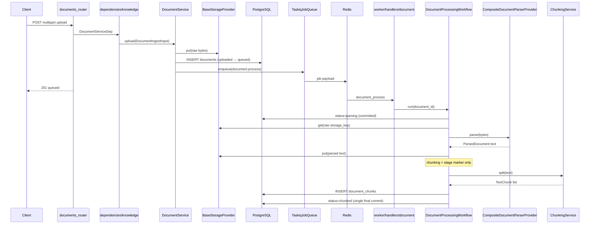

# Knowledge Ingestion — End-to-End Codebase Journey

Start here for the **full picture**: how a file uploaded through the API becomes chunked rows in PostgreSQL, which files are involved, and what each layer does.

> **Reading order:** this page → [Object storage](./object-storage-for-rag.md) → [Parsing](./document-parsing-and-extraction.md) → [Chunking](./text-chunking-for-rag.md) → [OCR (future)](./ocr-fundamentals.md)

---

## The 30-second story

1. Client uploads a file → API stores **raw bytes** in object storage and a **metadata row** in PostgreSQL.
2. API enqueues a background job (`document.process`) and returns immediately (`status=queued`).
3. **Taskiq worker** picks up the job and runs `DocumentProcessingWorkflow`.
4. Workflow **parses** the file into plain text, saves text to storage, **chunks** it, saves chunks to `document_chunks`.
5. Final state: `status=chunked` — ready for the **retrieval** module (`embed` → `index` → `ready` → search). See [Retrieval feature doc](../features/retrieval_module.md).

**OCR is not implemented yet.** Scanned PDFs may finish with empty text and a log warning. See [OCR fundamentals](./ocr-fundamentals.md).

---

## Big-picture diagram



---

## Status lifecycle (what to poll)

| Status | Set by | Meaning |
| ------ | ------ | ------- |
| `uploaded` | `DocumentService.upload` | Bytes in storage; row committed (brief) |
| `queued` | `DocumentService._enqueue_processing` | Job on Redis; **only status the worker accepts** |
| `parsing` | `DocumentProcessingWorkflow.run` | Worker reading file + extracting text (committed — recover via reprocess on crash) |
| `chunking` | same workflow | Transient stage marker — not separately committed |
| `chunked` | same workflow | **Knowledge complete** — chunks in DB |
| `failed` | same workflow | Safe `error_message` on document row |

Retrieval-owned statuses (`embedding` → `ready`) are documented in [retrieval_module.md](../features/retrieval_module.md).

Poll: `GET /api/v1/projects/{project_id}/documents/{document_id}`

List chunks: `GET .../documents/{document_id}/chunks`

---

## Phase 1 — Upload & storage (HTTP path)

**Starting point:** `POST /api/v1/projects/{project_id}/documents`

| Step | File | What happens |
| ---- | ---- | ------------- |
| 1 | `api/v1/routes/documents_router.py` | Receives `UploadFile`, streams bytes into `DocumentIngestInput` |
| 2 | `dependencies/knowledge.py` | Wires `DocumentService` with DB session, repo, storage, job queue |
| 3 | `modules/knowledge/services/document_service.py` | `upload()`: stream to spooled temp file while hashing, check duplicate SHA-256, enforce `max_upload_bytes` |
| 4 | `modules/knowledge/repositories/document_repository.py` | `add()` / `exists_by_content_sha256()` — project-scoped |
| 5 | `platform/providers/implementations/local_storage.py` or `minio_storage.py` | `put(storage_key, stream)` — raw file on disk/S3 |
| 6 | `models/document.py` | Row: `storage_key`, `content_sha256`, `status`, `version` |
| 7 | `document_service.py` | `_enqueue_processing()` → `status=queued`, enqueue job |
| 8 | `platform/jobs/implementations/taskiq_queue.py` | `document_process_task.kiq(project_id, document_id)` |

**Storage keys (two artifacts per document after processing):**

```text
Raw file:     {project_id}/{document_id}/{filename}
Parsed text:  {project_id}/{document_id}/parsed/v{version}.txt
```

Config: `APE_STORAGE__BACKEND`, `APE_STORAGE__LOCAL_ROOT` in `core/config.py` → `storage_factory.py`.

---

## Phase 2 — Background job & parsing (worker path)

**Starting point:** Redis delivers job to Taskiq worker (`python worker.py` from `backend/`)

| Step | File | What happens |
| ---- | ---- | ------------- |
| 1 | `worker/settings.py` | Registers `document_process` as worker function |
| 2 | `worker/handlers/document.py` | `document_process()` → `run_document_process()` |
| 3 | same | Builds `Database`, `ChunkingService`, `DocumentProcessingWorkflow` |
| 4 | `workflows/document_processing.py` | `run(document_id)` — orchestrates parse + chunk |
| 5 | same | `status=parsing`, `read_storage_bytes(storage_key)` |
| 6 | `providers/implementations/document_parser_factory.py` | `CompositeDocumentParserProvider` picks parser by extension/MIME |
| 7a | `providers/implementations/plain_text_parser.py` | `.txt` / `.md` → UTF-8 decode |
| 7b | `providers/implementations/docx_parser.py` | `.docx` → `python-docx` paragraphs + tables |
| 7c | `providers/implementations/pymupdf_parser.py` | `.pdf` → PyMuPDF `page.get_text()` per page |
| 8 | `workflows/document_processing.py` | Writes `ParsedDocument.text` to `parsed_text_storage_key` |
| 9 | `models/document.py` | Updates `page_count`, `parser_name`, `parser_version`, `language` |

**Important:** PyMuPDF **parses embedded text** in PDFs. It does **not** run OCR. Image-only pages log a warning and contribute no text.

---

## Phase 3 — Chunking (still inside the same worker run)

| Step | File | What happens |
| ---- | ---- | ------------- |
| 1 | `workflows/document_processing.py` | Guard `status=queued`; `status=parsing` committed; parse + chunk in one try block |
| 2 | `modules/knowledge/services/chunking_service.py` | `ChunkingService.from_settings` — `recursive_character` splitter (configurable via `APE_CHUNKING__STRATEGY`) |
| 3 | `models/document_chunk.py` | One row per segment: `chunk_index`, `content`, offsets, `token_count` |
| 4 | `repositories/document_chunk_repository.py` | `bulk_add()` + `flush()` |
| 5 | `workflows/document_processing.py` | `status=chunked`, commit |

Config: `APE_CHUNKING__STRATEGY`, `APE_CHUNKING__CHUNK_SIZE`, `APE_CHUNKING__CHUNK_OVERLAP`, `APE_KNOWLEDGE__MAX_UPLOAD_BYTES` in `core/config.py`.

Read chunks via API: `documents_router.py` → `DocumentService.list_chunks()` → `DocumentChunkRepository.list_by_document()`.

---

## Key models & tables

| Table | Model file | Holds |
| ----- | ---------- | ----- |
| `documents` | `models/document.py` | Metadata, status, parser info, storage keys |
| `document_chunks` | `models/document_chunk.py` | Text segments consumed by retrieval for embedding |

Both are scoped by `project_id` (isolation boundary).

---

## Reprocess & delete

| Action | Entry | Code path |
| ------ | ----- | --------- |
| Reprocess | `POST .../documents/{id}/reprocess` | `document_service.reprocess()` bumps `version`, re-enqueues job; workflow deletes old chunks |
| Delete | `DELETE .../documents/{id}` | `soft_delete()` + storage delete + chunks + `RetrievalCleanupService` (embeddings + vector purge) |

---

## What Knowledge does **not** do

- **OCR** — no `BaseOCRProvider` implementation yet ([planned](./ocr-fundamentals.md))
- **Embeddings / vector search** — owned by `modules/retrieval/` ([feature doc](../features/retrieval_module.md))
- **Chat (Conversations)** — shipped module; uses semantic baseline via `RetrievalPort` today; hybrid retrieval is the production upgrade (ADR-008 amends ADR-007 sequencing)

---

## Local dev commands

```bash
# API (from backend/)
python -m app

# Worker (separate terminal, needs Redis)
python worker.py

# Or Docker
docker compose --env-file .env.docker up -d redis worker backend
```

---

## Deeper dives

| Topic | Doc |
| ----- | --- |
| Raw file storage, keys, providers | [Object storage for RAG](./object-storage-for-rag.md) |
| Parsers, workflow, text extraction | [Document parsing and extraction](./document-parsing-and-extraction.md) |
| Splitting, overlap, chunk rows | [Text chunking for RAG](./text-chunking-for-rag.md) |
| OCR concepts + future hook points | [OCR fundamentals](./ocr-fundamentals.md) |
