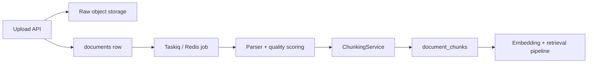
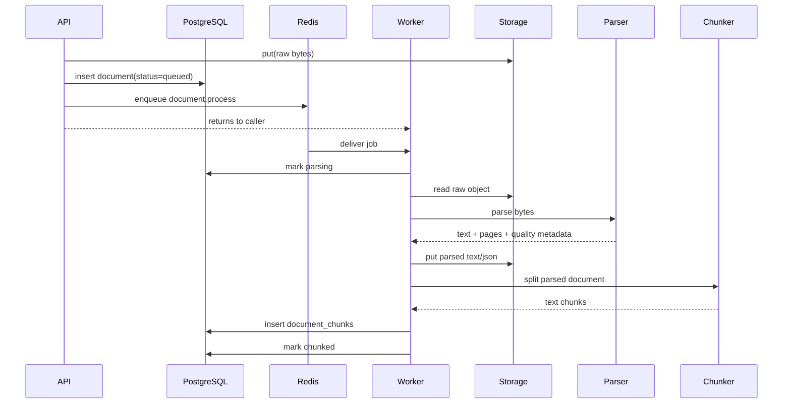

# Knowledge Ingestion: A Document’s First Day in APE

> **Story:** a customer uploads one policy PDF. Follow what happens before that policy can answer a question.

This chapter is the end-to-end map for the first half of RAG:

```text
upload -> store -> queue -> parse -> quality check -> chunk -> persist
```

The workflow is deliberately asynchronous. A large document should not hold an HTTP request open while workers do CPU-heavy parsing and chunking.

## The short version

1. The API receives a file and calculates a content hash.
2. The raw bytes go to local storage or MinIO/S3-compatible storage.
3. PostgreSQL records the document and its project boundary.
4. A `document.process` job is queued.
5. A worker parses the file into normalized text and metadata.
6. The same workflow selects a chunking strategy and writes `document_chunks` rows.
7. Retrieval later embeds and indexes those chunks.



## Why store the file before parsing it?

The raw file is the source of truth. Parsed text is a derived artifact.

That distinction makes reprocessing possible:

```text
raw file (keep) -> parser version 1 -> parsed text v1
                -> parser version 2 -> parsed text v2
```

If extraction improves, you should not ask the customer to upload the document again. Reprocessing reads the original bytes and creates a new derived version.

## The upload path

The request enters at:

```http
POST /api/v1/projects/{project_id}/documents
```

The important implementation path is:

| Step | Code | Beginner translation |
| --- | --- | --- |
| Receive request | `api/v1/routes/documents_router.py` | Validate the HTTP upload |
| Wire dependencies | `dependencies/knowledge.py` | Assemble the service with DB, storage, and queue |
| Orchestrate upload | `modules/knowledge/services/document_service.py` | Hash, deduplicate, store, commit, enqueue |
| Save metadata | `modules/knowledge/repositories/document_repository.py` | Keep the searchable record project-scoped |
| Store bytes | `platform/providers/implementations/local_storage.py` or `minio_storage.py` | Put the file outside PostgreSQL |
| Queue work | `platform/jobs/implementations/taskiq_queue.py` | Tell a worker what to process |

The response is intentionally quick. A typical first state is `queued`.

## Statuses are a story, not decoration

| Status | Meaning |
| --- | --- |
| `uploaded` | The document row exists and raw bytes were stored. |
| `queued` | A worker job should process this document. |
| `parsing` | A worker is reading and extracting the file. |
| `chunking` | The workflow is selecting and applying chunk rules. |
| `chunked` | Searchable text segments exist; retrieval can embed them. |
| `embedded` | Vector representations have been written. |
| `ready` | Embeddings and keyword indexes are complete for search. |
| `failed` | Processing stopped with an error that needs attention or reprocessing. |

The current implementation uses the document status as a lifecycle guard. A production job model should eventually record attempts, leases, progress, and recovery separately. That is an important platform lesson: **business state tells you what is true; job state tells you what workers are doing.**

## The worker path



## Storage keys

APE keeps raw and derived artifacts under project/document/version paths:

```text
raw:    {project_id}/{document_id}/{filename}
parsed: {project_id}/{document_id}/parsed/v{version}.txt
json:   {project_id}/{document_id}/parsed/v{version}.json
```

This makes the object store cheap for large content and leaves PostgreSQL responsible for metadata, chunks, vectors, and filters.

## What happens when the same document is uploaded twice?

The upload stream is hashed with SHA-256 before the document is accepted. The repository checks for an existing hash inside the same project. This protects the pipeline from doing expensive parse/embed work twice for identical content.

The lesson is broader than deduplication: **content identity is different from filename identity.** A renamed copy of the same file should still be recognisable.

## What can go wrong?

Use this failure map while reading the code:

| Failure | Where to reason about it | Good product behavior |
| --- | --- | --- |
| Storage unavailable | Storage provider boundary | Return a service-unavailable error; do not create a misleading ready document |
| Queue unavailable | Enqueue boundary | Keep the document recoverable and tell the caller that processing did not start |
| Corrupt/unsupported file | Parser boundary | Permanent, human-readable failure; do not retry forever |
| Temporary provider/network failure | Worker boundary | Retry with backoff and preserve attempt history |
| Worker crashes mid-stage | Job lifecycle | Detect expired work and requeue safely |
| Parser produces low-quality text | Quality scoring | Try the next extraction path or mark the document for review |

## Reprocess and delete

Reprocess should mean “read the source of truth again”:

```text
POST .../documents/{id}/reprocess
    -> bump document version
    -> enqueue document.process
    -> replace derived text and chunks
```

Delete should remove the searchable surface as well as the file:

```text
DELETE .../documents/{id}
    -> soft-delete metadata
    -> remove chunks and retrieval rows
    -> remove raw and parsed storage artifacts
```

## The first learning checkpoint

Before moving on, explain this in your own words:

> The API stores the original file and queues work because parsing is a derived, slow operation. The worker creates normalized text, then chunks that text so retrieval can later work with small, citable pieces.

Next: [Document Parsing and Extraction](./document-parsing-and-extraction.md).

## Related code and chapters

- [Object Storage for RAG](./object-storage-for-rag.md)
- [Document Parsing and Extraction](./document-parsing-and-extraction.md)
- [Text Chunking for RAG](./text-chunking-for-rag.md)
- [Embeddings Fundamentals](./embeddings-fundamentals.md)
- `backend/app/modules/knowledge/`
- `backend/app/worker/handlers/document.py`
