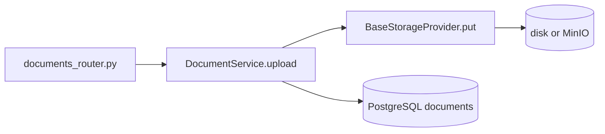

# Object Storage for RAG

## The basic idea

RAG pipelines work with **files** (PDFs, Word docs, images). Putting multi-megabyte binaries inside PostgreSQL is slow and expensive. **Object storage** keeps blobs in a filesystem or S3-compatible bucket; the database stores only **metadata** and **keys** that point to the blobs.

APE abstracts storage behind `BaseStorageProvider` so the same code runs on:

- **Local disk** during development (`APE_STORAGE__BACKEND=local`)
- **MinIO / S3** in Docker or production (`APE_STORAGE__BACKEND=minio`)

---

## Where storage fits in the journey

Object storage is touched **twice** during ingestion:

```text
Upload (API)          →  put raw file     →  storage_key
Worker (background)   →  put parsed text  →  parsed_text_storage_key
Worker (background)   →  get raw file     →  read for parsing
```

See the [full pipeline](./knowledge-ingestion-journey.md) for the complete diagram.

---

## File-by-file: upload path

**Trigger:** `POST /api/v1/projects/{project_id}/documents`



| # | File | Role |
| - | ---- | ---- |
| 1 | `api/v1/routes/documents_router.py` | Reads multipart `UploadFile`, builds async byte stream |
| 2 | `dependencies/knowledge.py` | Injects `get_storage_provider()` into `DocumentService` |
| 3 | `modules/knowledge/services/document_service.py` | `upload()`: SHA-256 while streaming, builds `storage_key` |
| 4 | `platform/providers/contracts/storage.py` | `BaseStorageProvider` interface (`put`, `get`, `delete`) |
| 5 | `platform/providers/implementations/storage_factory.py` | `get_storage_provider()` — picks local vs MinIO from config |
| 6 | `platform/providers/implementations/local_storage.py` | Writes chunks to `APE_STORAGE__LOCAL_ROOT/{key}` via `aiofiles` |
| 7 | `platform/providers/implementations/minio_storage.py` | Same contract via boto3 (used in Docker Compose) |
| 8 | `models/document.py` | Persists `storage_key`, `size_bytes`, `content_sha256` |

### What `upload()` does with storage

1. **Hash** the stream (`_hash_stream`) for duplicate detection per project.
2. **Build key:** `{project_id}/{document_id}/{safe_filename}` (`build_storage_key` in `document_service.py`).
3. **`storage.put(key, stream)`** — bytes land in object storage.
4. **Commit** the `documents` row; on failure, rollback and `storage.delete(key)`.

Duplicate content in the same project → `409` before any new object is written.

---

## Storage key design

```text
Raw upload:   {project_id}/{document_id}/{safe_filename}
Parsed text:  {project_id}/{document_id}/parsed/v{version}.txt
```

| Part | Why |
| ---- | --- |
| `project_id` prefix | Tenant isolation; bucket policies per customer |
| `document_id` | Stable path even if filename changes on re-upload |
| `safe_filename` | Basename only; unsafe chars stripped (`safe_filename()`) |
| `parsed/v{N}.txt` | Version bumps on reprocess — old parsed file can be replaced |

---

## File-by-file: worker read/write

**Trigger:** Taskiq job `document.process` (after upload enqueues)

| # | File | Role |
| - | ---- | ---- |
| 1 | `worker/handlers/document.py` | `create_storage_provider(settings)` per job |
| 2 | `workflows/document_processing.py` | `read_storage_bytes(storage, document.storage_key)` |
| 3 | same | After parse: `storage.put(parsed_text_storage_key, encoded text)` |
| 4 | same | On reprocess: may `storage.delete(old parsed key)` |

Parsed text lives in storage (not in a DB `TEXT` column) so large documents do not bloat PostgreSQL.

---

## Configuration

| Env var | Default | Effect |
| ------- | ------- | ------ |
| `APE_STORAGE__BACKEND` | `local` | `local` or `minio` |
| `APE_STORAGE__LOCAL_ROOT` | `./storage` | Root folder when backend is `local` |
| `APE_MINIO__*` | see `.env.example` | Endpoint, credentials, bucket when backend is `minio` |

Defined in `core/config.py` (`StorageConfig`, `MinioConfig`).

---

## Delete path

**Trigger:** `DELETE .../documents/{document_id}`

`DocumentService.soft_delete()`:

1. Soft-delete row (`deleted_at` set).
2. `storage.delete(storage_key)` — raw file.
3. `storage.delete(parsed_text_storage_key)` — parsed text, if present.

If storage delete fails, the DB row is still soft-deleted; a warning is logged (`storage_delete_failed`).

---

## Concepts worth knowing

| Concept | In APE |
| ------- | ------ |
| **Blob vs metadata** | Bytes in storage; `documents` table holds keys and status |
| **Provider pattern** | Modules never import boto3/aiofiles — only `implementations/` |
| **Stream-friendly `put`** | Upload reads file in 64KB chunks; storage writes incrementally |
| **Idempotency** | Content hash in DB prevents duplicate uploads per project |

---

## Production notes

- Use presigned URLs (`get_download_url` on MinIO provider) for large downloads without proxying through the API.
- Monitor `storage_delete_failed` logs — DB and storage can diverge.
- Virus scan / MIME validation are natural hooks before `put()` in `DocumentService`.

---

## Related

- [Knowledge ingestion journey](./knowledge-ingestion-journey.md) — full E2E
- [Document parsing](./document-parsing-and-extraction.md) — what happens after `get(storage_key)`
- [Feature doc](../features/knowledge_module.md)
