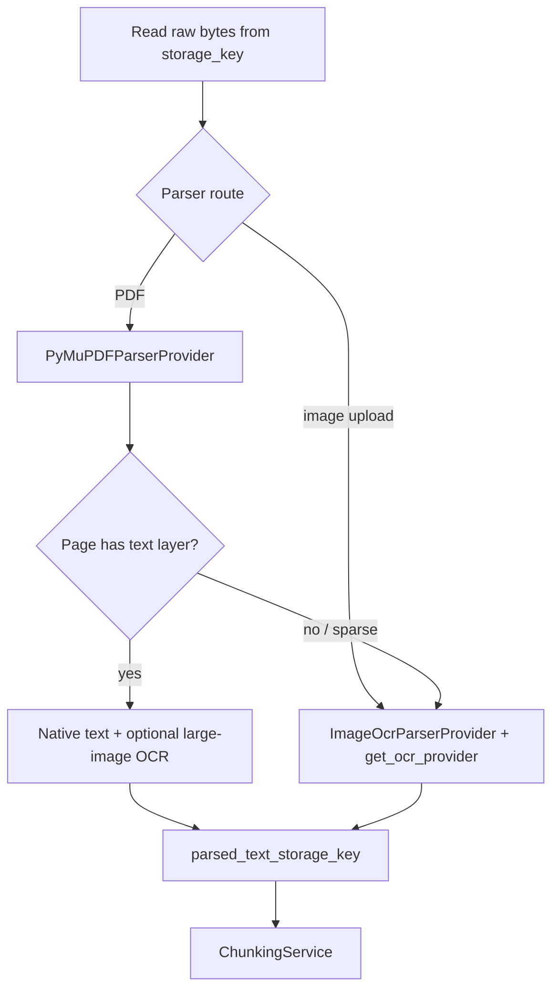

# OCR Fundamentals (APE Context)

## The basic idea

| Approach | What it reads | Example input |
| -------- | ------------- | ------------- |
| **Parsing** | Text already embedded in the file | Digital PDF, `.txt`, `.docx` |
| **OCR** | Text visible in **images** (pixels → characters) | Scanned PDF, photo of a page, screenshot |

**Parsing** asks: “What text does this file already contain?”  
**OCR** asks: “What characters are drawn in this picture?”

---

## What APE does today

**OCR is optional** via `OCRProvider` (`providers/contracts/ocr.py`):

| Component | Role |
| --------- | ---- |
| `OcrConfig` | `APE_OCR__ENABLED`, `APE_OCR__BACKEND`, `APE_OCR__LANG` (default `en`) |
| `ocr_factory` | Language-keyed provider pool; `get_ocr_provider(lang=...)` resolves document `ocr_lang` → deployment default |
| `PaddleOCRProvider` | Optional implementation — `pip install -r backend/requirements/ocr.txt` |
| `ImageOcrParserProvider` | Image uploads (PNG, JPEG, …) when OCR enabled |
| `PyMuPDFParserProvider` | OCR fallback for image-only PDF pages |

When OCR is **disabled** (default):

1. **PyMuPDF parsing** reads the PDF text layer only.
2. Image-only pages log: `Page N contains images only; OCR is not enabled.`
3. Image uploads fail with a clear error unless OCR is enabled.

When OCR is **enabled**:

- Scanned pages produce `ParsedElement` rows with `ocr_confidence` metadata.
- Per-page confidence stored in `structure_hints.ocr_pages`.
- **Language**: deployment default `APE_OCR__LANG` (`en`); optional per-document `ocr_lang` on upload/reprocess (stored on `documents.ocr_lang`). Worker passes `ocr_lang` into parsers; `ocr_factory` caches one Paddle instance per language (bounded pool).
- **Mixed pages**: native text is extracted first; only **large** embedded images (default ≥ 8% of page area) are OCR'd separately — small logos are skipped.
- **`min_text_chars`** (default 20): OCR output shorter than this is discarded (reduces logo noise).
- **`min_page_confidence`**: OCR below this confidence is discarded.
- **Layout analysis**: magazine/brochure pages with interleaved text and figures use reading-order block extraction.
- Optional retrieval filter: `APE_RETRIEVAL__MIN_OCR_CONFIDENCE`.

See [multilingual-text-processing.md](multilingual-text-processing.md) and ADR-010.

---

## OCR language resolution

```text
upload ocr_lang (optional)  →  documents.ocr_lang
                                    ↓
worker document_processing  →  parser.parse(ocr_lang=...)
                                    ↓
get_ocr_provider(lang=...)  →  resolve: document ocr_lang ?? APE_OCR__LANG
                                    ↓
_OcrProviderPool          →  reuse PaddleOCR per (backend, lang, use_gpu)
```

| Upload / env value | Resolved Paddle `lang` |
| ------------------ | ---------------------- |
| (omit) + `APE_OCR__LANG=en` | `en` |
| `ocr_lang=bn` | **Not supported** — `ProviderError` at worker (no stock Paddle model) |
| `ocr_lang=eng` | `en` (alias) |

---

## Known limitation: Bangla (Bengali)

Phase 1 ships PaddleOCR as the optional OCR backend. **Bangla is not a supported OCR language today.**

```text
Legacy Bangla PDF (broken ToUnicode)
        │
        ▼
PyMuPDF / PDFium → Latin glyph soup → parse quality scorer rejects
        │
        ▼
OCR fallback (Paddle, lang=en by default)
        │
        ▼
Wrong script output (CJK fragments, numbers, English blocks only)
        │
        ▼
May still index as "successful" — retrieval quality poor for Bangla queries
```

| If you need… | Phase 1 status |
| ------------ | -------------- |
| Unicode Bengali in PDF text layer | ✅ Native parsing |
| Scanned / image-only Bangla | ❌ No reliable OCR backend |
| `ocr_lang=bn` | ❌ Blocked by `ensure_paddle_ocr_lang_supported()` |
| Bangla `.png` upload | ❌ Same OCR limitation |

Canonical write-up: [multilingual_support.md](../features/multilingual_support.md#known-limitation-bangla-bengali-ocr). Planned fix: alternate `OCRProvider` (Tesseract `ben`, cloud API, or custom Paddle model).

---

## Where OCR runs (implemented)

Same entry as parsing — **not a separate upload endpoint**:

```text
POST upload  →  enqueue document.process  →  worker  →  workflow
```

OCR is a **branch inside** parsers invoked by `DocumentProcessingWorkflow`:



### Hook points in the codebase

| Location | Role |
| -------- | ---- |
| `platform/providers/contracts/ocr.py` | `OCRProvider`, `OcrPageResult` DTO |
| `platform/providers/implementations/ocr_factory.py` | Pool + `resolve_ocr_lang`, `get_ocr_provider` |
| `platform/providers/implementations/paddle_ocr_provider.py` | PaddleOCR adapter |
| `pymupdf_parser.py` / `image_ocr_parser.py` | OCR branches; accept `ocr_lang` on `parse()` |
| `workflows/document_processing.py` | Passes `document.ocr_lang` into `parser.parse()` |
| `models/document.py` | `ocr_lang` column (nullable override) |
| `documents_router.py` | `ocr_lang` form field on upload; query on reprocess |

Upload (`document_service.py`) and storage (`storage_key`) **stay the same** — OCR consumes the same raw bytes.

---

## File-by-file: scanned PDF path (with OCR enabled)

| Step | File | What happens |
| ---- | ---- | --------------------- |
| 1 | `documents_router.py` | Upload stores bytes; optional `ocr_lang` form field |
| 2 | `document_service.py` | Persists `documents.ocr_lang`; enqueues job |
| 3 | `worker/handlers/document.py` | Starts workflow |
| 4 | `document_processing.py` | `read_storage_bytes` → `parser.parse(ocr_lang=document.ocr_lang)` |
| 5 | `pymupdf_parser.py` | Native text where present; OCR fallback via `get_ocr_provider(lang=...)` |
| 6 | `document_processing.py` | Saves parsed text to `parsed_text_storage_key` |
| 7 | `chunking_service.py` | Chunks merged text |
| 8 | `document_processing.py` | `status=chunked` |

**Without OCR:** image-only pages log warnings and contribute no text; image uploads fail unless `APE_OCR__ENABLED=true`.

---

## How OCR would complete (conceptual)

1. **Input:** Page image (from PDF rasterization or direct `.png` upload).
2. **Engine:** Tesseract, PaddleOCR, cloud Vision API, etc. — behind `BaseOCRProvider`.
3. **Output:** Text string + optional bounding boxes (for citations).
4. **Merge:** Concatenate page texts same way `pymupdf_parser.py` joins pages with `\n\n`.
5. **Downstream:** Unchanged — `parsed_text_storage_key` → `ChunkingService` → `document_chunks`.

OCR must run in the **worker**, never in `documents_router.py` (CPU/GPU heavy, slow).

---

## Signals you need OCR

| Observation | Likely cause |
| ----------- | ------------ |
| `page_count > 0` but `GET .../chunks` returns `total: 0` | Scanned PDF |
| Worker logs `document_parse_warnings` with “images only” | Per-page OCR candidate |
| User uploads `.jpg` / `.png` | No parser route today → `failed` or unsupported |

---

## Concepts

| Term | Short definition |
| ---- | ---------------- |
| **Text layer** | Invisible text in PDFs from Word/LaTeX export — parsing reads this |
| **Raster / scan** | Page is a bitmap — needs OCR |
| **Tesseract** | Common open-source OCR engine (future provider candidate) |
| **Layout analysis** | Detecting columns, tables before OCR — advanced, not in v1 |
| **`language` column** | Detected script on `documents` after parse (not the OCR model hint) |
| **`ocr_lang` column** | Optional per-document Paddle language override |

---

## Production notes (when you build it)

- OCR is expensive — cache per page hash; track cost per `project_id`.
- Prefer OCR only when `len(parsed.text) / page_count` is below a threshold.
- Store OCR output in the same `parsed_text_storage_key` pattern for downstream chunking.
- Never expose raw OCR engine errors to API clients — same pattern as `safe_processing_error()`.

---

## Related

- [Document parsing and extraction](./document-parsing-and-extraction.md) — what runs today
- [Knowledge ingestion journey](./knowledge-ingestion-journey.md) — full file list
- [Text chunking](./text-chunking-for-rag.md) — consumes parsed text after OCR would fill it
