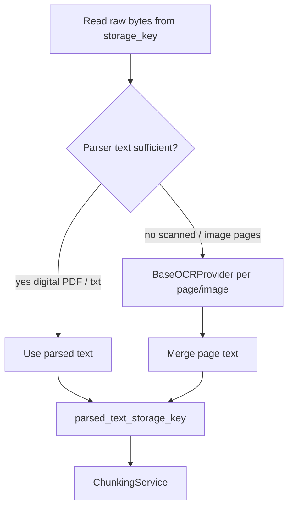

# OCR Fundamentals (APE Context)

## The basic idea

| Approach | What it reads | Example input |
| -------- | ------------- | ------------- |
| **Parsing** | Text already embedded in the file | Digital PDF, `.txt`, `.docx` |
| **OCR** | Text visible in **images** (pixels → characters) | Scanned PDF, photo of a page, screenshot |

**Parsing** asks: “What text does this file already contain?”  
**OCR** asks: “What characters are drawn in this picture?”

---

## What APE does today (Knowledge v1)

**OCR is not implemented.** There is no `BaseOCRProvider`, no OCR worker step, and no image upload path.

What exists instead:

1. **PyMuPDF parsing** (`pymupdf_parser.py`) calls `page.get_text()` — reads the PDF **text layer** only.
2. If a page has images but **no extractable text**, the parser adds a warning:

   ```text
   Page N contains images only; OCR is not enabled.
   ```

3. Warnings are logged in `document_processing.py`; they are **not** returned in the API body.
4. The document may still reach `status=chunked` with **empty** `document_chunks` if no text was extracted.

So for a scanned PDF today: upload works → worker runs → parse returns empty text → chunking produces nothing useful. You need to inspect `page_count`, chunk count, or worker logs.

---

## Where OCR would start (future)

Same entry as parsing — **not a separate upload endpoint**:

```text
POST upload  →  enqueue document.process  →  worker  →  workflow
```

OCR would be a **branch inside** `DocumentProcessingWorkflow`, after or alongside parsing:



### Likely hook points in the codebase

| Location | Future change |
| -------- | ------------- |
| `platform/providers/contracts/` | New `ocr.py` — `BaseOCRProvider`, `OcrResult` DTO |
| `platform/providers/implementations/` | e.g. `tesseract_ocr.py`, `paddle_ocr.py` — SDKs stay here |
| `workflows/document_processing.py` | After `parser.parse()`: if low text density → call OCR → merge into `parsed.text` |
| `pymupdf_parser.py` | Optionally export per-page images for OCR input |
| `models/document.py` | May reuse `language` column as OCR hint |

Upload (`document_service.py`) and storage (`storage_key`) **stay the same** — OCR consumes the same raw bytes.

---

## File-by-file: current path when OCR would be needed

This is what happens **today** for a scanned PDF — use it to see where OCR would slot in:

| Step | File | What happens (no OCR) |
| ---- | ---- | --------------------- |
| 1 | `documents_router.py` | Upload stores PDF bytes — OCR not involved |
| 2 | `document_service.py` | Enqueue job — same for all file types |
| 3 | `worker/handlers/document.py` | Starts workflow |
| 4 | `document_processing.py` | `read_storage_bytes` → full PDF bytes |
| 5 | `pymupdf_parser.py` | `get_text()` returns `""` per page; **warnings** for image-only pages |
| 6 | `document_processing.py` | Saves empty/minimal text to `parsed_text_storage_key` |
| 7 | `chunking_service.py` | `split("")` → **zero chunks** |
| 8 | `document_processing.py` | `status=chunked` anyway (ingestion pipeline completed, but no searchable text) |

**With OCR (future):** step 5–6 would become: detect low text → render page images → `OcrProvider.recognize(image)` → build full `ParsedDocument.text` → then chunking works as today.

---

## How OCR would complete (conceptual)

1. **Input:** Page image (from PDF rasterization or direct `.png` upload).
2. **Engine:** Tesseract, PaddleOCR, cloud Vision API, etc. — behind `BaseOCRProvider`.
3. **Output:** Text string + optional bounding boxes (for citations).
4. **Merge:** Concatenate page texts same way `pymupdf_parser.py` joins pages with `\n\n`.
5. **Downstream:** Unchanged — `parsed_text_storage_key` → `ChunkingService` → `document_chunks`.

OCR must run in the **worker**, never in `documents_router.py` (CPU/GPU heavy, slow).

---

## Signals you need OCR

| Observation | Likely cause |
| ----------- | ------------ |
| `page_count > 0` but `GET .../chunks` returns `total: 0` | Scanned PDF |
| Worker logs `document_parse_warnings` with “images only” | Per-page OCR candidate |
| User uploads `.jpg` / `.png` | No parser route today → `failed` or unsupported |

---

## Concepts

| Term | Short definition |
| ---- | ---------------- |
| **Text layer** | Invisible text in PDFs from Word/LaTeX export — parsing reads this |
| **Raster / scan** | Page is a bitmap — needs OCR |
| **Tesseract** | Common open-source OCR engine (future provider candidate) |
| **Layout analysis** | Detecting columns, tables before OCR — advanced, not in v1 |
| **`language` column** | On `documents` — can hint OCR model later |

---

## Production notes (when you build it)

- OCR is expensive — cache per page hash; track cost per `project_id`.
- Prefer OCR only when `len(parsed.text) / page_count` is below a threshold.
- Store OCR output in the same `parsed_text_storage_key` pattern for downstream chunking.
- Never expose raw OCR engine errors to API clients — same pattern as `safe_processing_error()`.

---

## Related

- [Document parsing and extraction](./document-parsing-and-extraction.md) — what runs today
- [Knowledge ingestion journey](./knowledge-ingestion-journey.md) — full file list
- [Text chunking](./text-chunking-for-rag.md) — consumes parsed text after OCR would fill it
