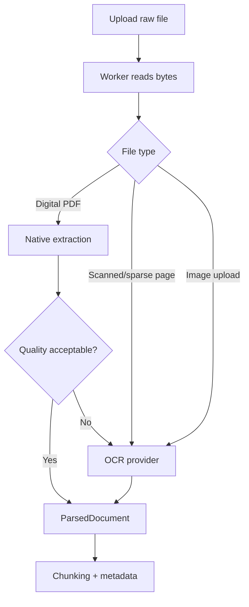

# OCR Fundamentals: When a Page Is Made of Pixels

> **The mystery:** a human can read the scanned page, but the PDF contains no characters. How can a search engine read it?

OCR means **Optical Character Recognition**. It turns pixels into estimated characters.

```text
image pixels -> OCR model -> text + confidence -> chunks -> retrieval
```

## Parsing versus OCR

| Method | Reads | Example |
| --- | --- | --- |
| Parsing | Text already embedded in a file | Digital PDF, TXT, DOCX |
| OCR | Letters drawn in pixels | Scanned PDF, photo, screenshot |

Always prefer a trustworthy text layer first. OCR is a fallback because it is slower and can misread names, numbers, punctuation, and scripts.

## Where OCR sits in APE

OCR is not a separate upload endpoint. It is a branch inside the asynchronous document-processing workflow:



The main hook points are:

- `platform/providers/contracts/ocr.py` — provider contract;
- `ocr_factory.py` — backend/language resolution and provider pooling;
- `paddle_ocr_provider.py` — optional PaddleOCR adapter;
- `pymupdf_parser.py` and `image_ocr_parser.py` — parser branches;
- `document_processing.py` — passes document OCR language into parsing.

## What confidence means

An OCR provider may say that it is 92% confident in a line. That does not mean the entire legal sentence is correct. Confidence is a signal for:

- choosing between extraction candidates;
- filtering very weak output;
- showing operators which pages deserve review;
- deciding whether retrieval should trust the text.

Confidence is not proof.

## Language is a product decision

`APE_OCR__LANG` sets the deployment default. An upload/reprocess may provide a document-level language override.

```text
document ocr_lang -> provider language
otherwise         -> deployment OCR language
```

The provider must actually support the requested script. Setting `bn` on a backend without a Bengali model does not create Bengali OCR; it creates a failure or, worse, wrong-language recognition.

## Current APE limitation

Unicode Bengali text can be tokenized and retrieved when the document contains real Bengali characters. Scanned or custom-font Bengali PDFs are different: the current PaddleOCR path does not provide a production-ready Bengali model.

This is an important beginner lesson: **multilingual text handling and multilingual OCR are separate capabilities.**

## A hands-on experiment

Compare a digital PDF and a scan of the same page:

1. run with OCR disabled;
2. run with English OCR enabled;
3. inspect parsed text, page metadata, confidence, and chunks.

Look for a number or proper name that changed. Retrieval quality is only as trustworthy as the text entering the pipeline.

## OCR tuning knobs

| Knob | Effect |
| --- | --- |
| OCR enabled | Allows pixel recognition; increases worker cost |
| OCR language | Chooses the recognition model/script |
| Minimum text characters | Rejects tiny logo/noise output |
| Minimum page confidence | Rejects weak page candidates |
| Image-area threshold | Avoids OCR on small decorative images |
| Retrieval OCR-confidence filter | Lets search exclude weak OCR chunks |

Tune these against a representative corpus, not a single clean scan.

## Learning checkpoint

You understand OCR when you can answer:

> Why should a scanned page be treated as lower-confidence evidence than a clean digital text layer, even when OCR returned readable words?

## Related

- [Document Parsing and Extraction](./document-parsing-and-extraction.md)
- [Multilingual Text Processing](./multilingual-text-processing.md)
- [Text Chunking for RAG](./text-chunking-for-rag.md)
- [Multilingual support limitation](../features/multilingual_support.md)
