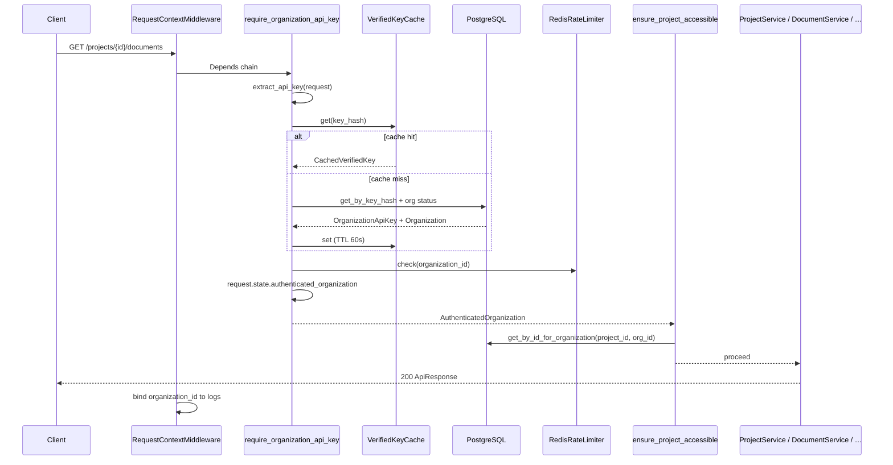

# Organization API Key Auth — Concepts & Codebase Journey

Start here for the **full auth picture**: why APE uses Organization-scoped API keys (not user sessions), how a request is authenticated and authorized, which files are involved, and what trade-offs were made.

> **Reading order:** this page → [Entity lifecycle and reusability](./entity-lifecycle-and-reusability.md) (shared CRUD patterns) → [Configuration system](./configuration-system.md) (`APE_AUTH__*` settings) → [Feature doc](../features/organization_module.md) → [ADR-012](../architecture/adr/012-organization-api-key-auth.md)

---

## The 30-second story

1. A deployment operator sets `APE_AUTH__ADMIN_API_KEY` and `APE_AUTH__KEY_PEPPER` in the environment.
2. Admin calls `POST /api/v1/organizations` with the admin key → creates a **tenant**.
3. Admin calls `POST /api/v1/organizations/{id}/api-keys` → receives a named secret (`ape_live_…`) **shown once**.
4. Integrations call business APIs (`/projects`, `/documents`, `/search`, `/conversations`) with that Organization key.
5. On each request, `require_organization_api_key` extracts the key, checks a **short-lived cache**, verifies the hash against PostgreSQL on miss, applies **rate limiting**, and binds `AuthenticatedOrganization` to `request.state`.
6. Downstream dependencies (`ensure_project_accessible`) confirm the `project_id` in the URL belongs to the authenticated organization — **one query**, no cross-tenant leaks.

**Not in scope (Phase 1):** user accounts, JWT, OAuth, RBAC, per-project keys, IP allowlists.

---

## Two boundaries: Organization vs Project

APE separates **who is calling** from **which corpus they are touching**.

```text
Deployment
  └── Organization          ← auth / tenant boundary (organization_id)
        ├── OrganizationApiKey(s)
        └── Project(s)        ← data isolation boundary (project_id)
              └── documents, chunks, search, chat…
```

| Boundary | Answers | Example |
| -------- | ------- | ------- |
| **Organization** | *Who is the customer / tenant?* | `Acme Corp` with API key `Production` |
| **Project** | *Which knowledge corpus?* | `Tax Audit 2024`, `HR Policies` |

URLs stay unchanged: `/api/v1/projects/{project_id}/documents/...`. The API key answers **who**; the path answers **which project**.

This supports both deployment models:

- **Dedicated (single customer):** one Organization, many Projects, one or more keys.
- **Multi-tenant SaaS:** many Organizations, each with Projects and their own keys.

---

## Glossary

| Term | Meaning in APE |
| ---- | -------------- |
| **M2M auth** | Machine-to-machine — integrations authenticate with long-lived API keys, not interactive login |
| **Admin key** | Deployment bootstrap credential (`APE_AUTH__ADMIN_API_KEY`) for Organization CRUD only |
| **Organization key** | Tenant credential stored hashed in `organization_api_keys`; used on all business routes |
| **Key prefix** | Short display hint (`ape_live_abc123…`) — never the full secret |
| **Pepper** | Server-side secret mixed into HMAC hashing; keys cannot be verified without it |
| **Verified-key cache** | Short TTL positive cache (30–60s) to skip DB lookup on repeat requests |
| **Rate limit key** | `organization_id` — fair throttling per tenant, not per IP |
| **Auth bypass** | When `APE_AUTH__ENABLED=false`, dependencies skip checks (local dev / tests) |

---

## Credential tiers

```text
┌─────────────────────────────────────────────────────────────┐
│  Tier          │  Routes                    │  Credential   │
├────────────────┼────────────────────────────┼───────────────┤
│  Public        │  GET /health, GET /ready   │  none         │
│  Admin         │  /api/v1/organizations/**  │  admin key    │
│  Organization  │  /api/v1/projects/**       │  org API key  │
│                │  + nested business routes  │               │
└─────────────────────────────────────────────────────────────┘
```

Transport (both supported):

```http
Authorization: Bearer ape_live_…
X-API-Key: ape_live_…
```

---

## Big-picture diagram (authenticated business request)



**Important:** middleware does **not** parse credentials. It only enriches logs *after* auth dependencies run.

---

## Phase 1 — Bootstrap journey (new deployment)

| Step | Who | Action | File / endpoint |
| ---- | --- | ------ | --------------- |
| 1 | Operator | Set `APE_AUTH__ENABLED=true`, pepper, admin key | `backend/.env` |
| 2 | Operator | Run migrations (creates `organizations`, backfills default org for existing projects) | `alembic upgrade head` |
| 3 | Admin client | `POST /api/v1/organizations` | `organizations_router.py` |
| 4 | Admin client | `POST …/api-keys` with `name: "Production"` | `api_key_service.py` |
| 5 | Integrator | Store secret securely; use on all business calls | — |
| 6 | Integrator | `POST /api/v1/projects` → get `project_id` | `projects_router.py` |
| 7 | Integrator | Upload docs, search, chat under that `project_id` | knowledge / retrieval / conversations |

**Chicken-and-egg solved:** the admin key lives in environment config, not in the database. No Organization exists until the first admin call.

---

## Phase 2 — Request authentication (Depends layer)

**Entry:** any business route under `api/v1/router.py` wrapped with `Depends(require_organization_api_key)`.

| Step | File | What happens |
| ---- | ---- | ------------- |
| 1 | `platform/http/auth_headers.py` | Read `Authorization: Bearer` or `X-API-Key`; require `ape_live_` prefix |
| 2 | `dependencies/auth.py` | If `APE_AUTH__ENABLED=false` → return bypass context (no org filter) |
| 3 | `platform/domain/api_key_crypto.py` | `hash_key(raw, pepper)` → lookup hash (never store/compare plaintext) |
| 4 | `platform/infra/auth/redis_verified_key_cache.py` or `memory_…` | Cache hit → skip DB |
| 5 | `modules/organizations/repositories/api_key_repository.py` | `get_by_key_hash` + load Organization; reject revoked / inactive / deleted |
| 6 | `platform/domain/api_key_crypto.py` | `verify_key` with `hmac.compare_digest` (timing-safe) |
| 7 | Cache | Populate `CachedVerifiedKey` (org id, active flag, api_key_id) |
| 8 | `platform/infra/rate_limit/redis_rate_limiter.py` | `INCR` per org per window; 429 + `Retry-After` if exceeded |
| 9 | `dependencies/auth.py` | Set `request.state.authenticated_organization` |

On cache miss, `touch_last_used` updates `last_used_at` via `flush()` — the service layer still owns the outer transaction commit.

---

## Phase 3 — Project authorization (single query)

Authentication tells you **which Organization**. Authorization checks **whether this Project belongs to them**.

| Step | File | What happens |
| ---- | ---- | ------------- |
| 1 | `dependencies/projects.py` | `ensure_project_accessible(repo, project_id, auth_org)` |
| 2 | `modules/projects/repositories/project_repository.py` | `get_by_id_for_organization(project_id, organization_id)` |
| 3 | Not found | `404 project_not_found` — same response whether project doesn't exist or belongs to another org |

**Why one query?** Fewer round trips, simpler mental model, fail-closed. Cross-tenant existence is not leaked.

**List/create scoping:**

- `GET /projects` → repository filters `WHERE organization_id = :auth_org_id`
- `POST /projects` → service sets `organization_id` from auth context (or default org when auth disabled)

---

## Phase 4 — Key lifecycle (admin API)

| Operation | Endpoint | Behavior |
| --------- | -------- | -------- |
| **Create** | `POST …/api-keys` | New active key; existing keys unchanged; secret returned once |
| **List** | `GET …/api-keys` | Metadata only (prefix, `last_used_at`, `revoked_at`) |
| **Rotate** | `POST …/api-keys/{id}/rotate` | Creates **new** key; old stays valid unless `?revoke_old=true` |
| **Revoke** | `DELETE …/api-keys/{id}` | Sets `revoked_at`; publishes `ApiKeyAuthInvalidated` after commit |

**Zero-downtime rotation pattern:**

```text
1. POST rotate (revoke_old=false)  →  deploy new secret to Production
2. Verify new key works
3. DELETE old key  →  or POST rotate?revoke_old=true next time
```

### Cache invalidation (domain events)

Services do **not** call `VerifiedKeyCache` directly. After a successful commit, they publish auth domain events; composition wires a single handler.

```text
organization_service / api_key_service
        │  commit
        ▼
AuthEventPublisher.publish(event)
        │
        ▼
VerifiedKeyCacheEventHandler   (dependencies/organizations.py)
        │
        ├── OrganizationAuthInvalidated  →  invalidate_organization(org_id)
        └── ApiKeyAuthInvalidated      →  invalidate(key_hash)
```

| Mutation | Event | Handler action |
| -------- | ----- | -------------- |
| Org `toggle_status` | `OrganizationAuthInvalidated` | Drop all cached keys for tenant |
| Org `soft_delete` | `OrganizationAuthInvalidated` | Drop all cached keys for tenant |
| Key `revoke` (first time) | `ApiKeyAuthInvalidated` | Drop one key hash |
| Key `rotate` + `revoke_old=true` | `ApiKeyAuthInvalidated` (old hash) | Drop old key hash |
| Org metadata `update`, key `create`, idempotent revoke | — | No event (no auth validity change) |

**Why events, not middleware?** Middleware runs on ingress, before writes. Invalidation must follow successful DB commits. A small in-process publisher keeps module services decoupled from Redis/memory cache details.

---

## Security concepts (why, not just what)

### Never store plaintext keys

```text
Create:  raw_key = "ape_live_" + random(32 bytes)
         key_hash = HMAC-SHA256(pepper, raw_key)
         DB stores: key_prefix, key_hash
Response: secret shown once → client must save it
```

If the database leaks, attackers still need the deployment pepper to forge valid hashes.

### Constant-time comparison

`hmac.compare_digest` prevents timing attacks that could guess keys byte-by-byte. Always compare hashes this way — never `==` on secrets.

### 401 for inactive organizations (not 403)

Clients cannot distinguish "bad key" from "disabled tenant" in the response body. Internally we log `organization_inactive` at warn level. This prevents tenant state enumeration.

### Positive-only cache

Failed lookups are **not** cached. Otherwise a brief window after key creation could incorrectly deny valid keys. TTL (30–60s) bounds staleness after revoke.

### Rate limit keyed by organization

IP-based limits break behind corporate NAT and unfairly throttle shared egress. Organization-scoped limits match the billing and fairness model for multi-tenant SaaS.

### Single `APE_AUTH__ENABLED` flag

One clear on/off — no ambiguous `ENABLED=false` + `REQUIRE=true` combinations. Tests and local dev set `false`; production sets `true`.

---

## Architectural choices

### Why Depends, not middleware?

| Depends | Middleware |
| ------- | ---------- |
| Explicit per-router; visible in OpenAPI | Hidden global behavior |
| Easy to unit-test in isolation | Harder to test credential paths |
| Matches APE composition-layer rules | Would mix transport + auth concerns |
| `APE_AUTH__ENABLED=false` is a no-op in one place | Would need duplicate bypass logic |

`RequestContextMiddleware` only assigns `request_id` / `trace_id` and, after the handler, binds `organization_id` from `request.state` for structured logs.

### Why Organization keys, not per-project keys?

Enterprise customers typically run **one integration** against **many Projects** (by topic, department, or audit). One key per customer reduces operational overhead. Project isolation is enforced at the data layer via `project_id` + `organization_id` guard.

### Why multiple named keys?

Supports zero-downtime rotation (`Production`, `CI/CD`, `Staging`) without a maintenance window. Each key is independently revocable.

---

## Key files

| Layer | Path |
| ----- | ---- |
| Config | `core/config.py` → `AuthConfig` |
| Crypto | `platform/domain/api_key_crypto.py` |
| Auth context | `platform/domain/auth_context.py` |
| Header parsing | `platform/http/auth_headers.py` |
| Cache contract | `platform/auth/contracts.py` |
| Auth domain events | `platform/auth/events.py` → `OrganizationAuthInvalidated`, `ApiKeyAuthInvalidated` |
| Cache event handler | `platform/infra/auth/verified_key_cache_event_handler.py` |
| Cache impl | `platform/infra/auth/redis_verified_key_cache.py`, `memory_verified_key_cache.py` |
| Rate limit | `platform/rate_limit/contracts.py`, `platform/infra/rate_limit/redis_rate_limiter.py` |
| Auth Depends | `dependencies/auth.py` |
| Project guard | `dependencies/projects.py` → `ensure_project_accessible` |
| Org DI + event wiring | `dependencies/organizations.py` → `get_auth_event_publisher` |
| Org module | `modules/organizations/{services,repositories,schemas}/` |
| Admin routes | `api/v1/routes/organizations_router.py` |
| Router wiring | `api/v1/router.py` (business sub-router with org auth Depends) |
| ORM | `models/organization.py`, `models/organization_api_key.py`, `models/project.py` |
| Migration | `composition/migrations/versions/20260708_0014-organizations_and_auth.py` |
| Exceptions | `core/exceptions.py` → `RateLimitError` (+ `Retry-After` in exception handler) |

---

## Configuration journey

| Environment | Typical settings |
| ----------- | ---------------- |
| **Local dev** | `APE_AUTH__ENABLED=false` — open API, no keys required |
| **CI / unit tests** | `APE_AUTH__ENABLED=false` (set in `tests/conftest.py`) |
| **Integration tests (auth)** | `auth_db_client` fixture enables auth + admin key + memory cache |
| **Production** | `ENABLED=true`, strong pepper + admin key, Redis cache + rate limit, `RATE_LIMIT_FAIL_OPEN=false` |

See [Configuration system](./configuration-system.md) for how nested `APE_AUTH__*` vars map to `Settings.auth`.

---

## Testing journey

| Layer | What it proves | Location |
| ----- | -------------- | -------- |
| Crypto | Hash determinism, `compare_digest` verification | `tests/unit/platform/test_api_key_crypto.py` |
| Cache | Hit/miss, TTL expiry, org invalidation | `tests/unit/platform/test_verified_key_cache.py` |
| Event handler | Org + key invalidation routing | `tests/unit/platform/infra/auth/test_verified_key_cache_event_handler.py` |
| Services | CRUD, rotate, event publish (mock publisher) | `tests/unit/modules/organizations/` |
| Project scoping | Org-filtered repository methods | `tests/unit/modules/projects/test_project_service.py` |
| Integration | 401/404 cross-org, rotate, revoke | `tests/integration/test_auth_api.py` |

Integration auth tests use a dedicated `auth_db_client` fixture that enables auth **before** `create_app()` so settings are parsed correctly.

---

## Common mistakes

1. **Enabling auth without running migration** — `projects.organization_id` is NOT NULL after `0014_organizations_auth`.
2. **Losing the secret on create** — it is never returned again; rotate if lost.
3. **Using admin key on business routes** — admin key only works on `/organizations/**`.
4. **Expecting 403 for disabled org** — always 401 `unauthorized` to external clients.
5. **Memory cache with multiple uvicorn workers** — each worker has its own cache; use Redis in production.
6. **Forgetting pepper rotation plan** — changing pepper invalidates all stored hashes; treat like a breaking migration.

---

## Trade-offs (Phase 1)

| Decision | Benefit | Cost |
| -------- | ------- | ---- |
| API keys vs JWT | Simple M2M; no token refresh | No fine-grained user identity |
| Short-lived cache | Avoids DB hot path | Up to TTL seconds stale after revoke |
| Org-scoped rate limit | Fair multi-tenant throttling | No per-project burst control |
| Single auth enabled flag | Clear dev/prod split | Cannot require auth on some routes only |
| Default org backfill | Existing projects keep working | Legacy data starts under `"Default"` org |

---

## Related

| Doc | Topic |
| --- | ----- |
| [Feature doc](../features/organization_module.md) | API surfaces, config table, production checklist |
| [API reference](../api/organization_api.md) | Postman-oriented endpoint samples |
| [ADR-012](../architecture/adr/012-organization-api-key-auth.md) | Decision record |
| [Entity lifecycle](./entity-lifecycle-and-reusability.md) | Shared CRUD / soft-delete patterns used by Organization |
| [Testing strategy](./testing-strategy.md) | Fixtures, `db_client`, integration DB guards |
| [Project feature doc](../features/project_module.md) | Project as data isolation boundary |
