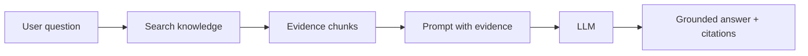
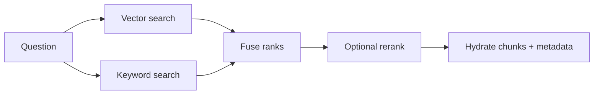

# RAG from Zero: Follow One Question Through the Engine

> **The story:** a customer asks, “What is our refund policy?” APE turns a folder of ordinary files into a grounded answer with evidence.

This is the shortest path through the learning material. You do not need to understand every class or provider first. Follow one question as it travels through six building blocks:

```text
documents -> parsed text -> chunks -> embeddings/indexes -> retrieved evidence -> answer
```

The engine is easier to understand when you imagine a very careful librarian:

- **Ingestion** receives the books.
- **Parsing** opens the files and reads the words.
- **Chunking** puts useful passages on index cards.
- **Embedding** gives each card a meaning-coordinate.
- **Retrieval** finds the best cards for a question.
- **Generation** writes an answer using only the cards it received.

APE is the machinery behind that librarian. Your product keeps the user interface and workflow; APE owns the knowledge journey.

## Before we start: what RAG actually means

RAG stands for **Retrieval-Augmented Generation**.

An LLM is good at writing, but its memory is not your private database. RAG adds a small research step before writing:

1. Search your approved documents.
2. Select the most relevant passages.
3. Put those passages into the LLM prompt.
4. Ask the LLM to answer from that evidence.



**Important distinction:** RAG is not training. The model is not permanently learning your documents. It is being handed a temporary research packet for one answer.

## The journey in six scenes

### Scene 1 — A file enters the system

The host product uploads `employee-handbook.pdf` to:

```http
POST /api/v1/projects/{project_id}/documents
```

APE does two jobs immediately:

- stores the original bytes in object storage;
- stores searchable metadata in PostgreSQL.

The API should not sit and parse a large PDF while the user waits. It commits the document and queues background work. The first visible state is usually `queued`.

**Try asking yourself:** what must survive if the worker crashes one second after upload? The answer is the raw file and a durable record saying what still needs to happen. That is why ingestion is a workflow, not one giant HTTP function.

Continue with [Knowledge Ingestion — End to End](./knowledge-ingestion-journey.md).

### Scene 2 — Bytes become language

The worker reads the raw file and asks a parser to produce normalized UTF-8 text plus useful metadata.

```text
PDF/DOCX/TXT/Markdown bytes
        ↓
parser selection
        ↓
text + pages + language + extraction quality
```

Parsing is not the same as OCR:

- A digital PDF may already contain a text layer. Extract it first.
- A scanned PDF may contain only pixels. OCR is a fallback that recognizes those pixels.
- A poor extraction can look successful while silently producing garbage text.

APE’s PDF path scores extraction quality and can try PyMuPDF, PDFium, and optional OCR. Learn the trade-offs in [Document Parsing and Extraction](./document-parsing-and-extraction.md) and [OCR Fundamentals](./ocr-fundamentals.md).

### Scene 3 — A long document becomes useful cards

An LLM cannot search a 200-page PDF as one giant object. Chunking splits text into passages that are small enough to retrieve and large enough to preserve meaning.

Imagine the sentence:

> Employees may request a refund within thirty days of purchase, provided the original receipt is attached.

A useful chunk keeps the heading, the rule, and its nearby conditions together. A bad chunk may split “within thirty days” from the exception that follows it.

```text
Document
  ├── heading: Refunds
  ├── chunk 0: eligibility rule + conditions
  ├── chunk 1: submission steps
  └── chunk 2: exceptions
```

Read [Text Chunking for RAG](./text-chunking-for-rag.md) to learn why size, overlap, structure, and token estimates change retrieval quality.

### Scene 4 — Words become coordinates

An embedding model turns a chunk into a fixed-length list of numbers:

```text
"refund within thirty days" -> [0.12, -0.07, ... , 0.41]
```

The individual numbers are not human-readable. Their geometry is useful: chunks with similar meaning land closer together in vector space.

When the question is “Can I get my money back after three weeks?”, exact words may not match “refund within thirty days.” Embeddings help the engine see the relationship.

Read [Embeddings Fundamentals](./embeddings-fundamentals.md) before [Vector Storage and pgvector](./vector-storage-and-pgvector.md).

### Scene 5 — Search finds evidence, not an answer

At question time, APE embeds the question and searches for nearby chunks. It can also run keyword search for exact terms such as policy IDs, product codes, case numbers, or dates.



Hybrid retrieval is not a compromise; it is two different instincts working together:

- semantic search catches paraphrases;
- keyword search protects exact identifiers;
- rank fusion combines their candidate lists;
- reranking takes a closer look at the shortlist.

Read [Semantic Search](./semantic-search-for-rag.md) and then [Hybrid Retrieval Journey](./hybrid-retrieval-journey.md).

### Scene 6 — The LLM writes from the research packet

The chat service builds a prompt containing:

- system instructions;
- selected evidence chunks;
- recent conversation history;
- the user’s question.

The LLM does not query PostgreSQL directly. It receives the retrieved evidence and returns language. A strong prompt says what the model should do when the evidence is missing and tells it to treat document text as data, not instructions.

Read [Conversation RAG Journey](./conversation_rag_journey.md) and [RAG Prompting](./conversation_rag_prompting.md).

## The knobs that change the answer

When a result is bad, do not randomly change the model. First identify which building block failed.

| Symptom | Likely knob | What changing it does |
| --- | --- | --- |
| The right section is never found | Chunk size, strategy, embedding model, candidate count | Changes what can be represented and how many candidates reach the answer stage |
| Exact case numbers are missed | Keyword candidate count, hybrid strategy, tokenizer | Gives rare identifiers a stronger path into retrieval |
| Search returns related but wrong passages | Metadata filters, score threshold, reranker, top-k | Narrows or reorders the evidence set |
| Answer is incomplete | Context chunk count or context budget | Gives the LLM more relevant evidence, at the cost of latency/tokens |
| Answer invents details | Prompt rule, evidence threshold, citation policy | Makes unsupported answers less acceptable |
| OCR documents search poorly | OCR language/provider, parse-quality thresholds | Changes the text that enters the rest of the pipeline |
| Reindexing gives inconsistent results | Embedding set version, provider/model snapshot | Ensures chunks and queries use compatible representations |

The configuration chapter explains how environment variables map to these controls: [Configuration System](./configuration-system.md).

## A small experiment: learn by changing one thing

Use one short document and three questions:

1. An exact question: “What is policy PR-104?”
2. A paraphrase: “How long do I have to request a refund?”
3. An out-of-scope question: “Who is the CEO of a company not mentioned here?”

Run the same corpus through the system and change only one variable at a time:

- chunk target size;
- `top_k`;
- semantic versus hybrid retrieval;
- context budget;
- score threshold.

Record which source chunk was returned and whether the final answer stayed inside the evidence. This turns configuration from a list of mysterious environment variables into observable cause and effect.

## The beginner’s completion checklist

You understand the core RAG flow when you can explain:

- why raw files and parsed text live in different places;
- why one document becomes many chunks;
- why the same embedding configuration must be used for chunks and questions;
- why keyword and semantic search have different strengths;
- why retrieval quality is separate from LLM writing quality;
- why a citation should point to evidence, not merely indicate that context existed;
- which setting you would change first for a missing answer and why.

## Where the code lives

| Building block | Main area |
| --- | --- |
| HTTP and project boundary | `backend/app/api/`, `backend/app/dependencies/` |
| Ingestion and lifecycle | `backend/app/modules/knowledge/` |
| Parsing and OCR providers | `backend/app/platform/providers/implementations/` |
| Embeddings and retrieval | `backend/app/modules/retrieval/` |
| Chat orchestration | `backend/app/modules/conversations/` |
| Workers and jobs | `backend/app/worker/`, `backend/app/platform/jobs/` |
| Configuration | `backend/app/core/config.py` |

Once this story makes sense, the detailed files stop looking like a maze. Each one is a room in the same building.
