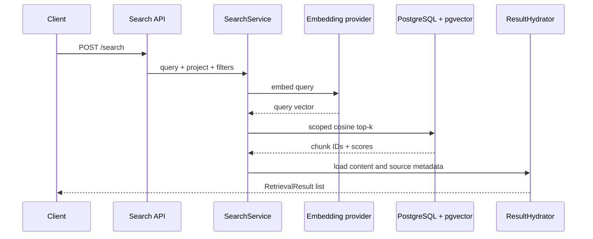

# Semantic Search: Ask for Meaning, Not Just Words

> **Scene:** the user asks a question. Before an LLM writes anything, APE must find the best evidence.

Semantic search turns the question into a vector, compares it with chunk vectors, and returns the closest candidates.

```text
question -> query embedding -> pgvector cosine search -> candidate chunks
```

## The request path



## Why the project filter is part of search

The search query is not “find similar text in the database.” It is:

```text
find similar text
where project_id = this project
and document is ready
and document is not deleted
and embedding provider/model/version are active
and metadata filters are allowed
```

Tenant and lifecycle filters are part of the meaning of a safe result. A perfect similarity match from another project is still a wrong answer.

## What a result contains

The `RetrievalResult` shape gives downstream chat enough information to reason about evidence:

- `chunk_id` and `document_id`;
- chunk content;
- similarity score;
- filename;
- page and character offsets;
- allowlisted metadata.

`ResultHydrator` is intentionally the one place that loads full response content and document details. Retrievers return candidate IDs and scores first, which keeps the hot path easier to test and optimize.

## The knobs that change semantic search

| Setting/concept | Effect |
| --- | --- |
| `top_k` | Number of final results returned |
| Candidate top-k | How many results enter later fusion/reranking |
| `score_threshold` | Rejects results below a similarity floor |
| `APE_RETRIEVAL__HNSW_EF_SEARCH` | Search effort/recall trade-off for HNSW |
| Metadata filter allowlist | Which business filters can become SQL predicates |
| Embedding set version | Which vector snapshot is comparable |

Start with the failure you observe. If no relevant chunk enters the candidate set, increase candidate depth or improve chunking/embeddings. If many related-but-wrong chunks enter, use filters, thresholds, or reranking.

## A practical experiment

Create two projects with similar documents. Upload the same policy to both. Search project A for it while passing project B’s ID.

The expected result is not “no vector match.” It is “no result from the wrong project.” This tiny experiment teaches why isolation belongs inside repository and SQL boundaries, not only in UI code.

## Semantic search is a baseline, not the whole retrieval product

Semantic search is good at paraphrase and conceptual similarity. It can be weaker for:

- exact policy numbers;
- SKUs and case IDs;
- rare names;
- dates and codes;
- queries where one character changes the meaning.

That is why the hosted product uses [Hybrid Retrieval](./hybrid-retrieval-journey.md): semantic and keyword candidates work together.

## Learning checkpoint

You understand semantic search when you can answer:

> Why is a high similarity score not enough to make a result safe for the customer?

Next: [Hybrid Retrieval Journey](./hybrid-retrieval-journey.md).

## Related code

- `backend/app/modules/retrieval/services/search_service.py`
- `backend/app/modules/retrieval/retrievers/semantic_retriever.py`
- `backend/app/modules/retrieval/repositories/chunk_embedding_repository.py`
- `backend/app/modules/retrieval/retrievers/result_hydrator.py`
