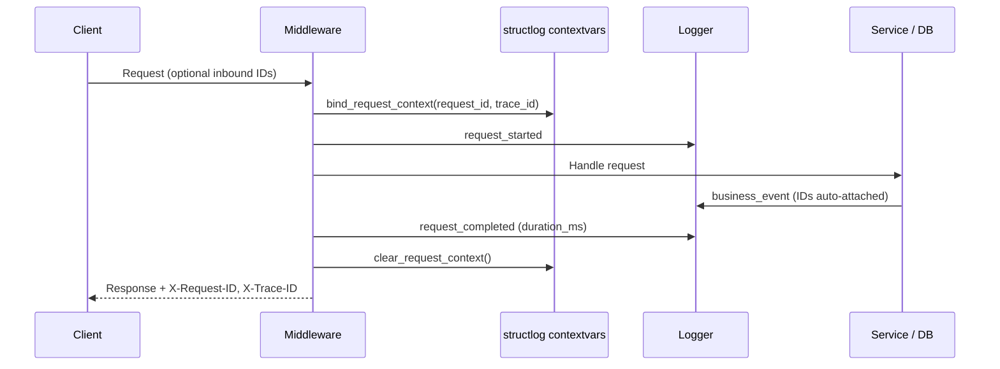

# Structured Logging

This document explains APE's production-ready logging: structlog integration,
correlation IDs, JSON vs console output, and how logs flow through a request.

---

## Why structured logging?

Plain text log lines are hard to query, correlate, and aggregate. Structured logs
attach key-value fields to every event so log platforms (ELK, Loki, CloudWatch)
can filter by `project_id`, `trace_id`, or `model_name` without regex parsing.

APE uses **structlog** on top of Python's standard `logging` module so
application code and third-party libraries (uvicorn, sqlalchemy) share one
pipeline.

---

## Architecture

```text
Application code (get_logger)
        │
        ▼
structlog (processors: contextvars, level, timestamp, ...)
        │
        ▼
stdlib logging (root handler)
        │
        ├── JSONRenderer        (production: APE_LOGGING__RENDER_JSON=true)
        └── ConsoleRenderer     (development: colorized, human-friendly)
```

Configured once in `configure_logging(settings)` called from `create_app()`.

---

## Correlation IDs

Every HTTP request gets two identifiers via `RequestContextMiddleware`:

| ID | Header | Purpose |
| -- | ------ | ------- |
| `request_id` | `X-Request-ID` | Single HTTP request |
| `trace_id` | `X-Trace-ID` | End-to-end trace across services |

Flow:



Inbound headers are honored when present; otherwise UUIDs are generated. This
supports upstream gateways that already assign trace IDs.

---

## Usage in code

```python
from app.core.logging import get_logger

log = get_logger(__name__)

log.info("document_indexed", document_id=str(doc_id), chunks=42)
log.warning("dependency_slow", dependency="qdrant", latency_ms=2500)
log.exception("unhandled_failure", error=str(exc))  # includes traceback
```

**Convention:** Use `snake_case` event names and attach structured fields rather
than interpolating into the message string.

---

## JSON vs console rendering

| Setting | Output | When to use |
| ------- | ------ | ----------- |
| `APE_LOGGING__RENDER_JSON=false` | Colorized console | Local development |
| `APE_LOGGING__RENDER_JSON=true` | One JSON object per line | Production, log aggregation |

JSON example:

```json
{
  "event": "request_completed",
  "level": "info",
  "timestamp": "2026-06-28T09:00:00.000000Z",
  "request_id": "a1b2c3",
  "trace_id": "d4e5f6",
  "method": "GET",
  "path": "/ready",
  "status_code": 200,
  "duration_ms": 45.2
}
```

---

## Uvicorn integration

Uvicorn's loggers (`uvicorn`, `uvicorn.error`, `uvicorn.access`) are reconfigured
to propagate through the root handler instead of using their own formatters.
This keeps access logs consistent with application logs.

---

## Error logging vs client responses

Exception handlers log full tracebacks with `log.exception()` but return opaque
`ErrorResponse` messages to clients. The `trace_id` in the error envelope lets
operators find the matching log line without exposing internals.

---

## Future observability

The foundation prepares for Langfuse tracing (Phase 1). `trace_id` alignment
between logs and traces is intentional. Future fields: `span_id`, `project_id`,
`model_name`, token counts.

---

## Common mistakes

| Mistake | Fix |
| ------- | --- |
| Using `print()` | Use `get_logger()` |
| Logging secrets or API keys | Redact in production; never log passwords |
| Creating a new logger per call | `get_logger(__name__)` once per module |
| Forgetting to clear context | Middleware handles this in `finally` |

---

## Key files

| File | Role |
| ---- | ---- |
| `backend/app/core/logging.py` | `configure_logging`, `get_logger`, context bind/clear |
| `backend/app/core/middleware.py` | Assign IDs, access logs |
| `backend/app/core/exception_handlers.py` | Log errors with trace context |
| `tests/unit/test_logging.py` | Configuration and emission tests |
