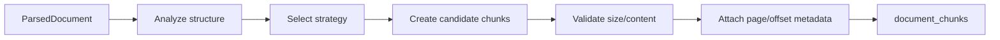

# Text Chunking for RAG: Cut the Document at the Right Places

> **The puzzle:** how do you split a long document so search can find the answer without tearing the meaning apart?

Chunking converts parsed text into searchable passages. Every passage will later become an embedding, a retrieval candidate, and potentially a citation.

```text
parsed document -> boundaries -> chunks -> validation -> document_chunks rows
```

## A chunk is a retrieval unit

Imagine a handbook containing a “Refunds” heading, an eligibility rule, three exceptions, and a submission address. If the chunk is only one sentence long, the answer may miss the exception. If the chunk is the entire handbook, every question receives too much noise.

The useful unit is usually:

```text
heading + related paragraphs + enough surrounding context
```

Chunking is therefore not merely “split every 500 characters.” It is a search-quality decision.

## The APE chunking pipeline



The main code lives under `backend/app/modules/knowledge/services/chunking/`.

## Strategy menu

| Strategy | Best first use | Main risk |
| --- | --- | --- |
| Markdown/heading | Well-structured Markdown or policy documents | A missing or noisy heading can create uneven chunks |
| Structure-aware | Documents with headings, paragraphs, lists, and layout signals | More logic and more behavior to inspect |
| Semantic | Text where neighboring sentences should be grouped by meaning | Depends on the embedding provider and thresholds |
| Recursive fallback | Messy or unstructured text | Can split important context if limits are too small |

The selector should be opinionated. More strategies do not automatically mean better results; they mean more behavior to measure.

## The three knobs beginners should understand first

### Target size

The target is the comfortable center of the chunk. It controls how much context normally stays together.

- too small: precise but fragmented evidence;
- too large: broad but noisy evidence;
- useful starting point: a few paragraphs or a model-appropriate token window.

### Maximum size

The maximum is a safety ceiling. It prevents one heading or malformed paragraph from creating an enormous chunk.

### Overlap

Overlap repeats a small boundary region between neighboring chunks:

```text
chunk A: ... eligibility, receipt, thirty days
chunk B: receipt, thirty days, exceptions, submission address ...
```

Overlap can preserve context at boundaries, but too much overlap increases storage, embedding cost, and duplicate search results.

## Tokens versus characters

LLMs and embedding models consume tokens, not characters. A character count is a useful cheap approximation, but it is not a provider tokenizer.

APE stores a token estimate with each chunk. Treat that estimate as a control signal, not as an exact billing number.

```text
English text: often fewer tokens than characters
code / tables: unusual punctuation can increase tokens
some scripts: character-to-token ratios can differ significantly
```

This is why a chunk size that works for English policy text may behave differently for code, mixed-language content, or tables.

## What makes a chunk good?

A good chunk usually has:

- one coherent topic;
- enough context to answer a question;
- a stable page or offset location;
- no accidental truncation in the middle of a rule;
- predictable size;
- content that is not only a heading or navigation fragment.

## What is stored

`document_chunks` rows carry more than content:

| Field | Role |
| --- | --- |
| `chunk_index` | Stable order within a document version |
| `content` | Text sent to embedding and retrieval |
| `page_number`, `page_start`, `page_end` | Human-readable evidence location |
| `char_start`, `char_end` | Precise offsets in parsed text |
| `token_count` | Budget and diagnostics |
| `chunk_metadata` | Structure, language, and future filters |
| `project_id`, `document_id` | Ownership and isolation |

The metadata is why a chunk can become a citation instead of an anonymous string.

## A hands-on experiment

Use a two-page policy and run three configurations:

1. small target, no overlap;
2. medium target, modest overlap;
3. structure-aware strategy.

For the same question, inspect:

- which chunk is retrieved;
- whether the heading stayed with the rule;
- whether the source page is still clear;
- how many near-duplicate chunks appear.

Do not choose the configuration because it produced the most chunks. Choose the one that returns the smallest sufficient evidence packet.

## Common mistakes

1. **One chunk per page:** page boundaries are useful metadata, not always semantic boundaries.
2. **Huge overlap:** it can make retrieval look busy while adding little evidence.
3. **Tiny chunks:** every result is precise but incomplete.
4. **Ignoring headings:** the rule loses the context that tells the model what it means.
5. **Changing chunking without re-embedding:** new chunks need new vectors.

## Learning checkpoint

You understand chunking when you can answer:

> If the correct document is found but the answer misses an exception in the next paragraph, would you first change the LLM, the chunk boundary, or the retrieval candidate count - and why?

Next: [Embeddings Fundamentals](./embeddings-fundamentals.md).

## Related code and chapters

- [Knowledge Ingestion — End to End](./knowledge-ingestion-journey.md)
- [Document Parsing and Extraction](./document-parsing-and-extraction.md)
- `backend/app/modules/knowledge/services/chunking_service.py`
- `backend/app/modules/knowledge/services/chunking/`
