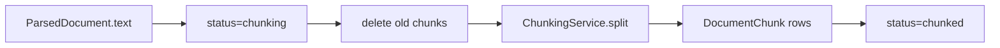

# Text Chunking for RAG

## The basic idea

Embedding models and LLMs have **limited context windows**. You cannot stuff a 200-page PDF into one vector. **Chunking** splits long text into smaller segments that can be:

1. Embedded individually (`modules/retrieval/`)
2. Retrieved by similarity at query time
3. Cited with position metadata (`chunk_index`, `char_start`, `page_number`)

In APE Knowledge v1, chunking is the **last step** of ingestion. The workflow ends at `status=chunked`.

---

## Starting point & end point

| | |
| - | - |
| **Starts** | Immediately after parsing in the **same worker run** (`DocumentProcessingWorkflow`) |
| **Input** | `ParsedDocument.text` (in memory; also saved to `parsed_text_storage_key`) |
| **Output** | Rows in `document_chunks` table |
| **Final status** | `chunked` on the `documents` row |

Upload does not chunk. Clients poll `GET .../documents/{id}` until `status=chunked`, then call `GET .../documents/{id}/chunks`.

---

## Visual flow



Chunking runs inside `workflows/document_processing.py` — not a separate job or API call.

---

## File-by-file journey

| Step | File | What happens |
| ---- | ---- | ------------- |
| 1 | `workflows/document_processing.py` | Parse phase finishes; `document.status = CHUNKING`, commit |
| 2 | `repositories/document_chunk_repository.py` | `delete_by_document(document.id)` — clears chunks from prior run/reprocess |
| 3 | `services/chunking_service.py` | `split(parsed.text, page_count=...)` |
| 3a | same | `RecursiveCharacterTextSplitter` (langchain) splits on paragraph → line → word boundaries |
| 3b | same | Builds `TextChunk` dataclass: content, offsets, `token_count`, `chunk_metadata` |
| 4 | `models/document_chunk.py` | ORM entity mapped to `document_chunks` table |
| 5 | `workflows/document_processing.py` | Maps each `TextChunk` → `DocumentChunk(...)`, `bulk_add()`, `flush()` |
| 6 | same | `document.status = CHUNKED`, final commit |
| 7 | `api/v1/routes/documents_router.py` | `GET .../chunks` → `DocumentService.list_chunks()` |
| 8 | `document_service.py` | `list_chunks()` verifies document exists, delegates to repository |
| 9 | `repositories/document_chunk_repository.py` | `list_by_document()` ordered by `chunk_index` |

Worker wiring: `worker/handlers/document.py` builds `ChunkingService.from_settings(settings)` and passes it into the workflow.

---

## What each chunk row stores

| Column | Source | Purpose |
| ------ | ------ | ------- |
| `chunk_index` | 0, 1, 2, … | Stable order within document |
| `content` | Splitter output | Text returned to retrieval / shown in citations |
| `char_start` / `char_end` | Computed in `chunking_service.py` | Offset in full parsed text |
| `page_number` | `1` if `page_count == 1` (plain text), else `null` | Citation hint; PDF per-page mapping is future work |
| `token_count` | `len(words)` estimate | Rough size — not a real tokenizer yet |
| `chunk_metadata` | `{"splitter": "recursive_character"}` | Extensible JSON |
| `project_id` | From document | Isolation — same as all project-owned data |

Model: `models/document_chunk.py`  
Migration: `composition/migrations/versions/20260630_0006-add_document_chunks_table.py`

---

## Configuration

| Env var | Default | Effect |
| ------- | ------- | ------ |
| `APE_CHUNKING__STRATEGY` | `recursive_character` | Splitter selection (`ChunkingStrategy` enum) |
| `APE_CHUNKING__CHUNK_SIZE` | `1000` | Max characters per chunk (splitter target) |
| `APE_CHUNKING__CHUNK_OVERLAP` | `200` | Characters repeated between adjacent chunks |

Defined in `core/config.py` (`ChunkingConfig`).

**Intuition:**

- **Larger `chunk_size`** → fewer chunks, more context per hit, risk of noisy retrieval.
- **Higher `chunk_overlap`** → less lost context at boundaries, more storage/embedding cost.

Changing env vars and reprocessing the same file should change `GET .../chunks` `total`.

---

## Concepts

| Term | Meaning |
| ---- | ------- |
| **Recursive character splitting** | Try big separators first (`\n\n`), then smaller (`\n`, space) — keeps paragraphs intact when possible |
| **Overlap** | Last N chars of chunk *i* appear again at start of chunk *i+1* — helps queries that span a boundary |
| **Chunk vs document** | Document = one uploaded file; chunks = many searchable pieces |
| **`chunked` status** | Ingestion handoff — embeddings/Qdrant are **out of scope** for Knowledge v1 |

---

## Reprocess behavior

**Trigger:** `POST .../documents/{id}/reprocess`

```text
document_service.reprocess()
  → version += 1
  → enqueue document.process
worker workflow
  → delete_by_document()   # remove old chunks
  → parse again
  → split again
  → new chunk rows
```

Idempotent for unchanged input + stable config → same chunk count.

---

## Delete behavior

**Trigger:** `DELETE .../documents/{id}`

`DocumentService.soft_delete()` calls `DocumentChunkRepository.delete_by_document()` before removing storage files.

---

## API example

```http
GET /api/v1/projects/{project_id}/documents/{document_id}/chunks?limit=20&offset=0
```

Response items include `chunk_index`, `content`, `token_count`, `char_start`, `char_end`. Wrong `project_id` → `404 document_not_found` (same isolation as document GET).

---

## What chunking does **not** do (v1)

- Semantic / sentence-transformer-based splitting
- Per-PDF-page chunk boundaries (only single-page hint for `.txt`)
- Embeddings or Qdrant writes — reserved for `retrieval` module
- Token-accurate counts (word estimate only)

---

## Related

- [Knowledge ingestion journey](./knowledge-ingestion-journey.md) — where chunking sits in the full pipeline
- [Document parsing](./document-parsing-and-extraction.md) — produces the text that gets split
- [Feature doc](../features/knowledge.md)
