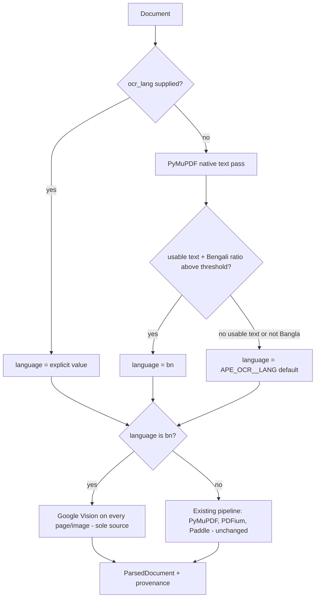

# Bangla OCR via Google Cloud Vision — Implementation Plan

**Status:** Planned (not yet implemented)

Resolve a document language (explicit `ocr_lang`, else existing Unicode script detection, else deployment default) and route Bangla documents to Google Cloud Vision as the sole extraction source. One branch inside the existing PDF workflow, one new OCR provider behind the existing contract, no Bangla-specific heuristics, no new dependencies, no changes to `ParseQualityScorer`.

## Mental model

```text
explicit ocr_lang
        ↓
otherwise existing lightweight detection on extracted text
        ↓
Bangla / mixed Bangla+English?
  ├─ yes → Google Vision DOCUMENT_TEXT_DETECTION for the whole PDF/image
  └─ no  → existing English pipeline unchanged (PyMuPDF → PDFium → Paddle)
```

## Known limitations (document clearly in feature docs)

| Document type | Auto-detectable? | How it reaches Google Vision |
| ------------- | ---------------- | ---------------------------- |
| Unicode Bangla PDF | Yes — Bengali script in the text layer | Detection or explicit/`APE_OCR__LANG=bn` |
| Mixed Unicode Bangla + English | Yes — treat as Bangla | Detection or explicit/`APE_OCR__LANG=bn` |
| Bijoy / custom-font Bangla PDF | **No** — extracts as Latin codepoints | Explicit `ocr_lang=bn` or deployment default `bn` required |
| Bangla scan / image (no usable text layer) | **No** — nothing to detect before OCR | Explicit `ocr_lang=bn` or deployment default `bn` required |

Do **not** add Bijoy/font/encoding heuristics, Windows-1252 penalties, or preliminary OCR solely for language detection.

## What this plan deliberately excludes

- Bijoy/font/encoding heuristics or scorer penalties
- Changes to `ParseQualityScorer`
- Per-page native-vs-OCR competition on the Bangla route
- `languageHints` on Vision requests (defer until benchmarking proves benefit)
- A general language→provider registry (use a blunt `bangla_backend` field only)
- Database migrations
- A parallel Bangla pipeline or new workflow class

## Layout (where each piece lives)

| Concern | Location |
| ------- | -------- |
| Language precedence | `backend/app/platform/domain/ocr_language.py` (extend existing) |
| Script detection | `backend/app/platform/domain/language_detection.py` (reuse as-is) |
| Vision provider | `backend/app/platform/providers/implementations/google_vision_ocr_provider.py` (new) |
| OCR contract | `backend/app/platform/providers/contracts/ocr.py` (unchanged) |
| Backend selection | `backend/app/platform/providers/implementations/ocr_factory.py` |
| Bangla routing | `backend/app/platform/providers/implementations/pdf_extraction_workflow.py` |
| Image path | `backend/app/platform/providers/implementations/image_ocr_parser.py` (no structural change; picks up Vision via factory) |
| Config / secrets | `backend/app/core/config.py`, `runtime_validation.py`, env examples, hosted profile |
| Upload / reprocess API | Existing `ocr_lang` form/query fields — no new endpoints |
| Operator UI | Test Lab language selector + reprocess `ocrLang` forwarding |

## Routing behavior



Mixed Bangla+English resolves to `bn` by testing the Bengali script ratio directly (any meaningful Bengali presence routes to Vision), not by inventing a mixed-language sub-case.

### Scanned / image behavior (explicit)

If there is no usable text layer, language cannot be reliably auto-detected before OCR. Bangla scans and images therefore depend on:

1. Explicit `ocr_lang=bn` on upload/reprocess, or
2. Deployment default `APE_OCR__LANG=bn`

Do not run a preliminary OCR pass just to detect language. For a Bangla-oriented dedicated deployment, setting the default alone covers Unicode, Bijoy, scanned, and mixed with zero heuristics.

On the Bangla route for PDFs: skip native candidate registration and PDFium; OCR every page; Vision output is the sole source. The PyMuPDF pass still runs only to supply `page_count` and a detection sample (milliseconds); its text is discarded on this route.

## Implementation pieces

### 1. Language resolution

Extend `ocr_language.py`:

```python
def resolve_document_language(
    *,
    explicit: str | None,
    sample_text: str,
    default_lang: str,
    bangla_min_ratio: float,
) -> tuple[str, str]:
    """Return (language, source) where source is explicit, detected, or default."""

def is_ocr_first_language(language: str) -> bool:
    return language == "bn"
```

Precedence:

1. Explicit `documents.ocr_lang` (already normalized; `bangla` / `bengali` / `ben` → `bn`)
2. Else `detect_language(sample_text).languages.get("bn", 0.0) >= bangla_min_ratio` → `bn`
3. Else primary detected language, else `default_lang`

Empty / letterless sample (scans, images) falls straight to the deployment default. `is_ocr_first_language` is the only extension point for future scripts — no registry.

### 2. Bangla branch in `PdfExtractionWorkflow`

After the PyMuPDF pass, resolve language once:

- **Bangla route:** skip native candidate registration, skip PDFium, OCR target set = all pages.
- **Otherwise:** today's behavior unchanged.

Shared downstream path stays verbatim: `_ocr_page_candidate`, `_register_candidate`, `_build_page_record`, `summarize_page_extractions`, `_should_fail_document_extraction`, `_build_elements`, `ParsedDocument` return. Two conditionals inside one function — not a second parse path.

`accepted_parser=ocr` and `extraction_method=ocr` for Bangla documents (already valid enum values; no schema change).

### 3. Google Vision OCR provider

New file implementing the unchanged `OCRProvider` contract:

- `provider_name = "google_vision"`
- `DOCUMENT_TEXT_DETECTION` via `https://vision.googleapis.com/v1/images:annotate?key=...`
- **Do not send `languageHints` initially** — let Google auto-detect Bangla + English inside the routed document. Revisit only if later benchmarking proves hints improve quality.
- Text from `fullTextAnnotation.text` through `normalize_for_storage`
- `confidence` = mean of block confidences; `lines` from newline splits
- Sync `httpx.Client` (already in `requirements/base.txt` — **no new dependency**)
- Map errors to existing hierarchy: 401/403 → `ProviderAuthenticationError`; 429 → `ProviderRateLimitError`; timeouts/5xx → retryable connection/timeout errors; malformed → `ProviderError`
- Bounded exponential backoff for retryable cases inside the provider

Replaceability: workflow only sees `OCRProvider`. Swapping Vision later is a factory branch.

### 4. Language-selected backend (`bangla_backend`)

```python
class OcrConfig(BaseModel):
    backend: OcrBackend = OcrBackend.NOOP           # English / current OCR
    bangla_backend: OcrBackend = OcrBackend.NOOP    # unset = Bangla route off
```

- Existing `backend` continues handling English / current OCR behavior (Paddle when enabled).
- `bangla_backend=google_vision` handles Bangla.
- Do **not** generalize into a language→provider registry yet.

`create_ocr_provider` picks the effective backend from the resolved language. Pool key must use the **effective** backend so Paddle and Vision coexist.

**Trap to fix:** `get_ocr_provider` currently short-circuits to noop when `cfg.backend is NOOP`. A Bangla-only deployment with only `bangla_backend=google_vision` would silently get noop. The guard must consider both fields.

Routing gate: `ocr.enabled and ocr.bangla_backend is not NOOP`. Feature is opt-in; no existing deployment changes.

### 5. Configuration, secrets, validation

- `OcrBackend.GOOGLE_VISION = "google_vision"`
- `OcrConfig`: `bangla_backend`, `google_api_key`, `google_endpoint`, `google_timeout_seconds`, `google_max_attempts`, `bangla_min_ratio` (default `0.10`), `max_ocr_pages_per_document`
- Plain `str | None` for the API key (matches OpenAI/Gemini convention; no `SecretStr`)
- Env examples + hosted profile entries
- `runtime_validation`: selecting `google_vision` requires a non-empty key; production `_require_secret` for `APE_OCR__GOOGLE_API_KEY`
- Preflight: construct provider / validate credential presence **without** a network Vision call (document as deliberate decision)

### 6. Failure and retry

`_ocr_page_candidate` currently swallows every `ProviderError`. For a network provider that would commit a partial/empty Bangla parse on transient failure.

- Re-raise when `exc.retryable` is true → durable job runtime retries
- Non-retryable: keep record-and-continue; auth/config fail the job clearly
- On Bangla route, a non-retryable page failure → `UNRECOVERABLE`; existing `min_document_success_ratio` decides document failure (prefer fail over corrupt native fallback)
- Exceeding `max_ocr_pages_per_document` fails explicitly (no silent truncation)

### 7. Provenance and observability

- `structure_hints.language_routing`: `resolved_language`, `source` (`explicit` / `detected` / `default`), `ocr_first`
- `_ocr_provenance()`: `google_vision → ("google_cloud_vision", "v1")`
- Per-page `ocr_provider` / `ocr_confidence` already flow via `ParserAttemptRecord`
- Bump `parsed_document_version` to `1.1.0` (additive)
- Extend `pdf_extraction_complete` log: `resolved_language`, `language_source`, `ocr_provider`
- Ensure operator config read model never serializes `google_api_key`

### 8. API and frontend

No new endpoints. Existing `ocr_lang` upload form field and reprocess query param remain the contract.

Additive console gaps:

- Forward `ocrLang` on `reprocessDocument` in `operatorApiClient`
- Optional language selector on Test Lab upload
- Regenerate OpenAPI types

### 9. Tests and acceptance criteria

- `resolve_document_language` precedence: explicit > detected > default; empty sample → default; mixed Unicode Bangla+English → `bn`; pure English → English
- Vision provider (stubbed `httpx`): success, confidence averaging, 401 auth error, 429 then succeed, malformed payload, timeout → retryable
- Factory: `bangla_backend` selects Vision for `bn`; `backend` for everything else; pool holds both; `backend=noop` + `bangla_backend=google_vision` does not collapse to noop; missing key raises
- Workflow Bangla route: every page → OCR; PDFium never runs; native text not selected; `extraction_method=ocr`
- Workflow English regression: Bangla route off, or English document with route on → identical page records / quality scores to today
- Retryable error propagates from `parse()`; page cap fails cleanly
- `runtime_validation` rejects `google_vision` without a key
- Integration: upload with `ocr_lang=bn` + stubbed provider → `accepted_parser=ocr`, `extraction_method=ocr`

**Acceptance:**

- Unicode Bangla PDF (auto-detect or explicit) → correct Bengali text via Vision
- Mixed Unicode Bangla+English → both scripts via Vision
- Bijoy PDF with `ocr_lang=bn` or default `bn` → correct Bengali text via Vision
- Bangla scan/image with `ocr_lang=bn` or default `bn` → correct Bengali text via Vision
- English corpus → byte-identical parse output, quality scores, and OCR page counts to current build

### 10. Compatibility and migration

- Defaults unchanged: `enabled=false`, `backend=noop`, `bangla_backend=noop`
- PaddleOCR remains fully supported and untouched for English
- No database migration
- `ParseQualityScorer` unmodified — no existing document scores change
- Previously ingested Bangla docs need explicit reprocess with `ocr_lang=bn` (or Bangla default) to correct; corpus does not self-heal
- Sidecar keys additive; tolerate `parsed_document_version=1.1.0`

### 11. Edge cases

- **Bangla images:** no text layer → detection impossible → explicit/`APE_OCR__LANG` decides; `ImageOcrParserProvider` unchanged structurally
- **Bijoy in DOCX/TXT:** no OCR path; out of scope
- **Vision empty text:** existing `accept_ocr_result` + unrecoverable / partial extraction
- **Cost:** Bangla route OCRs every page; `max_ocr_pages_per_document` bounds blast radius; Vision batching deferred
- **Data residency:** page images leave the deployment for Google — document in an ADR as an explicit per-deployment decision
- **Sparse Latin text layer on an otherwise scanned PDF:** detection may report English; empty pages still reach OCR via the existing degraded-page path on the English pipeline

### 12. Documentation deliverables

- Rewrite Bangla section of `docs/features/multilingual_support.md` (precedence + known limitations table above)
- New ADR: external OCR provider, `bangla_backend`, data residency
- Update `docs/Platform-at-a-glance.md` and Known Limitations in `.cursor/rules/project-context.mdc`
- Do **not** amend ADR-011 for encoding heuristics (those are not being added)

## Sequencing

1. Provider + factory + config + validation (verifiable via image path alone)
2. Workflow Bangla branch + retryable error propagation + provenance
3. Frontend language selection + docs

There is no useful smaller intermediate cut than group 1: the Bangla route does nothing without a Bangla-capable backend.

## Implementation todos

1. Extend `ocr_language.py` with `resolve_document_language` / `is_ocr_first_language`
2. Add `GoogleVisionOCRProvider` (`DOCUMENT_TEXT_DETECTION`, no `languageHints`)
3. Add `OcrBackend.GOOGLE_VISION` + `bangla_backend`; language-aware factory; fix noop short-circuit
4. Bangla branch in `PdfExtractionWorkflow`
5. Config/secrets/runtime validation / env examples / hosted profile
6. Re-raise retryable `ProviderError`; enforce page cap
7. Provenance / logging / `parsed_document_version` bump
8. Test Lab + reprocess `ocrLang` forwarding
9. Unit + integration tests per acceptance criteria
10. Feature docs + ADR + project-context limitations
