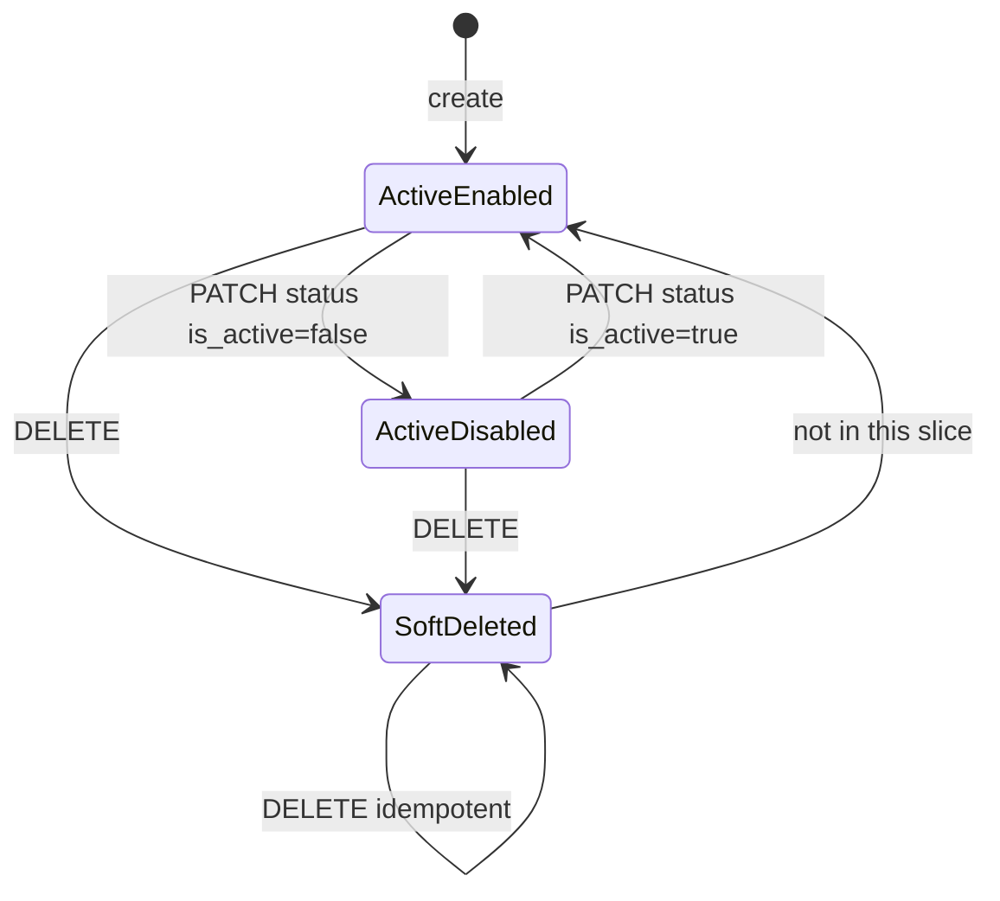
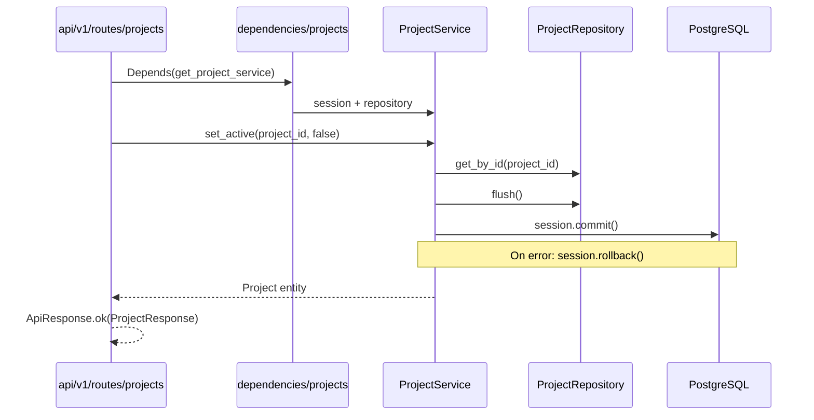
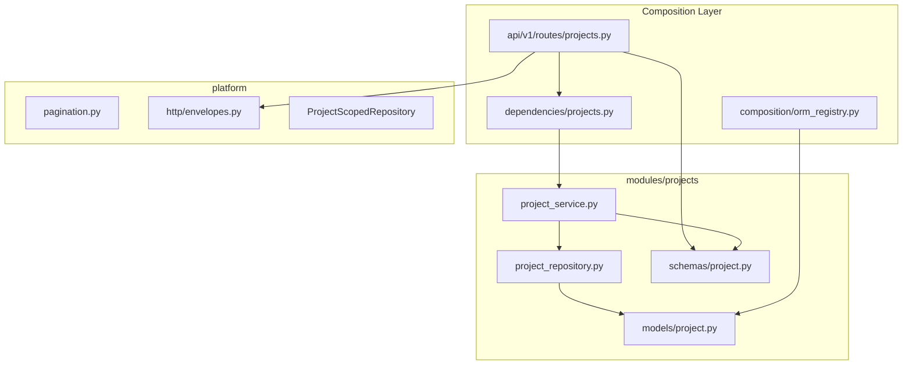

# Project Management Module — Implementation Plan

**Status:** Complete — shipped; see `docs/features/projects.md` for the as-built reference.  
**Phase:** 1 (first business module)  
**Overview:** Implement `modules/projects` with CRUD, `is_active` status toggle, and
soft-delete (`deleted_at` as source of truth). `ProjectRepository` uses
`AsyncSession` directly — no generic unscoped platform repository. HTTP wiring
under `/api/v1/projects`, shared pagination types, Alembic migration, tests, and
feature documentation.

## Implementation todos

| ID | Task | Status |
| -- | ---- | ------ |
| platform-primitives | Add `PaginationParams` / `PaginatedResult`; update template README; fix stale `api/v1/router.py` example | Complete |
| domain-migration | Implement Project ORM, register in `orm_registry`, create `0002` Alembic migration | Complete |
| repo-service | Build `ProjectRepository` (direct `AsyncSession`) + `ProjectService` with soft-delete and transaction boundaries | Complete |
| http-wiring | Add `dependencies/projects.py`, `api/v1/routes/projects_router.py`, mount on `api/v1/router.py` | Complete |
| unit-tests | Unit tests for `ProjectService` (mocked repo/session) | Complete |
| integration-tests | DB fixtures in `conftest` + integration tests for full API flow | Complete |
| feature-docs | Write `docs/features/projects.md` and run `make check` | Complete |

---

## Template-level blockers (resolve first)

| Blocker | Issue | Resolution |
| ------- | ----- | ---------- |
| **B1** | [`backend/app/modules/_template/README.md`](../../backend/app/modules/_template/README.md) assumes every repository extends `ProjectScopedRepository` | Update checklist: **Project-owned** entities use `ProjectScopedRepository`; the **Project aggregate root** uses a module-local repository over `AsyncSession` directly — no `ProjectScopedMixin`, no shared unscoped base |
| **B2** | No shared pagination types (architecture requires centralization) | Add `backend/app/platform/http/pagination.py` with `PaginationParams` + `PaginatedResult[T]` |
| **B3** | No DB integration fixtures | Add session-scoped migration + function-scoped transaction rollback fixtures in `tests/conftest.py`; skip gracefully when PostgreSQL is unreachable |
| **B4** | [`backend/app/api/v1/router.py`](../../backend/app/api/v1/router.py) stale example imports router from `modules/` | Replace docstring example with composition-layer import from `api/v1/routes/projects.py`; register router in same change set |

**Explicit non-goal:** Do **not** export a generic unscoped `EntityRepository` (or any reusable unscoped repository) from `platform/persistence/`. That would weaken fail-closed persistence by giving every module an easy unscoped data path. Project is a one-off aggregate root, not a pattern to generalize.

**Note on "module-local router":** Per [`docs/architecture/module-architecture.md`](../architecture/module-architecture.md), HTTP routers live in `api/v1/routes/`, not inside `modules/`.

**Note on `deleted_by`:** Nullable `UUID`, **no FK** until auth module. DELETE sets `deleted_by=None` until auth wiring exists.

---

## 1. Proposed domain model

### ORM entity — `Project`

Location: `backend/app/modules/projects/models/project.py`

```text
Project (table: projects)
├── id              UUID PK          (UUIDPrimaryKeyMixin)
├── name            VARCHAR(255)     NOT NULL, UNIQUE per deployment
├── description     TEXT             NULL
├── is_active       BOOLEAN          NOT NULL DEFAULT true, indexed
├── deleted_at      TIMESTAMPTZ      NULL — soft-delete source of truth
├── deleted_by      UUID             NULL (no FK until auth module)
├── created_at      TIMESTAMPTZ      (TimestampMixin)
└── updated_at      TIMESTAMPTZ      (TimestampMixin)
```

**Soft-delete rule:** `deleted_at IS NULL` → not deleted; `deleted_at IS NOT NULL` → soft-deleted. No `is_deleted` column or API field (redundant with `deleted_at`).

**Mixins used:** `UUIDPrimaryKeyMixin`, `TimestampMixin` only — **not** `ProjectScopedMixin` (aggregate root).

**Intentionally excluded:** `organization_id`, `slug`, `status` enum, `is_deleted`, members, RBAC, API keys, AI config, metadata JSON blobs.

### Lifecycle rules (service layer)



| State | `deleted_at` | `is_active` | Allowed operations |
| ----- | ------------ | ----------- | ------------------ |
| Active (enabled) | `NULL` | `true` | get, list, update metadata, toggle status, soft delete |
| Active (disabled) | `NULL` | `false` | get, list, update metadata, toggle status, soft delete |
| Soft deleted | set | `false` (set on delete) | get by id; list with `include_deleted=true`; metadata/status update rejected; delete idempotent |

**On soft delete:** set `deleted_at=now(UTC)`, `deleted_by=None`, and `is_active=false`.

**Default list:** `deleted_at IS NULL` only (includes both enabled and disabled projects).

---

## 2. API contract

Base path: `/api/v1/projects` (from `settings.app.api_v1_prefix`).

All success responses use `ApiResponse[T]` from `backend/app/platform/http/envelopes.py`. Errors use global `ErrorResponse` via `APEError` subclasses.

### Endpoints

| Method | Path | Description | Success | Errors |
| ------ | ---- | ----------- | ------- | ------ |
| `POST` | `/projects` | Create project | `201` `ApiResponse[ProjectResponse]` | `409` duplicate name, `422` validation |
| `GET` | `/projects` | List (paginated) | `200` `ApiResponse[PaginatedResult[ProjectResponse]]` | `422` bad pagination |
| `GET` | `/projects/{project_id}` | Get by id | `200` `ApiResponse[ProjectResponse]` | `404` |
| `PATCH` | `/projects/{project_id}` | Partial update (`name`, `description`) | `200` `ApiResponse[ProjectResponse]` | `404`, `409` name conflict, `409` soft-deleted |
| `PATCH` | `/projects/{project_id}/status` | Toggle `is_active` | `200` `ApiResponse[ProjectResponse]` | `404`, `409` soft-deleted |
| `DELETE` | `/projects/{project_id}` | Soft delete | `200` `ApiResponse[ProjectResponse]` | `404` |

### Request/response schemas

**`ProjectCreate`**

- `name`: `str`, min 1, max 255, stripped
- `description`: `str | None`, max 2000
- `is_active` not accepted on create — always `true`

**`ProjectUpdate`** (metadata only — no `is_active`)

- `name`: optional, same rules as create
- `description`: optional; explicit `null` clears description

**Status toggle** (as shipped)

- `PATCH /{project_id}/status` takes **no request body**; each call flips the
  stored `is_active` value (call again to flip back).

**`ProjectResponse`** (`from_attributes=True`)

- `id`, `name`, `description`, `is_active`, `deleted_at`, `deleted_by`, `created_at`, `updated_at`

**List query params** (`PaginationParams` + filters)

- `limit`: int, default 20, min 1, max 100
- `offset`: int, default 0, min 0
- `include_deleted`: bool, default `false`
- `is_active`: `bool | None`, default `None` (omit = all non-deleted; `true`/`false` = filter)

**List ordering:** `created_at ASC`, `id ASC` (deterministic).

### Example shapes

```json
// POST /api/v1/projects
{ "name": "Tax Audit 2026", "description": "Q1 engagement" }

// PATCH /api/v1/projects/{id}/status — no request body; toggles is_active

// GET /api/v1/projects?limit=20&offset=0&is_active=true
{
  "success": true,
  "data": {
    "items": [{ "id": "...", "name": "...", "is_active": true, "deleted_at": null }],
    "total": 42,
    "limit": 20,
    "offset": 0
  }
}

// DELETE /api/v1/projects/{id}  (soft delete)
{
  "success": true,
  "data": {
    "id": "...",
    "is_active": false,
    "deleted_at": "2026-06-29T12:00:00Z",
    "deleted_by": null
  }
}
```

---

## 3. File-by-file implementation plan

### Platform primitives (shared kernel only)

| File | Action |
| ---- | ------ |
| `backend/app/platform/http/pagination.py` | **Create** — `PaginationParams`, `PaginatedResult[T]` |
| `backend/app/platform/http/__init__.py` | Re-export pagination types if needed |

**No changes** to `platform/persistence/__init__.py` exports. Internal `_base_repository.py` stays unexported.

### Module — `modules/projects/`

```text
modules/projects/
├── __init__.py
├── models/
│   ├── __init__.py
│   └── project.py
├── schemas/
│   ├── __init__.py
│   └── project.py              # Create, Update, StatusUpdate, Response
├── repositories/
│   ├── __init__.py
│   └── project_repository.py   # AsyncSession directly — no platform base class
└── services/
    ├── __init__.py
    └── project_service.py
```

**`project_repository.py`** — holds `AsyncSession`, implements queries inline:

- `get_by_id(project_id)` — includes soft-deleted rows (for get-by-id)
- `list_page(limit, offset, include_deleted, is_active)` — `deleted_at` filter + optional `is_active` filter + `order_by(created_at, id)`
- `count(include_deleted, is_active)` — for pagination total
- `exists_by_name(name, exclude_id=None)` — uniqueness among non-deleted rows (`deleted_at IS NULL`)
- `add(entity)`, `flush()` — stage writes; **no commit**

**`project_service.py`** — owns `commit()` / `rollback()`:

- `create(data)` → `is_active=True` → add → flush → commit
- `get(project_id)` → `NotFoundError` if missing
- `list(params)` → returns `PaginatedResult`
- `update(project_id, data)` → reject if `deleted_at is not None`; uniqueness on rename
- `set_active(project_id, is_active)` → reject if `deleted_at is not None`; idempotent if unchanged
- `soft_delete(project_id)` → set `deleted_at`, `deleted_by=None`, `is_active=False`; idempotent if already deleted

Errors: `ConflictError` (duplicate name, mutation on soft-deleted project); `NotFoundError`; map `IntegrityError` → `ConflictError`.

### Composition layer

| File | Action |
| ---- | ------ |
| `backend/app/dependencies/projects.py` | **Create** — `get_project_repository`, `get_project_service` factories |
| `backend/app/api/v1/routes/projects.py` | **Create** — thin router (6 handlers); `Depends()` wiring; `ApiResponse.ok()` |
| `backend/app/api/v1/router.py` | Fix docstring example; `include_router(projects_router, prefix="/projects", tags=["projects"])` |
| `backend/app/composition/orm_registry.py` | Import `Project` model |

### Documentation and template

| File | Action |
| ---- | ------ |
| `backend/app/modules/_template/README.md` | Aggregate-root repository guidance (direct `AsyncSession`; no unscoped platform export) |
| `docs/features/projects.md` | **Create** — full feature doc per `docs/features/README.md` template |

---

## 4. Migration design

**Revision:** `0002_add_projects_table` (depends on `0001_initial`)

**File:** `backend/app/composition/migrations/versions/20260629_0002-add_projects_table.py`

```sql
-- conceptual DDL
CREATE TABLE projects (
    id          UUID PRIMARY KEY,
    name        VARCHAR(255) NOT NULL,
    description TEXT,
    is_active   BOOLEAN NOT NULL DEFAULT true,
    deleted_at  TIMESTAMPTZ,
    deleted_by  UUID,
    created_at  TIMESTAMPTZ NOT NULL DEFAULT now(),
    updated_at  TIMESTAMPTZ NOT NULL DEFAULT now()
);
-- unique name among non-deleted projects (partial unique index)
CREATE UNIQUE INDEX uq_projects_name ON projects (name) WHERE deleted_at IS NULL;
CREATE INDEX ix_projects_is_active ON projects (is_active);
CREATE INDEX ix_projects_deleted_at ON projects (deleted_at);
```

**Partial unique index** allows name reuse after soft delete in future restore/hard-delete flows without blocking this slice.

**Workflow:**

1. Register `Project` in `orm_registry.py`
2. `alembic revision --autogenerate -m "add projects table"`
3. Review diff (constraint names, partial index)
4. `alembic upgrade head`

**Downgrade:** drop `projects` table.

---

## 5. Repository and transaction approach



| Layer | Responsibility |
| ----- | -------------- |
| `get_db_session` (`dependencies/common.py`) | Yield request-scoped `AsyncSession`; rollback on unhandled exception |
| **ProjectRepository** | SQLAlchemy queries over injected `AsyncSession`; staging only |
| **Service** | Business rules, `deleted_at` / `is_active` semantics; **explicit `commit()` / `rollback()`** |
| **Router** | HTTP validation, DI, envelope wrapping only |

**Why not `ProjectScopedRepository`:** Project is the isolation boundary itself — no `project_id` column.

**Why not a platform unscoped repository:** Preserves fail-closed design; unscoped access stays a deliberate, module-local choice for this aggregate root only.

---

## 6. Testing plan

### Unit tests — `tests/unit/modules/projects/`

| File | Coverage |
| ---- | -------- |
| `test_project_service.py` | Create; duplicate name → `ConflictError`; update/toggle on soft-deleted → `ConflictError`; `set_active` idempotency; soft delete sets `deleted_at` and `is_active=false`; not found → `NotFoundError`; commit/rollback |

Pattern: `AsyncMock` repository + `AsyncMock` session; no PostgreSQL required.

### Integration tests — `tests/integration/test_projects_api.py`

Requires PostgreSQL. **Skip gracefully** when DB unreachable.

| Test | Asserts |
| ---- | ------- |
| `test_create_project` | `201`, `is_active=true`, `deleted_at=null` |
| `test_create_duplicate_name` | `409` among active projects |
| `test_list_projects_pagination` | deterministic order, `total/limit/offset` |
| `test_list_excludes_deleted_by_default` | `deleted_at` set → absent from default list |
| `test_list_include_deleted` | `?include_deleted=true` returns soft-deleted |
| `test_list_filter_is_active` | `?is_active=false` returns only disabled |
| `test_get_project` | `200` for active and soft-deleted |
| `test_get_not_found` | `404` standard envelope |
| `test_update_project` | partial patch on name/description |
| `test_update_deleted_project` | `409` |
| `test_set_active_status` | `PATCH .../status` toggles `is_active` |
| `test_set_active_on_deleted_project` | `409` |
| `test_soft_delete_project` | `deleted_at` set, `is_active=false`, `deleted_by=null` |
| `test_soft_delete_idempotent` | second DELETE still `200` |

### Fixtures — extend `tests/conftest.py`

- `db_engine` (session scope)
- `apply_migrations` (session scope)
- `db_session` (function scope, transaction rollback)
- `db_client` — `AsyncClient` with DB session override

Mark: `@pytest.mark.integration` on all DB-dependent tests.

---

## 7. Risks and deferred work

| Risk / deferral | Mitigation |
| --------------- | ---------- |
| **`deleted_by` without users** | Nullable column; `null` until auth module |
| **Hard delete + cascade** | Deferred (ADR-002); soft delete only |
| **Restore / undelete** | Deferred; no `POST /projects/{id}/restore` |
| **Auth / RBAC** | Open endpoints; `deleted_by` not populated |
| **Integration tests need Postgres** | Skip-if-unavailable fixture |
| **Name uniqueness** | Partial unique index on non-deleted rows only |
| **Per-project AI config** | Deferred to config module |
| **Future modules tempted to copy unscoped repo** | Template explicitly forbids generalizing Project's repository pattern |

---

## 8. Ordered implementation steps with acceptance criteria

### Step 1 — Platform primitives + router doc fix

- Add `PaginationParams` / `PaginatedResult`
- Update `_template/README.md` (aggregate-root guidance; no unscoped platform repo)
- Fix stale docstring in `api/v1/router.py`

**Acceptance:** Pagination types importable; template documents the split; router docstring shows `from app.api.v1.routes.projects import router as projects_router`.

### Step 2 — Domain model + migration

- Implement `Project` ORM + register in `orm_registry.py`
- Generate and apply `0002_add_projects_table` (partial unique index on `name`)

**Acceptance:** `alembic upgrade head` creates `projects`; no `is_deleted` column.

### Step 3 — Repository + service

- `ProjectRepository` over `AsyncSession` + `ProjectService` (CRUD, status toggle, soft delete)

**Acceptance:** Unit tests pass for all service paths.

### Step 4 — HTTP composition

- `dependencies/projects.py`, `api/v1/routes/projects.py`, register on `api/v1/router.py`

**Acceptance:** OpenAPI shows 6 endpoints; `PATCH .../status` toggles `is_active`; envelopes consistent.

### Step 5 — Integration tests + fixtures

- DB fixtures in `conftest.py`; `test_projects_api.py`

**Acceptance:** Full flow passes against PostgreSQL; skip cleanly without DB.

### Step 6 — Documentation

- `docs/features/projects.md`

**Acceptance:** Documents `deleted_at` semantics, `is_active` toggle, no hard delete, `deleted_by` deferral.

### Step 7 — Quality gate

- `ruff check .`, `mypy`, `pytest -m unit`, `pytest -m integration` (with docker)

**Acceptance:** `make check` passes; import boundary tests pass; `platform/persistence` still exports only `ProjectScopedRepository`.

---

## Dependency flow (final)



`ProjectRepository` uses `AsyncSession` only — **no edge** to `ProjectScopedRepository` or any new unscoped platform base.

No edges from `modules/projects` to `api/`, `dependencies/`, or other modules.
