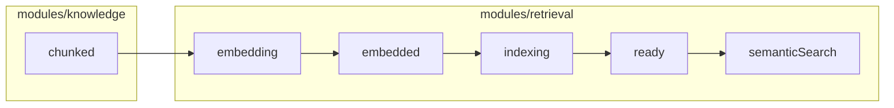

# Retrieval Module — 3-Phase Gated Plan (v3 — Review-Aligned)

Three gated phases: **Phase 1** (embeddings), **Phase 2** (vector indexing), **Phase 3** (semantic search baseline). Each phase ships code, tests, docs, and a manual gate checklist before the next phase starts.

**Prerequisite:** Knowledge v1 complete at `status=chunked` ([knowledge_module_plan.md](./knowledge_module_plan.md)).

---

## What changed in v3

| Review finding | Resolution in this plan |
|----------------|-------------------------|
| Module boundary docs conflict | **Phase 0** doc updates before code; canonical split documented below |
| Semantic-only vs hybrid rule | Phase 3 = **semantic retrieval baseline**; **production retrieval** requires hybrid (ADR) |
| Auto-embed in workflow | **Worker post-process** via `IndexingService`, not `DocumentProcessingWorkflow` |
| Job dispatch understated | **Phase 1 platform task:** `JobName` → Taskiq task **registry** |
| Delete semantics vague | **Documented policy:** soft-delete + immediate search exclusion + best-effort vector purge |
| Lifecycle ambiguous | **Transition table** with idempotency keys |
| Unique key / metadata filters | Unique includes **`provider`**; v1 **filterable metadata allowlist** |
| Premature abstractions | Drop `document_indexing_repository`; defer `BaseRetriever` ABC until hybrid v2 |

---

## Canonical module ownership

```text
modules/knowledge/     upload → parse → chunk     ends at status=chunked
modules/retrieval/     embed → index → search      chunked → embedded → ready → search API
```

- **Knowledge** does not import retrieval.
- **Retrieval** uses shared ORM (`Document`, `DocumentChunk`) via its own thin repos — never imports `modules/knowledge/`.
- **Composition layer** (`dependencies/`) wires delete cascade and optional cross-module hooks.

---

## How we work

```text
Phase 0 docs → Phase 1 → gate → Phase 2 → gate → Phase 3 → gate
```

Each implementation phase ships: code, tests, `docs/features/`, `docs/api/`, `docs/learning/`.

---

## Pipeline overview



**Completion targets (wording matters):**

| Milestone | Meaning |
|-----------|---------|
| **Retrieval Phase 3 baseline** | Semantic search API works E2E (`ready` → `POST /search`) |
| **Production retrieval** | Hybrid BM25 + vector + RRF + reranker — **Retrieval v2**, pre-Chat |

---

## Document status lifecycle

Add `EMBEDDED = "embedded"` in Phase 1 migration (enum already has `embedding`, `indexing`, `ready`).

### Transition table

| From | Action | To | Owner | Idempotency key pattern |
|------|--------|-----|-------|-------------------------|
| `chunked` | enqueue embed | `queued`→`embedding`* | `IndexingService` | `document.embed:{project_id}:{doc_id}:esv{embedding_set_version}` |
| `embedding` | embed success | `embedded` | `EmbeddingWorkflow` | — |
| `embedding` | embed failure | `failed` | `IndexingService` | — |
| `embedded` | enqueue index | `indexing` | `IndexingService` | `document.index:{project_id}:{doc_id}:esv{embedding_set_version}` |
| `indexing` | index success | `ready` | `VectorIndexingWorkflow` | — |
| `indexing` | index failure | `failed` | `IndexingService` | — |
| `ready` | re-embed (model/esv bump) | `embedding` | `IndexingService` | new embed key |
| `ready` | re-index only | `indexing` | `IndexingService` | new index key |
| any | soft-delete | `deleted_at` set | Knowledge `DocumentService` | — |
| deleted | vector purge | Qdrant points removed† | `IndexingService` | best-effort |

\*Worker sets `embedding` when job starts; brief `queued` optional if mirroring knowledge pattern.  
†See delete policy below.

---

## Layering (corrected)

Mirror Knowledge: **services/workers orchestrate; workflows process.**

| Layer | Responsibility |
|-------|----------------|
| **`DocumentService`** (knowledge) | Upload, list, delete, enqueue **`document.process` only** |
| **`DocumentProcessingWorkflow`** (knowledge) | Parse → chunk → `chunked` — **no embed enqueue** |
| **Worker `run_document_process`** | After workflow: if `auto_embed`, call **`IndexingService.enqueue_embed(document_id)`** |
| **`IndexingService`** (retrieval) | Status validation, enqueue embed/index, invoke workflows, delete vectors, structured logs |
| **`EmbeddingWorkflow`** / **`VectorIndexingWorkflow`** | Processing steps only |
| **`SearchService`** (retrieval) | HTTP-facing search; calls **`SemanticRetriever`** directly in Phase 3 |

---

## Platform: multi-job dispatch (Phase 1 deliverable)

1. Add `platform/jobs/registry.py` — maps `job.name` → Taskiq task + payload validator
2. Register: `document.process`, `document.embed`, `document.index`
3. `TaskiqJobQueue.enqueue` delegates to registry (no per-job if/else growth)
4. Worker handlers: `document.py`, `embedding.py`, `indexing.py`

---

## Module layout (trimmed)

```text
modules/retrieval/
    services/
        indexing_service.py
        search_service.py
    retrievers/
        semantic_retriever.py       # Phase 3 — no BaseRetriever ABC until hybrid v2
    repositories/
        chunk_embedding_repository.py
        retrieval_document_repository.py   # thin: get Document, update status only
    schemas/
        search.py                   # SearchRequest, SearchResponse, RetrievalResult
    workflows/
        embedding_workflow.py
        vector_indexing_workflow.py
```

| Route | Phase |
|-------|-------|
| `POST .../documents/{id}/embed` | 1 |
| `POST .../documents/{id}/index` | 2 |
| `POST .../projects/{project_id}/search` | 3 |

DI: `dependencies/retrieval.py`

---

## Configuration (grouped)

On `Settings`:

- **`EmbeddingConfig`** — `backend`, `model`, `dimensions`, `batch_size`, `ollama_base_url`, `openai_api_key`
- **`VectorStoreConfig`** — `collection_name` (uses existing `QdrantConfig` for connectivity)
- **`RetrievalConfig`** — `auto_embed`, `auto_index`, `default_top_k`, `score_threshold`, **`embedding_set_version`**, **`filterable_metadata_keys`** (allowlist, e.g. `["source", "tags"]`)

---

## Provider contracts

### `BaseEmbeddingProvider` (Phase 1)

`platform/providers/contracts/embedding.py` — Ollama + OpenAI via `embedding_factory.py`

### `BaseVectorStoreProvider` (Phase 2)

Neutral DTOs only:

- `VectorPoint`, **`VectorSearchResult`**, `VectorSearchFilter`
- `VectorSearchFilter`: `project_id`, optional `document_id`, optional `metadata: dict[str, str]` — **only allowlisted keys** from `RetrievalConfig.filterable_metadata_keys`

Qdrant impl: `qdrant_vector_store_provider.py` — single collection `ape_chunks`, payload includes filterable metadata copied from `chunk_metadata`.

### Search (Phase 3)

- **`SemanticRetriever`** — embed query → vector search → hydrate chunks → **`RetrievalResult`**
- **`SearchService`** — thin wrapper for router
- **`BaseRetriever` / `HybridRetriever`** — deferred to Retrieval v2 (document in ADR-007)

### `RetrievalResult` (stable API DTO for future Chat)

`chunk_id`, `document_id`, `chunk_index`, `content`, `score`, `filename`, `page_number`, `char_start`, `char_end`, `metadata`

---

## Data model — `chunk_embeddings`

| Column | Notes |
|--------|-------|
| `vector` | **`BYTEA`** via `vector_codec.py` |
| `embedding_set_version` | Deployment int — independent of `Document.version` |
| `document_version` | Audit snapshot only |
| `provider`, `model`, `dimensions`, `provider_version`, `input_content_hash`, `embedding_schema_version` | Metadata |

**Unique constraint:** `(chunk_id, embedding_set_version, provider, model)`

---

## Delete / consistency policy (v1)

When `DocumentService.soft_delete` runs:

1. **PostgreSQL:** soft-delete document; delete `document_chunks` + `chunk_embeddings` (same transaction)
2. **Search:** deleted documents excluded immediately (status/`deleted_at` check in hydration)
3. **Qdrant:** **`IndexingService.purge_document_vectors`** — best-effort in composition layer (`dependencies/knowledge.py`); log `vector_purge_failed` on error
4. **Future:** optional async purge job with retry — out of scope for v1

Object storage delete remains best-effort (unchanged).

---

## Observability (v1)

Structured **structlog** in `IndexingService`, workflows, `SemanticRetriever`:

- `embedding_complete` — `duration_ms`, `batch_size`, `chunk_count`, `provider`, `model`, `embedding_set_version`
- `indexing_complete` — `duration_ms`, `point_count`
- `search_complete` — `duration_ms`, `hit_count`, `top_k`
- `vector_purge_failed` — on delete errors

Prometheus/Langfuse deferred.

---

# Phase 1 — Embeddings

**Goal:** `chunked` → **`embedded`**. Vectors in PG (BYTEA). No Qdrant.

## Deliverables

1. Phase 0 doc updates (if not done)
2. Config: `EmbeddingConfig`, `RetrievalConfig`
3. **`platform/jobs/registry.py`** + refactor `TaskiqJobQueue`
4. Embedding provider contract + Ollama + OpenAI + factory
5. `vector_codec.py`, `ChunkEmbedding` model + migration (`embedded` enum)
6. `ChunkEmbeddingRepository`, `RetrievalDocumentRepository`, `IndexingService`, `EmbeddingWorkflow`
7. Worker: `document.embed` → `IndexingService.run_embed`
8. **Worker handoff:** extend `run_document_process` to call `IndexingService.enqueue_embed_if_enabled` after `chunked`
9. HTTP: `POST .../documents/{id}/embed`
10. Tests + learning docs (`embeddings-fundamentals.md`, journey Phase 1)

---

# Phase 2 — Vector indexing

**Goal:** `embedded` → **`ready`**. PG → Qdrant.

## Deliverables

1. `VectorStoreConfig`, `BaseVectorStoreProvider`, Qdrant impl
2. `VectorIndexingWorkflow`, `IndexingService.run_index`
3. Worker: `document.index`; auto-index after embed when `auto_index=true`
4. Qdrant payload: `project_id`, `document_id`, `chunk_index`, `embedding_set_version`, allowlisted metadata
5. Delete cascade: `purge_document_vectors` from composition layer
6. HTTP: `POST .../documents/{id}/index`
7. Tests + `vector-storage-and-qdrant.md`

---

# Phase 3 — Semantic search baseline

**Goal:** `POST /search` returns **`RetrievalResult`** list. **Not** production hybrid retrieval.

## Deliverables

1. `SemanticRetriever` + `SearchService`
2. `search_router.py` — `POST /api/v1/projects/{project_id}/search`
3. Request: `query`, `top_k`, `document_id?`, `metadata_filter?` (allowlisted keys only)
4. Tests: E2E unique phrase; project isolation; metadata filter
5. Docs: complete feature/API; `semantic-search-for-rag.md`; journey complete
6. ADR-007 + learning docs state hybrid is **next** milestone

**After Phase 3:** Retrieval **indexing + semantic baseline** shipped. **Retrieval v2** = hybrid + reranker (pre-Chat).

---

## Out of scope (Phases 1–3)

- Hybrid BM25 + RRF + reranker (Retrieval v2)
- `BaseRetriever` ABC (until v2)
- LLM / Chat
- pgvector (BYTEA now)
- Auth/RBAC
- Prometheus/Langfuse

---

## Implementation order

```text
Phase 0: module-architecture + project-context + ADR-007 + sync docs/plans/retrieval_module_plan.md
Phase 1: job registry → config → providers → BYTEA model → IndexingService + workflows → workers + worker handoff → tests → docs → GATE
Phase 2: vector provider → indexing workflow → delete cascade → tests → docs → GATE
Phase 3: SemanticRetriever + SearchService + search router → tests → docs → GATE
```
