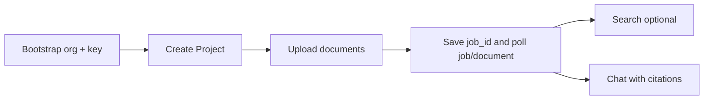

# APE Platform Integration Guide

**For developers integrating AI Platform Engine into an application.**

This guide walks you from zero to a working RAG integration: authenticate, create a
knowledge space, ingest documents, search, and chat with citations. Use it as the
primary onboarding path; [api/](api/README.md) remains the endpoint cheat sheet and
`/docs` is the live OpenAPI contract.

---

## What you are integrating

APE is a **dedicated hosted AI service** your application calls over REST. Your app
owns users, UI, and business workflows. APE owns the document pipeline:

```text
Upload  ->  Parse / chunk  ->  Embed / index  ->  Search  ->  Chat + citations
```

**You do not embed RAG logic in your app.** You call APE APIs and map responses into
your product.

| Your application | APE |
| ---------------- | --- |
| User sessions, RBAC, billing | Organization API keys (M2M auth) |
| Customer / department / matter UI | **Projects** (one corpus per `project_id`) |
| File picker, upload UX | Document upload + async processing |
| Search UI, filters | Hybrid retrieval API |
| Chat UI, history | Conversations API |

---

## Mental model: two IDs to remember

```text
Organization   who is calling        (API key)
Project        which knowledge base  (project_id in every business URL)
```

Every business route looks like:

```text
/api/v1/projects/{project_id}/...
```

The Organization API key proves **which tenant** is calling. The `project_id` in the
path selects **which document corpus** to use. A single Organization can own many
Projects (e.g. one per client matter, department, or product workspace).

---

## Before you start

### From your platform operator

| Item | Used for |
| ---- | -------- |
| **Base URL** | All requests, e.g. `https://ape.customer.internal` |
| **Organization API key** | Every business API call (`ape_live_…`) |
| **Admin key** | One-time bootstrap only — create orgs/keys (usually not in your app) |

Keys are provisioned once by an operator with the deployment admin credential. Your
integration stores the **Organization key** securely (secrets manager, env var, never
in client-side code).

### Local development

| Mode | Base URL | Auth |
| ---- | -------- | ---- |
| Backend in venv | `http://localhost:8088` | Often `APE_AUTH__ENABLED=false` — no key required |
| Full Docker stack | `http://localhost:8000` | Set `APE_AUTH__ENABLED=true` and provision keys |

Verify connectivity:

```bash
curl -s "$APE_BASE_URL/health" | jq .
curl -s "$APE_BASE_URL/ready"  | jq .
```

### Set shell variables (copy this block)

```bash
export APE_BASE_URL="http://localhost:8088"          # or your deployment URL
export APE_ORG_KEY="ape_live_your_organization_key"  # business API key
export APE_ADMIN_KEY="your_admin_key"                # bootstrap only
```

All examples below use these variables.

---

## Authentication

### Credential tiers

| Tier | Routes | Header |
| ---- | ------ | ------ |
| **Public** | `GET /health`, `GET /ready` | None |
| **Admin** | `/api/v1/organizations/**` | `Authorization: Bearer <admin_key>` |
| **Organization** | `/api/v1/projects/**` and nested routes | See below |

### Business API header (use on every integration call)

Either form works:

```http
Authorization: Bearer ape_live_…
```

```http
X-API-Key: ape_live_…
```

### Example authenticated request

```bash
curl -s "$APE_BASE_URL/api/v1/projects" \
  -H "Authorization: Bearer $APE_ORG_KEY" | jq .
```

### Common auth errors

| HTTP | `error.code` | Meaning |
| ---- | ------------ | ------- |
| 401 | `unauthorized` | Missing, invalid, or revoked key |
| 429 | `rate_limited` | Org quota exceeded — retry after `Retry-After` header |

> **Production:** always run with `APE_AUTH__ENABLED=true`. Never expose Organization
> keys in browser or mobile clients — call APE from your backend.

---

## API conventions

### Success envelope

All `/api/v1/*` success responses:

```json
{
  "success": true,
  "message": null,
  "data": { },
  "meta": {
    "request_id": "…",
    "trace_id": "…"
  }
}
```

Read business payloads from `data`. Use `meta.request_id` / `meta.trace_id` when
reporting issues to your platform team.

### Error envelope

```json
{
  "success": false,
  "error": {
    "code": "project_not_found",
    "message": "Project not found.",
    "trace_id": "…",
    "details": null
  }
}
```

### Pagination

List endpoints accept `limit` and `offset`. Responses include `items`, `total`,
`limit`, and `offset` inside `data`.

### Correlation headers

Every response includes `X-Request-ID` and `X-Trace-ID`. You may send your own
values on inbound requests for end-to-end tracing.

### Sample payloads in this guide

Request and response examples below use **expandable sections** (click to open).
They are collapsed by default to keep the page scannable. Not every endpoint needs
a sample — simple toggles, deletes, and enqueue-only calls are omitted.

---

## Integration flow (end to end)



| Step | Action | Async? |
| ---- | ------ | ------ |
| 0 | Operator provisions Organization + API key | — |
| 1 | Create a **Project** | No |
| 2 | **Upload** documents | Yes — worker processes |
| 3 | Wait for `status=ready` | Poll Document; optionally inspect returned `job_id` |
| 4 | **Search** (optional) | No |
| 5 | **Chat** | No (LLM call may take seconds) |

Steps 3–6 (embed/index) usually run automatically when `APE_RETRIEVAL__AUTO_EMBED` and
`APE_RETRIEVAL__AUTO_INDEX` are enabled (default in `.env.example`).

---

## Document lifecycle

Understanding `status` is essential for polling and error handling.
It describes product lifecycle. Durable execution details such as dispatch,
attempts, lease recovery, stage progress, and failure code live on JobRun.

```text
uploaded -> queued -> parsing -> chunked
                                    |
                    embedding -> embedded -> indexing -> ready
                                    |
                                 failed
```

| Status | Meaning | Your app should |
| ------ | ------- | --------------- |
| `queued` | Accepted, waiting for worker | Keep polling |
| `parsing` | Extracting text / OCR | Keep polling |
| `chunked` | Text split into chunks | Wait for embed/index (usually automatic) |
| `embedding` / `embedded` | Vectors being created | Keep polling |
| `indexing` | Vector + keyword index building | Keep polling |
| `ready` | Searchable and usable for chat | Enable search/chat UI |
| `failed` | Pipeline error | Show `error_message`; offer reprocess |

**Poll interval:** start at 2s, back off to 5–10s for large files. Typical PDFs
complete in tens of seconds depending on size and worker load.

---

## Step 0 — Bootstrap (operator, one-time)

> Skip if your operator already gave you an Organization API key.

**Create Organization** — defines the tenant boundary.

```bash
curl -s -X POST "$APE_BASE_URL/api/v1/organizations" \
  -H "Authorization: Bearer $APE_ADMIN_KEY" \
  -H "Content-Type: application/json" \
  -d '{"name": "Acme Corp", "description": "Production tenant"}' | jq .
```

<details>
<summary>Sample request &amp; response — create organization</summary>

**Request body**

```json
{
  "name": "Acme Corp",
  "description": "Production tenant"
}
```

**Response** `201`

```json
{
  "success": true,
  "message": null,
  "data": {
    "id": "3fa85f64-5717-4562-b3fc-2c963f66afa6",
    "name": "Acme Corp",
    "description": "Production tenant",
    "is_active": true,
    "deleted_at": null,
    "deleted_by": null,
    "created_at": "2026-07-08T12:00:00Z",
    "updated_at": "2026-07-08T12:00:00Z"
  },
  "meta": { "request_id": "…", "trace_id": "…" }
}
```

</details>

Save `data.id` as `ORGANIZATION_ID`.

**Create API key** — credential your backend will use. The full secret is returned
**once**.

```bash
curl -s -X POST "$APE_BASE_URL/api/v1/organizations/$ORGANIZATION_ID/api-keys" \
  -H "Authorization: Bearer $APE_ADMIN_KEY" \
  -H "Content-Type: application/json" \
  -d '{"name": "Production"}' | jq .
```

<details>
<summary>Sample request &amp; response — create API key</summary>

**Request body**

```json
{
  "name": "Production"
}
```

**Response** `201` — full `secret` shown **once**

```json
{
  "success": true,
  "message": null,
  "data": {
    "id": "7c9e6679-7425-40de-944b-e07fc1f90ae7",
    "organization_id": "3fa85f64-5717-4562-b3fc-2c963f66afa6",
    "name": "Production",
    "key_prefix": "ape_live_abc123",
    "secret": "ape_live_abc123…full_key_shown_once",
    "created_at": "2026-07-08T12:00:00Z",
    "updated_at": "2026-07-08T12:00:00Z",
    "last_used_at": null,
    "revoked_at": null
  },
  "meta": { "request_id": "…", "trace_id": "…" }
}
```

</details>

Store `data.secret` immediately. You cannot retrieve it again.

---

## Step 1 — Projects

### What it is

A **Project** is an isolated knowledge corpus. All documents, search results, and
conversations belong to exactly one `project_id`.

### When to create one

Create a Project when your user opens a new workspace, client matter, department
knowledge base, or any boundary where documents must not mix.

**Mapping tip:** store APE `project_id` in your database next to your own entity ID.

### Create project

```bash
curl -s -X POST "$APE_BASE_URL/api/v1/projects" \
  -H "Authorization: Bearer $APE_ORG_KEY" \
  -H "Content-Type: application/json" \
  -d '{"name": "Client Audit 2024", "description": "Working papers and policies"}' \
  | jq .
```

```bash
export PROJECT_ID="<data.id from response>"
```

<details>
<summary>Sample request &amp; response — create project</summary>

**Request body**

```json
{
  "name": "Client Audit 2024",
  "description": "Working papers and policies"
}
```

**Response** `201`

```json
{
  "success": true,
  "message": null,
  "data": {
    "id": "660e8400-e29b-41d4-a716-446655440001",
    "name": "Client Audit 2024",
    "description": "Working papers and policies",
    "is_active": true,
    "deleted_at": null,
    "deleted_by": null,
    "created_at": "2026-07-08T12:00:00Z",
    "updated_at": "2026-07-08T12:00:00Z"
  },
  "meta": { "request_id": "…", "trace_id": "…" }
}
```

</details>

### List / get / update

| Method | Path | Purpose |
| ------ | ---- | ------- |
| `GET` | `/api/v1/projects` | List projects for this Organization |
| `GET` | `/api/v1/projects/{project_id}` | Fetch one project |
| `PATCH` | `/api/v1/projects/{project_id}` | Update name or description |
| `PATCH` | `/api/v1/projects/{project_id}/status` | Toggle active (no body) |
| `DELETE` | `/api/v1/projects/{project_id}` | Soft-delete |

**Errors:** `project_not_found` (404), `project_name_conflict` (409)

<details>
<summary>Sample response — list projects</summary>

**Request:** `GET /api/v1/projects?limit=20&offset=0`

**Response** `200`

```json
{
  "success": true,
  "message": null,
  "data": {
    "items": [
      {
        "id": "660e8400-e29b-41d4-a716-446655440001",
        "name": "Client Audit 2024",
        "description": "Working papers and policies",
        "is_active": true,
        "deleted_at": null,
        "deleted_by": null,
        "created_at": "2026-07-08T12:00:00Z",
        "updated_at": "2026-07-08T12:00:00Z"
      }
    ],
    "total": 1,
    "limit": 20,
    "offset": 0
  },
  "meta": { "request_id": "…", "trace_id": "…" }
}
```

</details>

---

## Step 2 — Upload documents

### What it is

Upload validates supported type, MIME/signature, structural integrity, and
malware status before it sends a file to object storage and enqueues background
processing: parse, optional OCR, and structure-aware chunking.

### When to call

Whenever the user adds or replaces a document in a Project.

### Upload

```bash
curl -s -X POST "$APE_BASE_URL/api/v1/projects/$PROJECT_ID/documents" \
  -H "Authorization: Bearer $APE_ORG_KEY" \
  -F "file=@./policy-handbook.pdf" \
  | jq .
```

```bash
export DOCUMENT_ID="<data.id from response>"
```

Optional form field for scanned PDFs / images:

```bash
-F "ocr_lang=hi"   # per-document OCR language when OCR is enabled on deployment
```

**Limits:** default max upload 50 MB (`413` if exceeded).

<details>
<summary>Sample request &amp; response — upload document</summary>

**Request** — `multipart/form-data` (not JSON)

| Field | Required | Notes |
| ----- | -------- | ----- |
| `file` | Yes | Binary file content |
| `ocr_lang` | No | Per-document OCR override when OCR is enabled |

**Response** `201`

```json
{
  "success": true,
  "message": null,
  "data": {
    "id": "550e8400-e29b-41d4-a716-446655440000",
    "project_id": "660e8400-e29b-41d4-a716-446655440001",
    "filename": "policy-handbook.pdf",
    "status": "queued",
    "ocr_lang": null,
    "language": null,
    "version": 1,
    "page_count": null,
    "error_message": null,
    "job_id": "770e8400-e29b-41d4-a716-446655440002",
    "created_at": "2026-07-08T12:05:00Z",
    "updated_at": "2026-07-08T12:05:00Z"
  },
  "meta": { "request_id": "…", "trace_id": "…" }
}
```

</details>

### Poll until ready

Store the upload response's `job_id`. Document polling remains the simplest
product-ready check; job polling is useful for operational progress and retry.

```bash
curl -s "$APE_BASE_URL/api/v1/projects/$PROJECT_ID/documents/$DOCUMENT_ID" \
  -H "Authorization: Bearer $APE_ORG_KEY" | jq '.data.status, .data.error_message'
```

<details>
<summary>Sample responses — document status (GET)</summary>

**Request:** `GET /api/v1/projects/{project_id}/documents/{document_id}`

**While processing** — `status` is not yet `ready`

```json
{
  "success": true,
  "data": {
    "id": "550e8400-e29b-41d4-a716-446655440000",
    "filename": "policy-handbook.pdf",
    "status": "parsing",
    "version": 1,
    "page_count": null,
    "error_message": null
  }
}
```

**Ready for search and chat**

```json
{
  "success": true,
  "data": {
    "id": "550e8400-e29b-41d4-a716-446655440000",
    "filename": "policy-handbook.pdf",
    "status": "ready",
    "version": 1,
    "page_count": 12,
    "parser_name": "pymupdf",
    "language": "en",
    "error_message": null
  }
}
```

**Failed** — surface `error_message` to the user; call reprocess if appropriate

```json
{
  "success": true,
  "data": {
    "id": "550e8400-e29b-41d4-a716-446655440000",
    "filename": "policy-handbook.pdf",
    "status": "failed",
    "error_message": "Document processing failed: …",
    "version": 1
  }
}
```

</details>

### Inspect or retry durable work

```bash
curl -s "$APE_BASE_URL/api/v1/projects/$PROJECT_ID/jobs/$JOB_ID" \
  -H "Authorization: Bearer $APE_ORG_KEY" | jq '.data.state, .data.stage, .data.progress, .data.failure_code'

# Only a failed job can be retried; this returns a new linked job identity.
curl -s -X POST "$APE_BASE_URL/api/v1/projects/$PROJECT_ID/jobs/$JOB_ID/retry" \
  -H "Authorization: Bearer $APE_ORG_KEY"
```

List by document with
`GET /api/v1/projects/{project_id}/jobs?document_id={document_id}`. Automatic
transient retries and expired-worker recovery do not require client action.

### Other document endpoints

| Method | Path | Purpose |
| ------ | ---- | ------- |
| `GET` | `.../documents` | List documents (paginated) |
| `GET` | `.../documents/{id}/chunks` | Inspect chunk text after processing |
| `POST` | `.../documents/{id}/reprocess` | Re-run pipeline (bumps version) |
| `DELETE` | `.../documents/{id}` | Stage reversible delete (returns durable `job_id`) |
| `DELETE` | `.../documents/{id}/purge` | Stage irreversible full artifact purge |

---

## Step 3 — Indexing (when needed)

### What it is

After chunking, embeddings and keyword indexes are built so hybrid search and chat
can retrieve context.

### When to call manually

Usually **you do not need to** — the worker auto-enqueues embed and index when
`APE_RETRIEVAL__AUTO_EMBED` and `APE_RETRIEVAL__AUTO_INDEX` are true.

The document endpoints remain useful when auto flags are disabled. For a safe
whole-corpus model/configuration change, stage `/index-builds/reembed` or
`/index-builds/reindex`, wait for the build to become `validated`, then call
`/index-builds/{build_id}/activate`. The former active snapshot remains available
through `/index-builds/rollback`.

Per-document staging:

```bash
# Only when status is chunked
curl -s -X POST "$APE_BASE_URL/api/v1/projects/$PROJECT_ID/documents/$DOCUMENT_ID/embed" \
  -H "Authorization: Bearer $APE_ORG_KEY" | jq '.data.status'

# Only when status is embedded
curl -s -X POST "$APE_BASE_URL/api/v1/projects/$PROJECT_ID/documents/$DOCUMENT_ID/index" \
  -H "Authorization: Bearer $APE_ORG_KEY" | jq '.data.status'
```

Poll `GET /documents/{id}` until `status` is `ready`.

---

## Step 4 — Search

### What it is

Query indexed chunks. Production deployments use **hybrid retrieval**: keyword (BM25)
+ vector search, fused and reranked.

### When to call

- Build a search-only UI ("find relevant passages")
- Debug retrieval quality before enabling chat
- Power your own custom LLM flow with APE as the retriever

### Search request

```bash
curl -s -X POST "$APE_BASE_URL/api/v1/projects/$PROJECT_ID/search" \
  -H "Authorization: Bearer $APE_ORG_KEY" \
  -H "Content-Type: application/json" \
  -d '{
    "query": "What is the refund policy?",
    "top_k": 5,
    "strategy": "hybrid",
    "rerank": true
  }' | jq .
```

| Field | Required | Notes |
| ----- | -------- | ----- |
| `query` | Yes | 1–4096 characters |
| `top_k` | No | Default from deployment config |
| `document_id` | No | Restrict to one document |
| `metadata_filter` | No | Allowlisted keys only (`source`, `tags`, `ocr_confidence`, …) |
| `strategy` | No | `hybrid` (recommended) or `semantic` |
| `rerank` | No | Override deployment reranker setting |

<details>
<summary>Sample request &amp; response — search</summary>

**Request body**

```json
{
  "query": "What is the refund policy?",
  "top_k": 5,
  "document_id": null,
  "metadata_filter": { "source": "handbook" },
  "strategy": "hybrid",
  "rerank": true
}
```

**Response** `200`

```json
{
  "success": true,
  "message": null,
  "data": {
    "query": "What is the refund policy?",
    "top_k": 5,
    "results": [
      {
        "chunk_id": "770e8400-e29b-41d4-a716-446655440002",
        "document_id": "550e8400-e29b-41d4-a716-446655440000",
        "chunk_index": 2,
        "content": "Refunds are available within 30 days of purchase when…",
        "score": 0.87,
        "filename": "policy-handbook.pdf",
        "page_number": 4,
        "char_start": 1200,
        "char_end": 1680,
        "metadata": { "source": "handbook" }
      }
    ]
  },
  "meta": { "request_id": "…", "trace_id": "…" }
}
```

`results[].score` is the final ranking score (RRF / reranker), not raw cosine similarity.

</details>

**Prerequisite:** at least one document at `status=ready` in the Project.

---

## Step 5 — Chat (RAG)

### What it is

Stateful conversations: each message retrieves context, calls the configured LLM,
and returns an answer with **citation snapshots** pointing to source chunks.

### When to call

When the user asks a natural-language question and expects a grounded answer.

### Create conversation

```bash
curl -s -X POST "$APE_BASE_URL/api/v1/projects/$PROJECT_ID/conversations" \
  -H "Authorization: Bearer $APE_ORG_KEY" \
  -H "Content-Type: application/json" \
  -d '{"title": null}' | jq .
```

```bash
export CONVERSATION_ID="<data.id from response>"
```

Optional at create time: `provider`, `model`, `temperature`, `system_prompt_version`
— snapshotted for reproducible turns.

<details>
<summary>Sample request &amp; response — create conversation</summary>

**Request body**

```json
{
  "title": null,
  "provider": null,
  "model": null,
  "temperature": null,
  "system_prompt_version": null
}
```

All fields are optional. Omit or pass `null` to use deployment defaults.

**Response** `201`

```json
{
  "success": true,
  "message": null,
  "data": {
    "id": "880e8400-e29b-41d4-a716-446655440003",
    "project_id": "660e8400-e29b-41d4-a716-446655440001",
    "title": null,
    "provider": "echo",
    "model": "gpt-4o-mini",
    "temperature": 0.7,
    "system_prompt_version": "v1",
    "is_active": true,
    "last_message_at": null,
    "created_at": "2026-07-08T12:30:00Z",
    "updated_at": "2026-07-08T12:30:00Z"
  },
  "meta": { "request_id": "…", "trace_id": "…" }
}
```

</details>

### Send message

```bash
curl -s -X POST "$APE_BASE_URL/api/v1/projects/$PROJECT_ID/conversations/$CONVERSATION_ID/messages" \
  -H "Authorization: Bearer $APE_ORG_KEY" \
  -H "Content-Type: application/json" \
  -d '{
    "content": "What is the refund policy?",
    "document_id": null,
    "metadata_filter": {}
  }' | jq .
```

<details>
<summary>Sample request &amp; response — send message</summary>

**Request body**

```json
{
  "content": "What is the refund policy?",
  "document_id": null,
  "metadata_filter": {}
}
```

`metadata_filter` values must be strings. Set `document_id` to scope retrieval to one document.

**Response** `200`

```json
{
  "success": true,
  "message": null,
  "data": {
    "user_message": {
      "id": "990e8400-e29b-41d4-a716-446655440004",
      "role": "user",
      "content": "What is the refund policy?",
      "created_at": "2026-07-08T12:31:00Z"
    },
    "assistant_message": {
      "id": "aa0e8400-e29b-41d4-a716-446655440005",
      "role": "assistant",
      "content": "According to the policy handbook, refunds are available within 30 days…",
      "citations": [
        {
          "chunk_id": "770e8400-e29b-41d4-a716-446655440002",
          "document_id": "550e8400-e29b-41d4-a716-446655440000",
          "filename": "policy-handbook.pdf",
          "chunk_index": 2,
          "page_number": 4,
          "char_start": 120,
          "char_end": 260,
          "score": 0.87,
          "chunk_hash": "a1b2c3…",
          "excerpt": "Refunds are available within 30 days of purchase when…"
        }
      ],
      "claims": [
        {
          "claim_id": "claim-1",
          "text": "Refunds are available within 30 days.",
          "grounded": true,
          "evidence": [
            {
              "citation_index": 1,
              "chunk_id": "770e8400-e29b-41d4-a716-446655440002",
              "document_id": "550e8400-e29b-41d4-a716-446655440000",
              "filename": "policy-handbook.pdf",
              "chunk_index": 2,
              "page_number": 4,
              "char_start": 120,
              "char_end": 260
            }
          ]
        }
      ],
      "grounded": true,
      "insufficient_evidence_reason": null,
      "metadata": {
        "retrieval_time_ms": 120,
        "generation_time_ms": 800,
        "total_time_ms": 950,
        "retrieval_strategy": "hybrid",
        "retrieval_top_k": 10,
        "retrieved_chunk_count": 5,
        "selected_chunk_count": 3
      },
      "created_at": "2026-07-08T12:31:02Z"
    }
  },
  "meta": { "request_id": "…", "trace_id": "…" }
}
```

Unsupported questions are a successful API response: the assistant contains the configured
insufficient-evidence message, `grounded=false`, empty claims/citations, and a stable
`insufficient_evidence_reason`. Do not convert this correct outcome into an application error.

</details>

### Streaming (SSE)

For token-by-token UI, use:

```http
POST /api/v1/projects/{project_id}/conversations/{conversation_id}/messages/stream
```

Events: `token` (partial text), `done` (final id + citations + claims + grounding), `error`.

<details>
<summary>Sample SSE events — stream message</summary>

Same request body as non-streaming `POST .../messages`.

**Event: token**

```json
{"event": "token", "delta": "According to the policy"}
```

**Event: done**

```json
{
  "event": "done",
  "assistant_message_id": "aa0e8400-e29b-41d4-a716-446655440005",
  "citations": [
    {
      "chunk_id": "770e8400-e29b-41d4-a716-446655440002",
      "document_id": "550e8400-e29b-41d4-a716-446655440000",
      "filename": "policy-handbook.pdf",
      "excerpt": "Refunds are available within 30 days…"
    }
  ],
  "claims": [
    {
      "claim_id": "claim-1",
      "text": "Refunds are available within 30 days.",
      "grounded": true,
      "evidence": [{ "citation_index": 1, "chunk_id": "770e8400-e29b-41d4-a716-446655440002" }]
    }
  ],
  "grounded": true,
  "insufficient_evidence_reason": null
}
```

**Event: error**

```json
{
  "event": "error",
  "message": "The language model provider is temporarily unavailable."
}
```

</details>

### Conversation management

| Method | Path | Purpose |
| ------ | ---- | ------- |
| `GET` | `.../conversations` | List conversations |
| `GET` | `.../conversations/{id}/messages` | Message history |
| `PATCH` | `.../conversations/{id}` | Update title or model snapshot |
| `DELETE` | `.../conversations/{id}` | Soft-delete (messages kept for audit) |

**Errors:** `conversation_not_found`, `conversation_inactive`, `llm_provider_unavailable` (503)

<details>
<summary>Sample response — message history (GET)</summary>

**Request:** `GET /api/v1/projects/{project_id}/conversations/{conversation_id}/messages?limit=50&offset=0`

**Response** `200`

```json
{
  "success": true,
  "message": null,
  "data": {
    "items": [
      {
        "id": "990e8400-e29b-41d4-a716-446655440004",
        "conversation_id": "880e8400-e29b-41d4-a716-446655440003",
        "role": "user",
        "content": "What is the refund policy?",
        "citations": null,
        "metadata": null,
        "created_at": "2026-07-08T12:31:00Z"
      },
      {
        "id": "aa0e8400-e29b-41d4-a716-446655440005",
        "conversation_id": "880e8400-e29b-41d4-a716-446655440003",
        "role": "assistant",
        "content": "According to the policy handbook, refunds are available within 30 days…",
        "citations": [{ "chunk_id": "…", "filename": "policy-handbook.pdf", "excerpt": "…" }],
        "metadata": { "retrieval_strategy": "hybrid", "total_time_ms": 950 },
        "created_at": "2026-07-08T12:31:02Z"
      }
    ],
    "total": 2,
    "limit": 50,
    "offset": 0
  },
  "meta": { "request_id": "…", "trace_id": "…" }
}
```

</details>

---

## Step 6 — Receive document outcomes with signed webhooks

Create one Project-scoped endpoint and store the returned `signing_secret` in your
application secret manager:

```bash
curl -s -X POST "$APE_BASE_URL/api/v1/projects/$PROJECT_ID/webhooks/endpoints" \
  -H "Authorization: Bearer $APE_ORG_KEY" \
  -H "Content-Type: application/json" \
  -d '{
    "url":"https://your-app.example/webhooks/ape",
    "event_types":[
      "document.processing.succeeded.v1",
      "document.processing.failed.v1",
      "document.indexing.succeeded.v1",
      "document.indexing.failed.v1"
    ]
  }' | jq .
```

A minimal Python receiver verifies the raw body before parsing and deduplicates by event ID:

```python
import hashlib, hmac, json

def receive(headers: dict[str, str], raw_body: bytes, secret: str, already_seen: set[str]):
    event_id = headers["x-ape-event-id"]
    timestamp = headers["x-ape-timestamp"]
    supplied = headers["x-ape-signature"].removeprefix("v1=")
    signed = timestamp.encode() + b"." + event_id.encode() + b"." + raw_body
    expected = hmac.new(secret.encode(), signed, hashlib.sha256).hexdigest()
    if not hmac.compare_digest(supplied, expected):
        raise PermissionError("invalid webhook signature")
    if event_id in already_seen:
        return "duplicate"
    event = json.loads(raw_body)
    already_seen.add(event_id)  # persist this transactionally in a real receiver
    return event["type"], event["data"]["document_id"]
```

Return any `2xx` only after durably accepting the event. A non-2xx/transport failure is
retried with backoff. Operators can inspect attempts, disable endpoints, and replay; replay
uses the original event ID, so the receiver's deduplication remains authoritative.

---

## Recommended integration patterns

### Map your tenant model

```text
Your customer account  ->  APE Organization (one key per integration / env)
Your workspace / matter  ->  APE Project (store project_id in your DB)
Your uploaded file       ->  APE Document (store document_id)
Your async operation     ->  APE JobRun (store returned job_id when useful)
Your chat thread         ->  APE Conversation (store conversation_id)
```

### Polling helper (pseudo-code)

```python
import time
import httpx

def wait_until_ready(client, project_id, document_id, timeout=600):
    deadline = time.time() + timeout
    while time.time() < deadline:
        doc = client.get(f"/api/v1/projects/{project_id}/documents/{document_id}").json()["data"]
        status = doc["status"]
        if status == "ready":
            return doc
        if status == "failed":
            raise RuntimeError(doc.get("error_message") or "processing failed")
        time.sleep(3)
    raise TimeoutError("document not ready in time")
```

### Backend proxy pattern

```text
Browser  ->  Your API  ->  APE (Organization key on server only)
```

Never ship `APE_ORG_KEY` to frontends. Your backend adds the auth header and enforces
your own user authorization before choosing `project_id`.

### Idempotency

- Uploading identical content twice in one Project returns
  `document_content_duplicate`.
- `reprocess` bumps `version`, replaces that version's chunks, and atomically
  activates a complete new full-corpus build.
- Duplicate delivery and worker recovery rebuild only private snapshot output;
  partial or failed builds never replace the active vectors or keyword rows.
- Revoked API keys fail immediately on cache miss; cached keys may work up to ~60s.

---

## Quick reference

| Goal | Method | Path |
| ---- | ------ | ---- |
| Health check | `GET` | `/health` |
| Readiness | `GET` | `/ready` |
| Create project | `POST` | `/api/v1/projects` |
| Upload file | `POST` | `/api/v1/projects/{project_id}/documents` |
| Document status | `GET` | `/api/v1/projects/{project_id}/documents/{id}` |
| List jobs | `GET` | `/api/v1/projects/{project_id}/jobs` |
| Job detail | `GET` | `/api/v1/projects/{project_id}/jobs/{job_id}` |
| Retry failed job | `POST` | `/api/v1/projects/{project_id}/jobs/{job_id}/retry` |
| Search | `POST` | `/api/v1/projects/{project_id}/search` |
| Create chat | `POST` | `/api/v1/projects/{project_id}/conversations` |
| Send message | `POST` | `/api/v1/projects/{project_id}/conversations/{id}/messages` |
| Stream message | `POST` | `/api/v1/projects/{project_id}/conversations/{id}/messages/stream` |
| Create evaluation dataset | `POST` | `/api/v1/projects/{project_id}/evaluations/datasets` |
| Queue quality run | `POST` | `/api/v1/projects/{project_id}/evaluations/runs` |
| Latest quality summary | `GET` | `/api/v1/projects/{project_id}/evaluations/quality` |
| Create webhook endpoint | `POST` | `/api/v1/projects/{project_id}/webhooks/endpoints` |
| Delivery history | `GET` | `/api/v1/projects/{project_id}/webhooks/deliveries` |
| Replay delivery | `POST` | `/api/v1/projects/{project_id}/webhooks/deliveries/{id}/replay` |

---

## Production checklist

- [ ] `APE_AUTH__ENABLED=true` on deployment
- [ ] Organization API key stored in secrets manager (not in repo)
- [ ] Backend proxy — keys never in client apps
- [ ] Worker process running (`taskiq` worker in Docker or `python worker.py`)
- [ ] `/ready` returns healthy before routing user traffic
- [ ] Save async `job_id`; poll Document for readiness and JobRun for execution detail
- [ ] Handle `429` with `Retry-After` backoff
- [ ] Log `trace_id` from errors for support requests
- [ ] Hybrid search enabled (`APE_RETRIEVAL__STRATEGY=hybrid` in production `.env`)
- [ ] Versioned pilot evaluation dataset has a passing stored run before trusted-answer rollout
- [ ] Client displays insufficient-evidence outcomes and claim/source locations explicitly
- [ ] Webhook receiver verifies raw-body HMAC, checks timestamp, and durably deduplicates event IDs

---

## Troubleshooting

| Symptom | Likely cause | What to do |
| ------- | ------------ | ---------- |
| `401 unauthorized` | Bad or missing API key | Verify header and key not revoked |
| `404 project_not_found` | Wrong `project_id` or other org's project | Confirm project belongs to your Organization |
| Job remains `queued`/`retry_scheduled` | Redis/worker unavailable | Restore infrastructure; durable outbox/lease recovery resumes automatically |
| Job is `failed` | Permanent error or attempts exhausted | Inspect `failure_code`, fix the cause, then `POST .../jobs/{job_id}/retry` |
| Search returns empty | Document not `ready` | Poll status; check worker logs |
| Chat `503 llm_provider_unavailable` | LLM backend down or misconfigured | Check `APE_LLM__*` settings on deployment |
| `413` on upload | File too large | Split file or raise `APE_KNOWLEDGE__MAX_UPLOAD_BYTES` |
| Webhook retries/fails | Receiver timeout, non-2xx, TLS/DNS error | Inspect delivery attempts, fix receiver, then replay the same event |

---

## Related documentation

| Need | Document |
| ---- | -------- |
| Endpoint cheat sheet | [api/README.md](api/README.md) |
| Auth deep dive | [learning/organization-api-key-auth-journey.md](learning/organization-api-key-auth-journey.md) |
| Product overview | [Platform-at-a-glance.md](Platform-at-a-glance.md) |
| Feature behavior | [features/README.md](features/README.md) |
| Run locally | [../README.md](../README.md) |
| Live schema | `{APE_BASE_URL}/docs` |
| Webhook contract | [api/webhooks_api.md](api/webhooks_api.md) |
| Hosted operations | [../infra/hosted/RUNBOOK.md](../infra/hosted/RUNBOOK.md) |

---

*OpenAPI at `/docs` is authoritative for request/response schemas. This guide is the
recommended path for first integration.*
